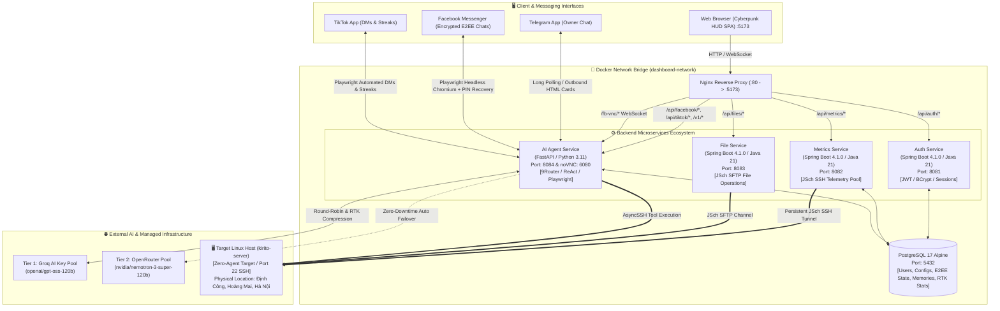
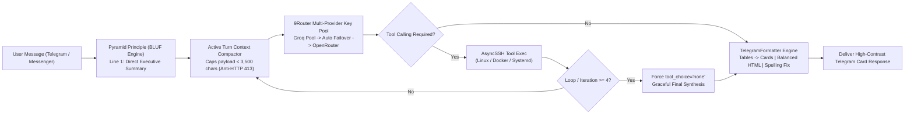
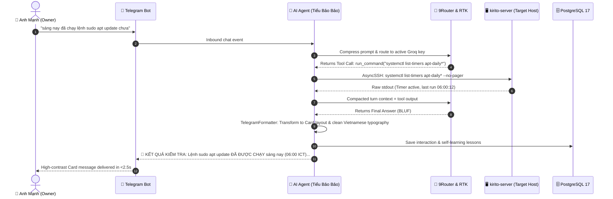

# Mini Server Dashboard — Sci-Fi Cyberpunk Edition

[](https://spring.io/projects/spring-boot)
[](https://www.oracle.com/java/)
[](https://www.python.org/)
[](https://fastapi.tiangolo.com/)
[](https://react.dev/)
[](https://vitejs.dev/)
[](https://www.postgresql.org/)
[](https://www.docker.com/)
[](./LICENSE)

> **A modern, self-hosted, real-time Linux server monitoring & autonomous management ecosystem featuring a futuristic Cyberpunk / Sci-Fi HUD interface.**  
> Connect securely to any remote Linux host over SSH with **zero agent installation** on the target machine. Monitor system metrics, processes, services, containers, files, logs, and interact via an **autonomous AI Assistant ("Tiểu Bảo Bảo")** across Telegram and Facebook Messenger E2EE.

---

## 📑 Table of Contents

- [Overview](#-overview)
- [System Topology & High-Level Architecture](#-system-topology--high-level-architecture)
- [Screenshots / Demo](#-screenshots--demo)
- [Key Features & Visual Workflows](#-key-features--visual-workflows)
  - [1. Autonomous AI Assistant ("Tiểu Bảo Bảo")](#1-autonomous-ai-assistant-tiểu-bảo-bảo)
  - [2. System Overview Dashboard (`/`)](#2-system-overview-dashboard-)
  - [3. 3D Interactive Globe Map (`/map`)](#3-3d-interactive-globe-map-map)
  - [4. Process Explorer (`/processes`)](#4-process-explorer-processes)
  - [5. Services & Docker Runtime Center (`/services`)](#5-services--docker-runtime-center-services)
  - [6. Container Management (`/containers`)](#6-container-management-containers)
  - [7. Remote File Manager (`/files`)](#7-remote-file-manager-files)
  - [8. Interactive Web SSH Terminal (`/terminal`)](#8-interactive-web-ssh-terminal-terminal)
  - [9. Security & Network Inspector (`/security`)](#9-security--network-inspector-security)
  - [10. Control Center & Preferences (`/settings`)](#10-control-center--preferences-settings)
- [AI Agent & 9Router Cognitive Lifecycle](#-ai-agent--9router-cognitive-lifecycle)
- [Microservices & Tech Stack](#-microservices--tech-stack)
- [Project Directory Structure](#-project-directory-structure)
- [Getting Started & Installation](#-getting-started--installation)
  - [Prerequisites](#prerequisites)
  - [1. Clone & Configure Environment](#1-clone--configure-environment)
  - [2. Deploy with Docker Compose](#2-deploy-with-docker-compose-recommended)
  - [3. Local Development (Hot Reload)](#3-local-development-hot-reload)
  - [4. Running Unit Tests](#4-running-unit-tests)
- [Documentation Index](#-documentation-index)
- [License](#-license)

---

## 🌟 Overview

**Mini Server Dashboard** delivers a complete single-pane-of-glass operational suite designed for sysadmins, DevOps engineers, and self-hosters who demand both deep operational control and top-tier aesthetic excellence.

### Core Philosophy

1. **Zero Target Footprint (Agentless):** No daemon, agent, or extra process needs to be installed on target Linux servers. The backend connects via SSH (`JSch` / `AsyncSSH`) and collects real-time telemetry through standard Linux utilities (`top`, `free`, `df`, `sensors`, `ps`, `systemctl`, `docker`, `ss`, `journalctl`).
2. **Autonomous Hybrid AI Agent ("Tiểu Bảo Bảo"):** Powered by a Multi-Provider LLM Pool (Groq + OpenRouter) that operates 24/7. It diagnoses server alerts, executes sysadmin tasks over SSH via tool calling, and bridges notifications/conversations through Telegram and Facebook Messenger End-to-End Encrypted (E2EE) chats.
3. **Immersive Cyberpunk Sci-Fi HUD:** Replaces mundane flat dashboards with a dynamic, neon-lit HUD interface featuring SVG crosshair cursors, audio-synthesized tactile feedback, canvas shockwaves, and a 3D orthographic globe.

---

## 🏗 System Topology & High-Level Architecture



---

## 📸 Screenshots / Demo

### 1. System Overview Dashboard (`/`)
Real-time KPI metric cards, CPU & RAM donut gauges, multi-core temperature sensors, disk partition usage, and fan HUD.


### 2. Process Explorer (`/processes`)
Live Linux process monitor with column sorting, CPU/Memory threshold filters, process termination modal, and 1-click CSV export.


### 3. Services & Docker Runtime Center (`/services`)
Start/stop/restart systemd units, inspect Docker containers, view live streaming container logs, and monitor scheduled system timers.


### 4. Interactive Web SSH Terminal Console (`/terminal`)
Embedded web terminal with command history, security sandbox, and 1-click Quick Command Macro Chips.


### 5. Control Center & Settings (`/settings`)
Configure critical alert threshold sliders, global refresh speeds, Telegram/Facebook AI agent preferences, and Sci-Fi visual effects.


---

## 🚀 Key Features & Visual Workflows

### 1. Autonomous AI Assistant ("Tiểu Bảo Bảo")



- **Pyramid Principle / BLUF Thinking Architecture:** Direct answer on line 1, verified card breakdown in the body, concise technical insights at the end.
- **Telegram Native Formatter Engine (`TelegramFormatter`):** Converts Markdown tables into mobile-friendly bullet cards, auto-escapes HTML, balances tags, and normalizes Vietnamese typography.
- **Anti-Loop Circuit Breaker & Context Compactor:** Dynamically compacts older tool outputs, keeping payload under 3,500 characters (~900 tokens) to eliminate Groq `HTTP 413 Payload Too Large` errors.
- **Ground Truth Physical Location Metadata:** Configured on-premise location: **Định Công, Hoàng Mai, Hà Nội, Việt Nam** (FPT Telecom, LAN: `192.168.0.100`).
- **Facebook Messenger E2EE Automation:** Playwright Chromium automation with automated 6-digit PIN decryption, absence auto-reply, and automatic message unsend when the owner replies.
- **TikTok Automation & Long-Term Memory:** Automated daily streak keeper, proactive appointment reminders, and PostgreSQL-backed self-learning brain (`AgentMemoryService`).

---

## 🔄 End-to-End Operational Lifecycle



---

## 🛠 Microservices & Tech Stack

| Component | Framework / Technology | Version | Purpose |
| --- | --- | --- | --- |
| **Frontend** | React + Vite + Tailwind/CSS | React 19 / Vite 8 | Cyberpunk Sci-Fi SPA & Visualization |
| **Auth Service** | Spring Boot + Spring Security | 4.1.0 (Java 21) | JWT Authentication, User Verification |
| **Metrics Service** | Spring Boot + JSch SSH | 4.1.0 (Java 21) | Real-time SSH Telemetry, System Control |
| **File Service** | Spring Boot + JSch SFTP | 4.1.0 (Java 21) | Remote File Navigation & Operations |
| **AI Agent Service** | FastAPI + Playwright + AsyncSSH | Python 3.11 | Telegram Bot & Facebook E2EE AI Agent |
| **Database** | PostgreSQL Alpine | 17 | User Auth, Configs & E2EE Thread State |
| **Visual Bridge** | Xvfb + x11vnc + noVNC | — | Web-based GUI stream for Headless Browser |
| **Reverse Proxy** | Nginx Alpine | latest | Static Asset Serving & `/api/*` Routing |

---

## 📁 Project Directory Structure

```text
quan_ly_server/
├── .agents/                              # AI Agent workflows & operational guides
├── .env.example                          # Safe environment configuration template
├── docker-compose.yml                    # Multi-container orchestration specification
├── docs/                                 # Complete technical documentation suite
│   ├── README.md                         # Documentation index
│   ├── architecture.md                   # System topology & communication patterns
│   ├── api-reference.md                  # REST API & Gateway specifications
│   ├── backend-internals.md              # Spring Boot & FastAPI architectural details
│   ├── database-and-auth.md              # PostgreSQL 17 schema & JWT auth lifecycle
│   ├── deployment.md                     # Production deployment & hardening guide
│   ├── frontend-internals.md             # React 19, D3 Globe & Sci-Fi HUD engine
│   ├── security.md                       # Security model, sandboxing & credential policies
│   ├── system-automation.md              # Background schedulers, scanners & timers
│   ├── telegram-ai-agent.md              # Autonomous AI Agent, 9Router & E2EE guide
│   └── troubleshooting.md                # Diagnostic runbooks & recovery handbook
├── frontend/                             # React 19 + Vite 8 SPA
│   ├── src/pages/                        # Dashboard, Processes, Services, Containers, Files, etc.
│   ├── src/components/                   # SciFi HUD components, SciFiIcons, Terminal, etc.
│   └── nginx.conf                        # Nginx reverse proxy configuration
├── services/
│   ├── auth-service/                     # Spring Boot JWT authentication microservice
│   ├── metrics-service/                  # Spring Boot JSch telemetry microservice
│   ├── file-service/                     # Spring Boot SFTP file operations microservice
│   └── ai-agent-service/                 # FastAPI Python AI Agent & 9Router service
│       ├── app/core/                     # LLM Router (RTK), Telegram Formatter, SSH client
│       ├── app/routers/                  # Health, Facebook, TikTok, OpenAI Gateway
│       └── app/services/                 # AiAgent, TelegramBot, FacebookService, TikTokService, Memory
└── db/                                   # Database migration scripts & PostgreSQL config
```

---

## 🚀 Getting Started & Installation

### Prerequisites

- **Docker & Docker Compose V2** (Installed on production host)
- **Target Linux Server** with SSH access (OpenSSH server enabled)
- Optional: **Groq API Key** / **OpenRouter API Key** (for AI Agent features)
- Optional: **Telegram Bot Token** (for Telegram Bot automation)

### 1. Clone & Configure Environment

```bash
git clone https://github.com/tranvanmanh9325/quan_ly_server.git
cd quan_ly_server

# Copy environment template
cp .env.example .env

# Edit environment variables
nano .env
```

Key environment settings:
```dotenv
SSH_HOST=192.168.0.100
SSH_PORT=22
SSH_USER=kirito
SSH_PASSWORD=your_ssh_password

# Ground truth physical server metadata
SERVER_PHYSICAL_LOCATION="Định Công, Hoàng Mai, Hà Nội, Việt Nam"
SERVER_ISP="FPT Telecom"
SERVER_OWNER="Trần Văn Mạnh (kirito)"

# Telegram & AI Agent Key Pool
TELEGRAM_BOT_TOKEN=your_telegram_bot_token
TELEGRAM_CHAT_ID=your_chat_id
GROQ_API_KEY=gsk_your_groq_key
OPENROUTER_API_KEY=sk-or-v1-your_openrouter_key
```

### 2. Deploy with Docker Compose (Recommended)

```bash
# Build and start all 6 containers in detached mode
docker compose up -d --build

# Check status of all microservices
docker compose ps
```

Once running, access the dashboard at:
- **Web Dashboard:** `http://<server-ip>:5173`
- **noVNC Visual Console:** `http://<server-ip>:6080/vnc.html`

### 3. Local Development (Hot Reload)

```bash
# Frontend (Vite hot-reload)
cd frontend && npm install && npm run dev

# AI Agent Service (Python FastAPI)
cd services/ai-agent-service
pip install -r requirements.txt
uvicorn app.main:app --host 0.0.0.0 --port 8084 --reload
```

### 4. Running Unit Tests

```bash
# Run AI Agent & Telegram Formatter unit tests inside container
docker exec dashboard_ai_agent python -m unittest discover -v -s /app/tests

# Run frontend tests
cd frontend && npm test
```

---

## 📚 Documentation Index

| Topic | Document |
| --- | --- |
| **System Architecture** | [docs/architecture.md](./docs/architecture.md) |
| **Complete API Reference** | [docs/api-reference.md](./docs/api-reference.md) |
| **AI Agent & 9Router Ecosystem** | [docs/telegram-ai-agent.md](./docs/telegram-ai-agent.md) |
| **Backend Microservices Internals** | [docs/backend-internals.md](./docs/backend-internals.md) |
| **Database & JWT Authentication** | [docs/database-and-auth.md](./docs/database-and-auth.md) |
| **Frontend & HUD Engine** | [docs/frontend-internals.md](./docs/frontend-internals.md) |
| **System Automation & Schedulers** | [docs/system-automation.md](./docs/system-automation.md) |
| **Production Deployment Guide** | [docs/deployment.md](./docs/deployment.md) |
| **Security Hardening & Sandboxing** | [docs/security.md](./docs/security.md) |
| **Troubleshooting & Diagnostics** | [docs/troubleshooting.md](./docs/troubleshooting.md) |

---

## 📄 License

Distributed under the **MIT License**. See [LICENSE](./LICENSE) for details.
