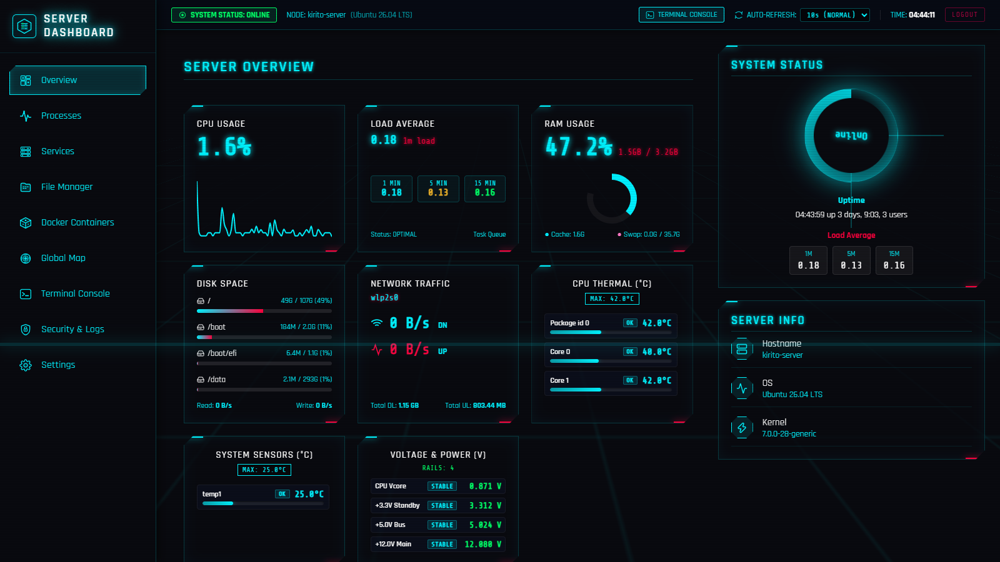
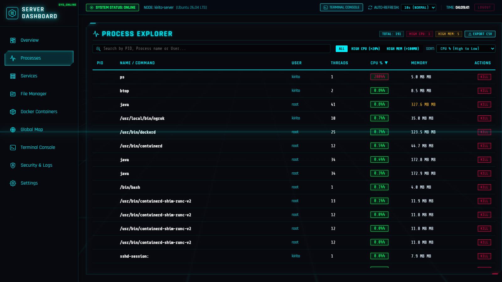
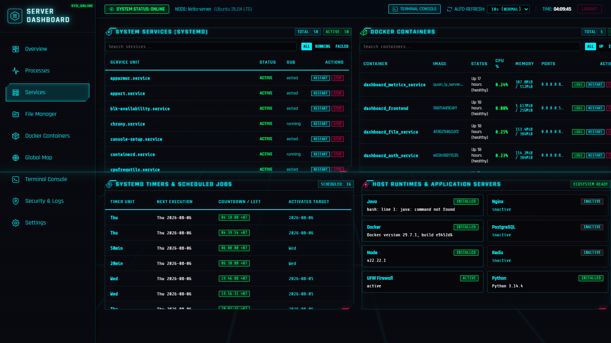
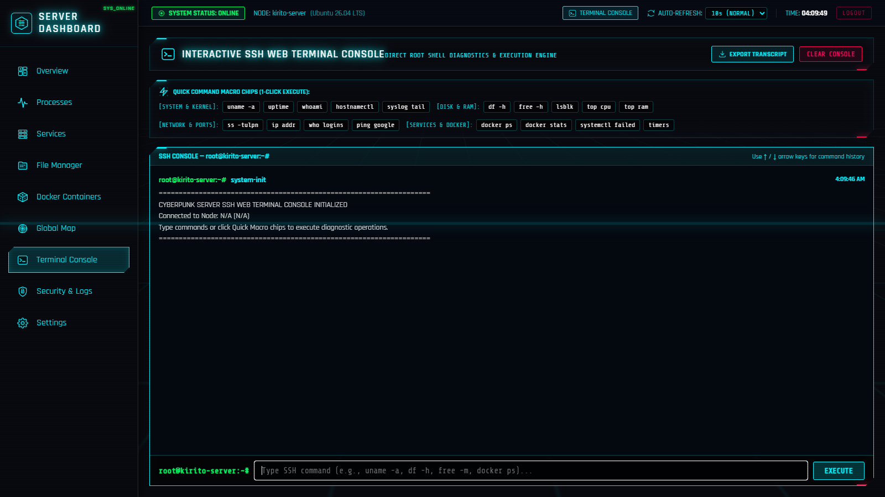
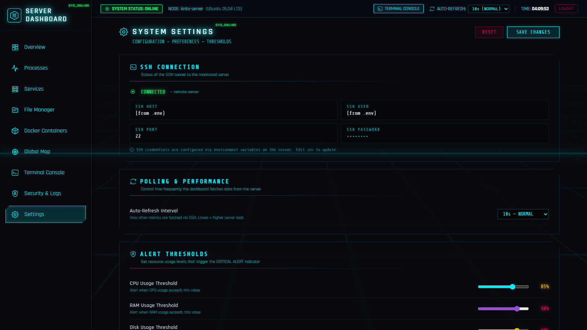

# Mini Server Dashboard — Sci-Fi Cyberpunk Edition

[](https://spring.io/projects/spring-boot)
[](https://www.oracle.com/java/)
[](https://www.python.org/)
[](https://fastapi.tiangolo.com/)
[](https://react.dev/)
[](https://vitejs.dev/)
[](https://www.postgresql.org/)
[](https://www.docker.com/)
[](./LICENSE)

> **A modern, self-hosted, real-time Linux server monitoring & autonomous management ecosystem featuring a futuristic Cyberpunk / Sci-Fi HUD interface.**  
> Connect securely to any remote Linux host over SSH with **zero agent installation** on the target machine. Monitor system metrics, processes, services, containers, files, logs, and interact via an **autonomous AI Assistant ("Tiểu Bảo Bảo")** across Telegram and Facebook Messenger E2EE.

---

## 📑 Table of Contents

- [Overview](#-overview)
- [Screenshots / Demo](#-screenshots--demo)
- [Key Features](#-key-features)
  - [Autonomous AI Assistant ("Tiểu Bảo Bảo")](#1-autonomous-ai-assistant-tiểu-bảo-bảo)
  - [System Overview Dashboard (`/`)](#2-system-overview-dashboard-)
  - [3D Interactive Globe Map (`/map`)](#3-3d-interactive-globe-map-map)
  - [Process Explorer (`/processes`)](#4-process-explorer-processes)
  - [Services & Docker Runtime Center (`/services`)](#5-services--docker-runtime-center-services)
  - [Container Management (`/containers`)](#6-container-management-containers)
  - [Remote File Manager (`/files`)](#7-remote-file-manager-files)
  - [Interactive Web SSH Terminal (`/terminal`)](#8-interactive-web-ssh-terminal-terminal)
  - [Security & Network Inspector (`/security`)](#9-security--network-inspector-security)
  - [Control Center & Preferences (`/settings`)](#10-control-center--preferences-settings)
  - [Futuristic Sci-Fi HUD Interaction Layer](#11-futuristic-sci-fi-hud-interaction-layer)
- [System Architecture](#-system-architecture)
- [Microservices & Tech Stack](#-microservices--tech-stack)
- [Project Directory Structure](#-project-directory-structure)
- [API Reference](#-api-reference)
- [Getting Started & Installation](#-getting-started--installation)
  - [Prerequisites](#prerequisites)
  - [1. Clone & Configure Environment](#1-clone--configure-environment)
  - [2. Deploy with Docker Compose (Recommended)](#2-deploy-with-docker-compose-recommended)
  - [3. Local Development (Hot Reload)](#3-local-development-hot-reload)
  - [4. Running Unit Tests](#4-running-unit-tests)
- [Documentation Index](#-documentation-index)
- [Contributing](#-contributing)
- [Security Policy](#-security-policy)
- [License](#-license)

---

## 🌟 Overview

**Mini Server Dashboard** delivers a complete single-pane-of-glass operational suite designed for sysadmins, DevOps engineers, and self-hosters who demand both deep operational control and top-tier aesthetic excellence.

### Core Philosophy

1. **Zero Target Footprint (Agentless):** No daemon, agent, or extra process needs to be installed on target Linux servers. The backend connects via SSH (`JSch` / `AsyncSSH`) and collects real-time telemetry through standard Linux utilities (`top`, `free`, `df`, `sensors`, `ps`, `systemctl`, `docker`, `ss`, `journalctl`).
2. **Autonomous Hybrid AI Agent:** Features **"Tiểu Bảo Bảo"**, an intelligent assistant powered by a Multi-Provider LLM Pool (Groq + OpenRouter) that operates 24/7. It diagnoses server alerts, executes sysadmin tasks over SSH via tool calling, and bridges notifications/conversations through Telegram and Facebook Messenger End-to-End Encrypted (E2EE) chats.
3. **Immersive Cyberpunk Sci-Fi HUD:** Replaces mundane flat dashboards with a dynamic, neon-lit HUD interface featuring SVG crosshair cursors, audio-synthesized tactile feedback, canvas shockwaves, and a 3D orthographic globe.

---

## 📸 Screenshots / Demo

### 1. System Overview Dashboard (`/`)

Real-time KPI metric cards, CPU & RAM donut gauges, multi-core temperature sensors, disk partition usage, and fan HUD.


### 2. Process Explorer (`/processes`)

Live Linux process monitor with column sorting, CPU/Memory threshold filters, process termination modal, and 1-click CSV export.


### 3. Services & Docker Runtime Center (`/services`)

Start/stop/restart systemd units, inspect Docker containers, view live streaming container logs, and monitor scheduled system timers.


### 4. Interactive Web SSH Terminal Console (`/terminal`)

Embedded web terminal with command history, security sandbox, and 1-click Quick Command Macro Chips.


### 5. Control Center & Settings (`/settings`)

Configure critical alert threshold sliders, global refresh speeds, Telegram/Facebook AI agent preferences, and Sci-Fi visual effects.


---

## 🚀 Key Features

### 1. Autonomous AI Assistant ("Tiểu Bảo Bảo")

- **Multi-Provider LLM Key Pool:**
  - **Groq AI Pool (`openai/gpt-oss-120b` / `llama-3.1-8b-instant`):** 9router-style round-robin rotation with 60-second smart cooldown on 429 rate limits.
  - **OpenRouter AI Pool (`nvidia/nemotron-3-super-120b-a12b:free` / custom models):** Automatic Tier-2 failover when primary pool experiences outages or quota exhaustion.
- **Telegram Bot Automation:**
  - Natural language server diagnostics, health reports, and system administration.
  - Autonomous SSH tool calling (`run_command`, `sudo_command`, `docker_manage`, `get_system_metrics`).
  - Rolling context window with prompt compression to prevent token explosion.
- **Facebook Messenger E2EE Automation:**
  - Headless Chromium (Playwright) running in an isolated container with persistent session storage.
  - **Automated E2EE PIN Recovery:** Seamlessly unlocks 6-digit E2EE PIN screens to decrypt secure conversations.
  - **Away Message & Intelligent Unsend Engine:** Sends friendly absence notifications when the owner is offline, and automatically revokes/unsends ("Thu hồi với mọi người") the absence message the moment the owner replies directly on Facebook or via Telegram.
  - **noVNC Visual Console (Port 6080):** Built-in browser GUI stream allowing visual intervention and debugging whenever required.

### 2. System Overview Dashboard (`/`)

- **Live KPI Telemetry:** CPU utilization, RAM usage breakdown, Partition disk meters, Network TX/RX throughput, Load Average (1m / 5m / 15m).
- **Hardware Health:** Multi-sensor CPU temperature readings, system voltages, and fan speeds.
- **CRITICAL ALERT Warning System:** Pulsing visual alerts and notification triggers when user-defined thresholds are exceeded.
- **Adaptive Polling Engine:** Dynamically throttles polling frequencies when network latency or server load rises.

### 3. 3D Interactive Globe Map (`/map`)

- **Orthographic 3D Globe:** Rendered using D3-geo and TopoJSON with smooth drag-to-rotate interaction.
- **Server Geolocation:** Pinpoints server location with glowing neon pins and animated sonar pulse waves.
- **Active Node Tracker:** Visualizes incoming SSH tunnel connections and client IP metadata.

### 4. Process Explorer (`/processes`)

- Real-time Linux process table with dynamic sorting by CPU%, Memory MB, PID, and Command Name.
- Quick filter tabs: `ALL`, `HIGH CPU (>20%)`, `HIGH MEM (>100MB)`.
- Safe process termination modal with PID verification.
- Instant CSV export for audit and analysis.

### 5. Services & Docker Runtime Center (`/services`)

- **Systemd Service Manager:** Live status badges with 1-click Start / Stop / Restart actions.
- **Systemd Timers:** Tracks scheduled maintenance jobs (such as `apt-daily.timer` and `apt-daily-upgrade.timer`).
- **Installed Runtimes:** Auto-detects active runtimes (Docker, Node.js, Java, Python) and daemons (Nginx, PostgreSQL, Redis, UFW).

### 6. Container Management (`/containers`)

- Complete Docker container overview with live container states and port mappings.
- Container lifecycle controls: start, stop, restart, and inspect.
- Real-time container log streaming modal (`docker logs --tail`).

### 7. Remote File Manager (`/files`)

- Full-featured SSH filesystem browser (navigate directories, inspect files, create, rename, and delete items).
- Built-in syntax-highlighted code and configuration file viewer.

### 8. Interactive Web SSH Terminal (`/terminal`)

- Browser-based terminal emulator (`root@server:~#`).
- Command history navigation (Up / Down arrows).
- Quick command macro chips for frequent diagnostics (`uname -a`, `df -h`, `docker ps`, `ss -tulpn`).
- Server-side security sandbox preventing destructive commands (`rm -rf /`, `mkfs`, `reboot`).

### 9. Security & Network Inspector (`/security`)

- **Listening Ports:** Comprehensive TCP / UDP socket scan mapped to respective process names and PIDs (`ss -tulpn`).
- **Active SSH Sessions:** Real-time user login monitoring via `who` and session tracking.
- **Colorized System Log Viewer:** Automatic severity parsing (`ERROR`/`DENIED` → Neon Red/Pink, `WARN` → Neon Yellow, `INFO` → Neon Green).

### 10. Control Center & Preferences (`/settings`)

- Custom threshold sliders for CPU, Memory, and Disk alert triggers.
- Per-session polling frequency adjustments.
- Sci-Fi visual toggles: Custom cursor, audio effects, scanline filters, grid overlays.
- Telegram & Facebook AI integration controls.

### 11. Futuristic Sci-Fi HUD Interaction Layer

- **Dual-Ring Animated Crosshair Cursor:** Custom SVG HUD cursor replacing standard system pointers.
- **Tactile Canvas Shockwaves:** Interactive particle bursts and energy ripples on click.
- **Web Audio API Synthesizer:** Real-time laser chirps and sub-bass audio feedback without external audio assets.

---

## 🏗 System Architecture

```text
┌───────────────────────────────────────────────────────────────────────────────────────────────────────┐
│                                       Docker Network (bridge)                                         │
│                                                                                                       │
│   ┌───────────────────────────────────────────────────────────────────────────────────────────────┐   │
│   │                                       Frontend (Nginx)                                        │   │
│   │                                         React 19 SPA                                          │   │
│   │                                    Host Port: 5173 (Nginx :80)                                │   │
│   └───────┬──────────────────────┬──────────────────────┬──────────────────────┬──────────────────┘   │
│           │ /api/auth/*          │ /api/metrics/*       │ /api/files/*         │ /api/facebook/*      │
│           │                      │                      │                      │ /api/ai/* , /v1/*    │
│           │                      │                      │                      │ /fb-vnc/*            │
│           ▼                      ▼                      ▼                      ▼                      │
│   ┌──────────────┐       ┌──────────────┐       ┌──────────────┐       ┌──────────────────────────┐   │
│   │ Auth Service │       │Metrics Service       │ File Service │       │     AI Agent Service     │   │
│   │ Spring Boot  │       │ Spring Boot  │       │ Spring Boot  │       │      FastAPI (8084)      │   │
│   │ (Port 8081)  │       │ (Port 8082)  │       │ (Port 8083)  │       │    noVNC GUI (Port 6080) │   │
│   └───────┬──────┘       └───────┬──────┘       └───────┬──────┘       └───────┬──────────┬───────┘   │
│           │                      │                      │                      │          │           │
│           │ (User / JWT Auth)    │ (Telemetry & Alert)  │ (SFTP Navigation)    │ (State)  │           │
│           ▼                      ▼                      │                      ▼          │           │
│   ┌─────────────────────────────────────┐               │              ┌───────────────┐  │           │
│   │            PostgreSQL 17            │               │              │ Playwright    │  │           │
│   │        (Database Container)         │               │              │ Chromium Head │  │           │
│   │            Port 5432/tcp            │               │              │ (E2EE Session)│  │           │
│   └─────────────────────────────────────┘               │              └───────┬───────┘  │           │
│                                                         │                      │          │           │
└─────────────────────────────────────────────────────────┼──────────────────────┼──────────┼───────────┘
               │ (JSch SSH Tunnel)                        │ (JSch SFTP)          │          │ (AsyncSSH)
               ▼                                          ▼                      │          ▼
  ┌───────────────────────────────────────────────────────────────────┐          │ ┌────────────────────┐
  │                        Remote Linux Server                        │          │ │  LLM Key Pools     │
  │                       (Managed Target Host)                       │          │ │ ────────────────── │
  │    Standard Linux CLI: top, free, df, sensors, ps, systemctl,     │          │ │ 1. Groq API Pool   │
  │    docker, ss, journalctl, ufw (Zero target agent footprint)      │          │ │ 2. OpenRouter Pool │
  │                             Port 22/tcp                           │          │ └────────────────────┘
  └───────────────────────────────────────────────────────────────────┘          │          ▲
                                                                                 │          │
                                                                                 ▼          │
                                      ┌─────────────────────────────────────────────────────┴───────────┐
                                      │                   External Messaging Integrations               │
                                      │ ─────────────────────────────────────────────────────────────── │
                                      │ • Telegram Bot API (Long Polling Agent Execution)               │
                                      │ • Facebook Messenger E2EE (Automated PIN Unlock & Unsend Engine)│
                                      └─────────────────────────────────────────────────────────────────┘
```

---

## 🛠 Microservices & Tech Stack

| Component | Framework / Technology | Version | Purpose |
| --- | --- | --- | --- |
| **Frontend** | React + Vite + Tailwind/CSS | React 19 / Vite 8 | Cyberpunk Sci-Fi SPA & Visualization |
| **Auth Service** | Spring Boot + Spring Security | 4.1.0 (Java 21) | JWT Authentication, User Verification |
| **Metrics Service** | Spring Boot + JSch SSH | 4.1.0 (Java 21) | Real-time SSH Telemetry, System Control |
| **File Service** | Spring Boot + JSch SFTP | 4.1.0 (Java 21) | Remote File Navigation & Operations |
| **AI Agent Service** | FastAPI + Playwright + AsyncSSH | Python 3.11 | Telegram Bot & Facebook E2EE AI Agent |
| **Database** | PostgreSQL Alpine | 17 | User Auth, Configs & E2EE Thread State |
| **Visual Bridge** | Xvfb + x11vnc + noVNC | — | Web-based GUI stream for Headless Browser |
| **Reverse Proxy** | Nginx Alpine | latest | Static Asset Serving & `/api/*` Routing |

---

## 📁 Project Directory Structure

```text
quan_ly_server/
├── .agents/                              # AI Agent workflows & operational guides
├── .env.example                          # Safe environment configuration template
├── .gitignore                            # Git ignore rules
├── docker-compose.yml                    # Full-stack container orchestration specification
├── LICENSE                               # MIT License
├── README.md                             # Main documentation
├── SECURITY.md                           # Security policy & reporting guidelines
│
├── db/                                   # Database Initialization & Config
│   ├── migrations/                       # PostgreSQL schema definitions & seeds
│   └── postgresql.conf                   # Optimized PostgreSQL configuration
│
├── docs/                                 # 11 In-Depth Technical Architecture Guides
│   ├── README.md                         # Documentation navigation hub
│   ├── architecture.md                   # Microservices architecture & network design
│   ├── api-reference.md                  # Comprehensive REST API specifications
│   ├── frontend-internals.md             # React state, routing & parser internals
│   ├── backend-internals.md              # Spring Boot architecture & JSch SSH service
│   ├── telegram-ai-agent.md              # AI Agent design, tool calling & key pools
│   ├── database-and-auth.md              # Auth service, JWT token lifecycle & DB schema
│   ├── system-automation.md              # Automation policies & systemd timers
│   ├── deployment.md                     # Production deployment & CI/CD workflows
│   ├── security.md                       # Threat model, sandboxing & security policies
│   └── troubleshooting.md                # Diagnostic handbook & recovery procedures
│
├── services/                             # Backend Microservices
│   ├── auth-service/                     # [Spring Boot] Authentication & JWT tokens (Port 8081)
│   ├── metrics-service/                  # [Spring Boot] Telemetry & SSH metrics engine (Port 8082)
│   ├── file-service/                     # [Spring Boot] Remote SFTP filesystem operations (Port 8083)
│   └── ai-agent-service/                 # [FastAPI] AI Agent & Playwright Facebook E2EE (Port 8084 & 6080)
│
└── frontend/                             # [React 19 + Vite 8] Cyberpunk Sci-Fi UI
    ├── src/
    │   ├── components/                   # SciFiIcons, SpaceInteractionLayer, Modals
    │   ├── pages/                        # Overview, Processes, Services, Terminal, Map, etc.
    │   └── utils/                        # Telemetry parsers, audio synthesis, API clients
    ├── nginx.conf                        # Reverse proxy rules (/api/* routing)
    └── Dockerfile                        # Multi-stage production build container
```

---

## 🔌 API Reference

### 1. Telemetry & Metrics (`metrics-service` :8082)

| Endpoint | Method | Description |
| --- | --- | --- |
| `/api/metrics/system` | `GET` | Hostname, OS, kernel, uptime |
| `/api/metrics/cpu` | `GET` | Overall CPU utilization percentage |
| `/api/metrics/ram` | `GET` | Memory breakdown (total, used, free, buffers/cache) |
| `/api/metrics/disk` | `GET` | Filesystem partition usage via `df -h` |
| `/api/metrics/disk-io` | `GET` | Read/write throughput via `/proc/diskstats` |
| `/api/metrics/network` | `GET` | Interface TX/RX deltas via `/proc/net/dev` |
| `/api/metrics/temperature` | `GET` | Multi-core thermal sensor readings |
| `/api/metrics/voltage` | `GET` | System voltage sensor readings |
| `/api/metrics/fan` | `GET` | Fan RPM readings and control status |
| `/api/metrics/load-average` | `GET` | 1, 5, and 15-minute load averages |
| `/api/metrics/processes` | `GET` | Process table via `ps -eo` |
| `/api/metrics/services` | `GET` | Systemd unit statuses |
| `/api/metrics/docker` | `GET` | Docker container list with health and port mapping |
| `/api/metrics/ports` | `GET` | Listening TCP/UDP sockets via `ss -tulpn` |
| `/api/metrics/connections` | `GET` | Active SSH sessions and network sockets |
| `/api/metrics/logs` | `GET` | Recent color-parsed system logs |
| `/api/metrics/services/control` | `POST` | Control systemd unit (`service`, `action`) |
| `/api/metrics/docker/control` | `POST` | Control Docker container (`containerId`, `action`) |
| `/api/metrics/kill-process` | `POST` | Terminate process by PID (`pid`) |
| `/api/metrics/execute-command` | `POST` | Execute safe allowlisted shell command in terminal |

### 2. Authentication (`auth-service` :8081)

| Endpoint | Method | Description |
| --- | --- | --- |
| `/api/auth/login` | `POST` | Authenticate with username & password, returns JWT token |
| `/api/auth/verify` | `GET` | Validate existing JWT token integrity |

### 3. File Operations (`file-service` :8083)

| Endpoint | Method | Description |
| --- | --- | --- |
| `/api/files/list` | `GET` | List files and directories in a given path |
| `/api/files/content` | `GET` | Read and view file contents |
| `/api/files/action` | `POST` | Create, rename, or delete files/folders |

### 4. AI Agent & Facebook Automation (`ai-agent-service` :8084)

| Endpoint | Method | Description |
| --- | --- | --- |
| `/health` | `GET` | Healthcheck endpoint for AI Agent container |
| `/api/facebook/trigger` | `POST` | Manually trigger a Facebook message scan cycle |
| `/api/facebook/status` | `GET` | Retrieve Facebook E2EE bot and scanner status |
| `/api/facebook/send-reply` | `POST` | Relay a reply to a Facebook thread from Telegram |
| `/api/facebook/test-ai-chat` | `POST` | Test natural language AI assistant response directly |

---

## ⚡ Getting Started & Installation

### Prerequisites

- **Docker & Docker Compose V2** (Docker 24.0+ recommended)
- A target Linux server with SSH enabled (LAN or public IP)

### 1. Clone & Configure Environment

```bash
git clone https://github.com/tranvanmanh9325/quan_ly_server.git
cd quan_ly_server
cp .env.example .env
```

Edit `.env` with your actual credentials:

```dotenv
# ==========================================
# SSH Target Server Credentials
# ==========================================
SSH_HOST=192.168.0.100
SSH_PORT=22
SSH_USER=kirito
SSH_PASSWORD=your_secure_ssh_password

# ==========================================
# Database Configuration (PostgreSQL 17)
# ==========================================
POSTGRES_PASSWORD=your_postgres_password

# ==========================================
# Auth Service Credentials & JWT Secret
# ==========================================
APP_AUTH_USERNAME=admin
APP_AUTH_PASSWORD=your_dashboard_password
JWT_SECRET=your_super_secret_jwt_key_at_least_32_characters_long
JWT_EXPIRATION_HOURS=24

# ==========================================
# Groq Multi-Key Pool (Primary LLM Engine)
# ==========================================
GROQ_API_KEY=gsk_primary_key_here
GROQ_API_KEY_2=gsk_second_key_here
GROQ_MODEL=openai/gpt-oss-120b

# ==========================================
# OpenRouter Multi-Key Pool (Tier-2 Fallback)
# ==========================================
OPENROUTER_API_KEY=sk-or-v1-primary_key_here
OPENROUTER_API_KEY_2=sk-or-v1-second_key_here
OPENROUTER_MODEL=nvidia/nemotron-3-super-120b-a12b:free
```

### 2. Deploy with Docker Compose (Recommended)

```bash
# Build and run the entire ecosystem in the background
docker compose up -d --build

# Verify container health
docker compose ps

# Stream logs
docker compose logs -f
```

- **Web Dashboard:** Access at **`http://localhost:5173`** (or your server IP)
- **noVNC Visual Console (Facebook E2EE):** Access at **`http://localhost:6080/vnc.html`**

### 3. Local Development (Hot Reload)

#### Frontend (React 19 + Vite)

```bash
cd frontend
npm install --legacy-peer-deps
npm run dev
# Running on http://localhost:5173 (proxies /api/* to backend services)
```

#### AI Agent Service (Python 3.11)

```bash
cd services/ai-agent-service
python -m venv venv
source venv/bin/activate # or venv\Scripts\activate on Windows
pip install -r requirements.txt
playwright install chromium
uvicorn app.main:app --host 0.0.0.0 --port 8084 --reload
```

### 4. Running Unit Tests

```bash
# Frontend Unit Tests (Vitest)
cd frontend
npm test
```

---

## 📚 Documentation Index

For deep-dive technical specifications, consult our **11 comprehensive technical guides** in the [`docs/`](./docs) directory:

| Guide | Description |
| --- | --- |
| 📖 [Architecture Guide](./docs/architecture.md) | Complete microservices topology, communication protocols, and resource allocation. |
| 🔌 [API Reference](./docs/api-reference.md) | Full endpoint contracts, request/response JSON schemas, and error codes. |
| ⚛️ [Frontend Internals](./docs/frontend-internals.md) | React 19 architecture, real-time parser layers, and Sci-Fi HUD canvas engine. |
| ☕ [Backend Internals](./docs/backend-internals.md) | Spring Boot 4.1.0 microservices, JSch SSH session pooling, and fault tolerance. |
| 🤖 [AI Agent Internals](./docs/telegram-ai-agent.md) | Multi-provider key pools, tool execution, and Facebook Messenger E2EE automation. |
| 🗄 [Database & Security](./docs/database-and-auth.md) | PostgreSQL 17 schema, JWT authentication flow, and credential encryption. |
| ⏱ [System Automation](./docs/system-automation.md) | Daily system maintenance timers, memory optimization, and auto-cleanup jobs. |
| 🚢 [Deployment Guide](./docs/deployment.md) | Production Docker Compose hardening, network isolation, and CI/CD pipelines. |
| 🛡 [Security Hardening](./docs/security.md) | Threat modeling, terminal command sandboxing, and security trade-offs. |
| 🔧 [Troubleshooting Handbook](./docs/troubleshooting.md) | Common runtime issues, SSH connection recovery, and diagnostic procedures. |
| 📋 [Docs Index](./docs/README.md) | Overview and navigation map for all documentation files. |

---

## 🤝 Contributing

Contributions are welcome! Please follow these steps:

1. **Fork** the repository.
2. Create a dedicated feature branch (`git checkout -b feat/your-feature-name`).
3. Commit your changes following [Conventional Commits](https://www.conventionalcommits.org/) (`git commit -m "feat: add gpu telemetry card"`).
4. Push to your branch (`git push origin feat/your-feature-name`).
5. Open a **Pull Request** against `main`.

---

## 🔒 Security Policy

Please review [`SECURITY.md`](./SECURITY.md) for vulnerability reporting guidelines and our security policy. **Never commit sensitive `.env` files or API keys.**

---

## 📄 License

This project is licensed under the **MIT License** — see the [`LICENSE`](./LICENSE) file for details.

```text
Copyright (c) 2026 Tran Van Manh
```
