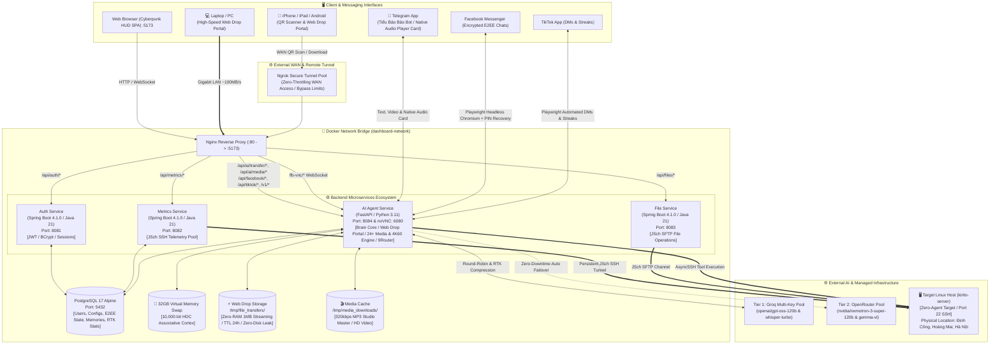
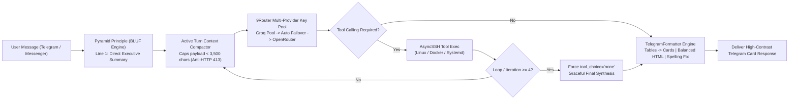
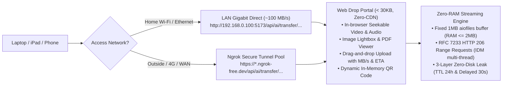
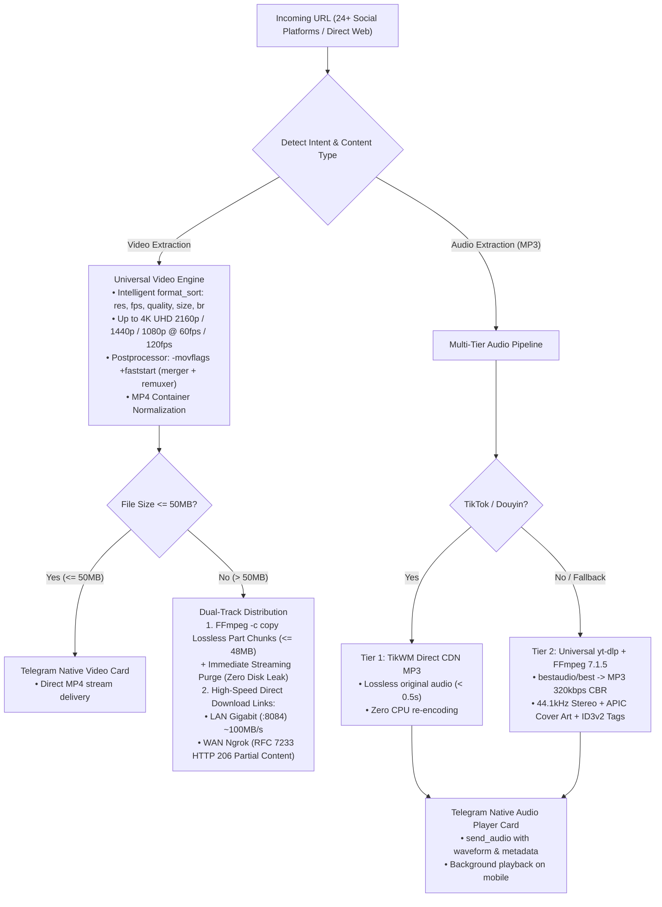
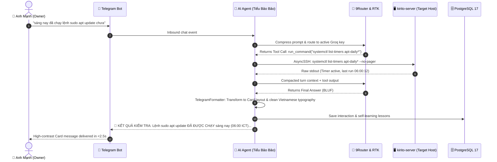

# Mini Server Dashboard — Sci-Fi Cyberpunk Edition

[](https://spring.io/projects/spring-boot)
[](https://www.oracle.com/java/)
[](https://www.python.org/)
[](https://fastapi.tiangolo.com/)
[](https://react.dev/)
[](https://vitejs.dev/)
[](https://www.postgresql.org/)
[](https://www.docker.com/)
[](./docs/security.md)
[](./LICENSE)

> **A modern, self-hosted, real-time Linux server monitoring & autonomous management ecosystem featuring a futuristic Cyberpunk / Sci-Fi HUD interface.**  
> Connect securely to any remote Linux host over SSH with **zero agent installation** on the target machine. Monitor system metrics, processes, services, containers, files, logs, and interact via an **autonomous Neuromorphic AI Assistant ("Tiểu Bảo Bảo")** featuring biological neurochemistry, multimodal video analysis, Ultra-HD 4K 60fps & Studio Master 320kbps MP3 extraction from 24+ social platforms with Telegram Native Audio Cards & Dual-Track Distribution, high-speed dual-link (LAN 1Gbps / WAN Ngrok) Web Drop Portal, regional Vietnamese dialect understanding, 32GB Virtual Memory Swap, and enterprise-grade CodeQL 0-alert security hardening across Telegram and Facebook Messenger E2EE.

---

## 📑 Table of Contents

- [Overview](#-overview)
- [System Topology & High-Level Architecture](#-system-topology--high-level-architecture)
- [Screenshots / Demo](#-screenshots--demo)
- [Key Features & Visual Workflows](#-key-features--visual-workflows)
  - [1. Autonomous AI Assistant ("Tiểu Bảo Bảo")](#1-autonomous-ai-assistant-tiểu-bảo-bảo)
  - [2. High-Speed Dual-Link Web Drop Portal](#2-high-speed-dual-link-web-drop-portal-zero-ram--zero-throttling)
  - [3. Universal 24+ Platform Media Pipeline (4K 60fps & 320kbps MP3)](#3-universal-24-platform-media-pipeline-4k-60fps--320kbps-mp3)
  - [4. CodeQL Zero-Vulnerability Security Architecture](#4-codeql-zero-vulnerability-security-architecture)
- [End-to-End Operational Lifecycle](#-end-to-end-operational-lifecycle)
- [Microservices & Tech Stack](#-microservices--tech-stack)
- [Project Directory Structure](#-project-directory-structure)
- [Getting Started & Installation](#-getting-started--installation)
  - [Prerequisites](#prerequisites)
  - [1. Clone & Configure Environment](#1-clone--configure-environment)
  - [2. Deploy with Docker Compose](#2-deploy-with-docker-compose-recommended)
  - [3. Local Development (Hot Reload)](#3-local-development-hot-reload)
  - [4. Running Unit Tests](#4-running-unit-tests)
- [Documentation Index](#-documentation-index)
- [Author & Core Architecture](#-author--core-architecture)
- [Contributors & Community](#-contributors--community)
- [License](#-license)

---

## 🌟 Overview

**Mini Server Dashboard** delivers a complete single-pane-of-glass operational suite designed for sysadmins, DevOps engineers, and self-hosters who demand both deep operational control and top-tier aesthetic excellence.

### Core Philosophy

1. **Zero Target Footprint (Agentless):** No daemon, agent, or extra process needs to be installed on target Linux servers. The backend connects via SSH (`JSch` / `AsyncSSH`) and collects real-time telemetry through standard Linux utilities (`top`, `free`, `df`, `sensors`, `ps`, `systemctl`, `docker`, `ss`, `journalctl`).
2. **Autonomous Neuromorphic AI Agent ("Tiểu Bảo Bảo"):** Powered by an artificial cognitive architecture simulating 6 biological neurochemicals, Karl Friston Active Inference, 10,000-bit Hyperdimensional Computing on 32GB Virtual Swap, multimodal video analysis, and dual-tier LLM routing (Groq + OpenRouter) that operates 24/7 over Telegram and Facebook Messenger E2EE.
3. **Immersive Cyberpunk Sci-Fi HUD:** Replaces mundane flat dashboards with a dynamic, neon-lit HUD interface featuring interactive 3D connectome visualizers, SVG crosshair cursors, audio-synthesized tactile feedback, canvas shockwaves, and a 3D orthographic globe.

---

## 🏗 System Topology & High-Level Architecture



---

## 📸 Screenshots / Demo

### 1. System Overview Dashboard (`/`)

Real-time KPI metric cards, CPU & RAM donut gauges, multi-core temperature sensors, disk partition usage, and fan HUD.


### 2. Process Explorer (`/processes`)

Live Linux process monitor with column sorting, CPU/Memory threshold filters, process termination modal, and 1-click CSV export.


### 3. Services & Docker Runtime Center (`/services`)

Start/stop/restart systemd units, inspect Docker containers, view live streaming container logs, and monitor scheduled system timers.


### 4. Interactive Web SSH Terminal Console (`/terminal`)

Embedded web terminal with command history, security sandbox, and 1-click Quick Command Macro Chips.


### 5. Control Center & Settings (`/settings`)

Configure critical alert threshold sliders, global refresh speeds, Telegram/Facebook AI agent preferences, and Sci-Fi visual effects.


### 6. Neuromorphic Brain Core Inspection Deck (`/brain-core`)

Live Cyberpunk inspection deck visualizing 6 biological neurochemicals, 2D Russell Circumplex radar, Karl Friston Active Inference Free Energy, Global Workspace spotlight, and 3D Neural Connectome visualizer.


---

## 🚀 Key Features & Visual Workflows

### 1. Autonomous AI Assistant ("Tiểu Bảo Bảo")



- **Pyramid Principle / BLUF Thinking Architecture:** Direct answer on line 1, verified card breakdown in the body, concise technical insights at the end.
- **Telegram Native Formatter Engine v2.0 (`TelegramFormatter`):** Converts Markdown tables into mobile-friendly bullet cards, whitelists valid Telegram HTML tags (`<b>`, `<i>`, `<code>`, `<pre>`, `<blockquote>`, `<a>`), and auto-balances unclosed tags.
- **Anti-Loop Circuit Breaker & Context Compactor:** Dynamically compacts older tool outputs, keeping payload under 3,500 characters (~900 tokens) while allocating up to 8,000 characters for media attachments to eliminate Groq `HTTP 413 Payload Too Large` errors.
- **Neuromorphic Cognitive Brain Core (`BrainCore`):** Implements homeostatic regulation of 6 biological neurochemicals (Dopamine, Noradrenaline, Serotonin, Cortisol, Oxytocin, Endorphins), Karl Friston Active Inference (FEP), 2D Russell Circumplex emotional radar, and two-stage SWS/REM sleep memory consolidation.
- **32GB Virtual Memory Hyperdimensional Cortex (HDC):** 10,000-bit binary hypervectors mapped directly to 32GB Linux swap space via zero-copy `mmap` for instant associative concept recall in <5ms without physical RAM exhaustion.
- **Multimodal Video & Audio Intelligence Pipeline:** Dual-track parallel processing of Telegram video uploads combining mono audio extraction (Whisper STT with visual-informed vocabulary biasing) and 5-keyframe uniform sampling (Qwen-VL / Gemma-VL OCR) with Cross-Modal Discrepancy Resolution.
- **Vietnamese Regional Dialect Normalizer:** Fluent comprehension of Central Vietnam dialects (Nghệ An, Hà Tĩnh, Quảng Bình) and teencode, guarded by structured envelope bypass filters.
- **High-Speed Multi-Tier Archive Cracker:** 4-tier autonomous password recovery engine (Flash check, Context clues, PIN sweep, Dictionary) running under low-priority `nice -n 19`.
- **Ground Truth Physical Location Metadata:** Configured on-premise location: **Định Công, Hoàng Mai, Hà Nội, Việt Nam** (FPT Telecom, LAN: `192.168.0.100`).
- **Facebook Messenger E2EE Automation:** Playwright Chromium automation with automated 6-digit PIN decryption, absence auto-reply, and automatic message unsend when the owner replies.
- **TikTok Automation & Long-Term Memory:** Automated daily streak keeper, proactive appointment reminders, and PostgreSQL-backed self-learning brain (`AgentMemoryService`).

### 2. High-Speed Dual-Link Web Drop Portal (Zero-RAM & Zero-Throttling)



- **Dual-Link Gigabit LAN & WAN Tunnel:** Automatically discovers and generates parallel links: Gigabit LAN (`http://192.168.0.100:5173/...`) for ultra-fast local transfers ($\sim 100\text{MB/s}$) and WAN Ngrok Tunnel for remote access anywhere without port forwarding.
- **Fixed-Buffer Zero-RAM Chunked Disk Streaming:** Employs an asynchronous 1MB buffer via `aiofiles`, capping RAM consumption to $\le 2\text{MB}$ per connection and safeguarding `kirito-server`'s 3.2GB RAM ceiling during multi-gigabyte transfers.
- **RFC 7233 HTTP 206 Partial Content & Zero-Throttling:** Full support for byte-range headers (`bytes=start-end`, `bytes=start-`, `bytes=-suffix`) enabling multi-threaded download acceleration (IDM, Aria2) and instant in-browser seeking without waiting for full downloads. Valid transfer tokens automatically bypass application rate limits.
- **Zero-CDN Responsive Web Drop Portal (< 30KB):** Ultra-lightweight, 100% self-contained HTML5/CSS3/Vanilla JS UI with inline SVGs, automatic Dark/Light theme, $\ge 44\text{px}$ touch targets for iOS/iPadOS, and drag-and-drop chunked uploads with real-time MB/s speedometer and ETA calculation.
- **Rich In-Browser Previews:** Embedded HTML5 video player with HTTP 206 seek, native audio player, full-screen image lightbox, and PDF previewer.
- **In-Memory Dynamic QR Code Generator:** Generates PNG QR codes directly in RAM via `io.BytesIO` (`/api/ai/transfer/qr/{token}`) for instant camera scanning from phones and tablets without disk overhead.
- **3-Layer Zero-Disk Leak Lifecycle:** Automated disk sanitation via 15-minute background sweeper, on-access expiration checks, and a 30-second delayed grace cleanup for one-time downloads (`one_time=True`).

### 3. Universal 24+ Platform Media Pipeline (4K 60fps & 320kbps MP3)



- **Universal Support for 24+ Social Platforms & Generic Sites:** Seamless ingestion across TikTok, Douyin, YouTube (Shorts/Watch), Facebook (Reels/Watch/Posts), Instagram (Reels/Stories/Posts), Twitter/X, Threads, SoundCloud, Reddit, Bilibili, Pinterest, Kuaishou, Vimeo, Dailymotion, Twitch, Kick, Bluesky, Tumblr, Mastodon, Lemon8, CapCut, Weibo, XiaoHongShu, LinkedIn, and generic video links via the intelligent Universal Extractor fallback.
- **Maximum Resolution & High Frame Rate Video Engine (4K / 60fps):**
  - **Intelligent Format Sorting:** Prioritizes native resolution and true high frame rates with `format_sort: ["res", "fps", "quality", "size", "br"]` and `format: "bestvideo+bestaudio/best"`, extracting 4K UHD (2160p), 2K QHD (1440p), and 1080p Full HD at authentic 60fps/120fps without downscaling or codec penalization.
  - **Instant In-Browser / Mobile Playback (`faststart`):** Employs ISO-BMFF box reordering via FFmpeg `-movflags +faststart` across both merger and video remuxer post-processors, relocating the `moov` atom ahead of `mdat` for zero-buffering instant playback.
  - **Smart Enclosure Stripping & Parameter Cleaning:** Automatically strips surrounding markdown, brackets, and tracking telemetry (`?si=`, `?mibextid=`, `?utm_*`) to maximize platform cache hits.
- **Dual-Track Distribution Architecture:**
  - **Direct Telegram Send ($\le 50\text{MB}$):** Sent directly via Telegram Video with native resolution and duration metadata.
  - **Lossless Part-Chunking & Direct Accelerated Links ($> 50\text{MB}$):** Large videos are losslessly sliced into $\le 48\text{MB}$ chunks using FFmpeg stream copy (`-c copy`) and sequentially dispatched to Telegram with immediate file purging (`os.unlink`). Concurrently, two accelerated direct download URLs are provided: Gigabit LAN (`http://192.168.0.100:8084/...`) and WAN Ngrok Tunnel, fully supporting RFC 7233 HTTP 206 Partial Content (multi-threaded IDM/Aria2 acceleration and instant timeline seeking).
- **Studio Master MP3 320kbps CBR Audio Extraction:**
  - **Tier 1 (TikTok/Douyin):** Direct CDN MP3 extraction via TikWM API ($< 0.5\text{s}$, zero CPU transcoding, original artist bitrate).
  - **Tier 2 (Universal 24+ Platforms):** `yt-dlp` extraction transcoded via FFmpeg 7.1.5 to constant 320kbps CBR MP3 at 44.1kHz stereo with embedded APIC album art and ID3v2 metadata.
- **Enterprise-Grade DoS Defenses & Concurrency Controls:**
  - Infinite livestreams (`is_live=True`) and videos exceeding 2 hours ($> 7,200\text{s}$) are rejected up-front to safeguard host compute and disk resources.
  - Downloads are gated by an `asyncio.Semaphore(2)` concurrency limit and stream to NVMe SSD in 64KB chunks to maintain physical memory overhead strictly under 15MB.
- **Telegram Native Audio Player Cards (`send_audio`):** Interactive player card with real-time waveform graphics, artist, title, duration, and seamless background lock-screen playback on iOS and Android.

### 4. CodeQL Zero-Vulnerability Security Architecture

- **PathSanitizer Barrier (`os.path.commonpath`):** Employs invariant geometric path checks `os.path.commonpath([base_dir, safe_path]) == base_dir and safe_path != base_dir` across all transfer and media endpoints, eliminating Path Traversal and Directory Injection.
- **Local Filesystem Directory Enumeration (`Path.iterdir()`):** Eradicates static analysis taint flows by resolving target directories strictly from active local filesystem entries rather than user-supplied strings.
- **Zero-Reflected Data Anti-XSS Design:** 404/Error HTML templates never reflect untrusted user strings back into response markup, completely mitigating Reflective XSS vulnerabilities (`py/reflective-xss`).
- **Cryptographic Filename & Token Sanitization:** Strict regex token validation (`^[A-Za-z0-9_-]{16,64}$`), control-character stripping, and atomic file replacement (`os.replace` via `.tmp` files).

---

## 🔄 End-to-End Operational Lifecycle



---

## 🛠 Microservices & Tech Stack

| Component | Framework / Technology | Version | Purpose |
| --- | --- | --- | --- |
| **Frontend** | React + Vite + Three.js + Tailwind | React 19 / Vite 8 | Cyberpunk Sci-Fi SPA, Brain Core HUD & 3D Connectome |
| **Auth Service** | Spring Boot + Spring Security | 4.1.0 (Java 21) | JWT Authentication, User Verification |
| **Metrics Service** | Spring Boot + JSch SSH | 4.1.0 (Java 21) | Real-time SSH Telemetry, System Control |
| **File Service** | Spring Boot + JSch SFTP | 4.1.0 (Java 21) | Remote File Navigation & Operations |
| **AI Agent Service** | FastAPI + Playwright + AsyncSSH | Python 3.11 | Neuromorphic AI Agent ("Tiểu Bảo Bảo"), Brain Core, Multimodal Video Pipeline |
| **Database** | PostgreSQL Alpine | 17 | User Auth, Configs, E2EE Thread State & Brain Memory |
| **Virtual Memory Swap** | Linux NVMe Swap via `mmap` | 32 GB | 10,000-bit HDC Associative Virtual Cortex Storage |
| **Visual Bridge** | Xvfb + x11vnc + noVNC | — | Web-based GUI stream for Headless Browser |
| **Reverse Proxy** | Nginx Alpine | latest | Static Asset Serving & `/api/*` Routing |

---

## 📁 Project Directory Structure

```text
quan_ly_server/
├── .agents/                              # AI Agent workflows & operational guides
├── .env.example                          # Safe environment configuration template
├── docker-compose.yml                    # Multi-container orchestration specification
├── docs/                                 # Complete technical documentation suite
│   ├── README.md                         # Documentation index & architecture summary
│   ├── architecture.md                   # System topology & communication patterns
│   ├── file-transfer-portal.md           # High-Speed Dual-Link Web Drop Portal (< 30KB, Zero-RAM, RFC 7233)
│   ├── MEDIA_PIPELINE_ARCHITECTURE_V2.md # Multi-platform media & 320kbps Studio Master MP3 pipeline
│   ├── neuromorphic-brain.md             # Neuromorphic Brain Core, 6 Neurotransmitters, 32GB HDC
│   ├── multimodal-video-pipeline.md      # Dual-track video/audio pipeline & cross-modal resolution
│   ├── api-reference.md                  # REST API & Gateway specifications (Transfer, Media, Brain, Auth)
│   ├── backend-internals.md              # Spring Boot & FastAPI architectural details & tool delegation
│   ├── database-and-auth.md              # PostgreSQL 17 schema & JWT auth lifecycle
│   ├── deployment.md                     # Production deployment & hardening guide
│   ├── frontend-internals.md             # React 19, Brain Core HUD, D3 Globe & Sci-Fi HUD engine
│   ├── security.md                       # Security model, CodeQL 0-alert hardening & sandboxing
│   ├── system-automation.md              # Background schedulers, cognitive heartbeat & dream engine
│   ├── telegram-ai-agent.md              # Autonomous AI Agent, 9Router, Dialect normalizer, E2EE
│   └── troubleshooting.md                # Diagnostic runbooks & recovery handbook
├── frontend/                             # React 19 + Vite 8 SPA
│   ├── src/pages/                        # Dashboard, BrainCore, Processes, Services, Terminal, etc.
│   ├── src/components/brain/             # 3D Neural Connectome, Neurotransmitter Gauges, Russell Radar
│   ├── src/components/agents/            # TikTokAgentTab, AiAgentVncModal, AgentUiControls
│   ├── src/components/                   # SciFi HUD components, SciFiIcons, Terminal, etc.
│   └── nginx.conf                        # Nginx reverse proxy configuration
├── services/
│   ├── auth-service/                     # Spring Boot JWT authentication microservice
│   ├── metrics-service/                  # Spring Boot JSch telemetry microservice
│   ├── file-service/                     # Spring Boot SFTP file operations microservice
│   └── ai-agent-service/                 # FastAPI Python AI Agent & 9Router service
│       ├── app/core/                     # Brain Core (HDC/FEP), Vietnamese Dialect, Telegram Formatter, SSH client
│       ├── app/routers/                  # FileTransfer, MediaDownloader, Brain, Facebook, TikTok, OpenAI Gateway
│       └── app/services/                 # TransferStorage, WebPortalTemplate, QRGenerator, AudioPipeline, AiAgent
└── db/                                   # Database migration scripts & PostgreSQL config
```

---

## 🚀 Getting Started & Installation

### Prerequisites

- **Docker & Docker Compose V2** (Installed on production host)
- **Target Linux Server** with SSH access (OpenSSH server enabled)
- Optional: **Groq API Key** / **OpenRouter API Key** (for AI Agent features)
- Optional: **Telegram Bot Token** (for Telegram Bot automation)

### 1. Clone & Configure Environment

```bash
git clone https://github.com/tranvanmanh9325/quan_ly_server.git
cd quan_ly_server

# Copy environment template
cp .env.example .env

# Edit environment variables
nano .env
```

Key environment settings:

```dotenv
SSH_HOST=192.168.0.100
SSH_PORT=22
SSH_USER=kirito
SSH_PASSWORD=your_ssh_password

# Ground truth physical server metadata
SERVER_PHYSICAL_LOCATION="Định Công, Hoàng Mai, Hà Nội, Việt Nam"
SERVER_ISP="FPT Telecom"
SERVER_OWNER="Trần Văn Mạnh (kirito)"

# Telegram & AI Agent Key Pool
TELEGRAM_BOT_TOKEN=your_telegram_bot_token
TELEGRAM_CHAT_ID=your_chat_id
GROQ_API_KEY=gsk_your_groq_key
OPENROUTER_API_KEY=sk-or-v1-your_openrouter_key
```

### 2. Deploy with Docker Compose (Recommended)

```bash
# Build and start all 6 containers in detached mode
docker compose up -d --build

# Check status of all microservices
docker compose ps
```

Once running, access the dashboard at:

- **Web Dashboard:** `http://<server-ip>:5173`
- **noVNC Visual Console:** `http://<server-ip>:6080/vnc.html`

### 3. Local Development (Hot Reload)

```bash
# Frontend (Vite hot-reload)
cd frontend && npm install && npm run dev

# AI Agent Service (Python FastAPI)
cd services/ai-agent-service
pip install -r requirements.txt
uvicorn app.main:app --host 0.0.0.0 --port 8084 --reload
```

### 4. Running Unit Tests

```bash
# Run AI Agent & Telegram Formatter unit tests inside container
docker exec dashboard_ai_agent python -m unittest discover -v -s /app/tests

# Run frontend tests
cd frontend && npm test
```

---

## 📚 Documentation Index

| Topic | Document |
| --- | --- |
| **System Architecture** | [docs/architecture.md](./docs/architecture.md) |
| **High-Speed File Transfer & Web Drop Portal** | [docs/file-transfer-portal.md](./docs/file-transfer-portal.md) |
| **Media Pipeline V2 (Video & 320kbps MP3)** | [docs/MEDIA_PIPELINE_ARCHITECTURE_V2.md](./docs/MEDIA_PIPELINE_ARCHITECTURE_V2.md) |
| **Neuromorphic Brain Core (6 Neurotransmitters & 32GB HDC)** | [docs/neuromorphic-brain.md](./docs/neuromorphic-brain.md) |
| **Multimodal Video & Audio Intelligence Pipeline** | [docs/multimodal-video-pipeline.md](./docs/multimodal-video-pipeline.md) |
| **Complete API Reference** | [docs/api-reference.md](./docs/api-reference.md) |
| **AI Agent & 9Router Ecosystem** | [docs/telegram-ai-agent.md](./docs/telegram-ai-agent.md) |
| **Backend Microservices Internals** | [docs/backend-internals.md](./docs/backend-internals.md) |
| **Database & JWT Authentication** | [docs/database-and-auth.md](./docs/database-and-auth.md) |
| **Frontend & HUD Engine** | [docs/frontend-internals.md](./docs/frontend-internals.md) |
| **System Automation & Schedulers** | [docs/system-automation.md](./docs/system-automation.md) |
| **Production Deployment Guide** | [docs/deployment.md](./docs/deployment.md) |
| **Security Hardening & CodeQL Zero-Alerts** | [docs/security.md](./docs/security.md) |
| **Troubleshooting & Diagnostics** | [docs/troubleshooting.md](./docs/troubleshooting.md) |

---

## 👨‍💻 Author & Core Architecture

The **Kirito Server Dashboard & Autonomous AI Agent Ecosystem** was conceptualized, designed, and developed by **Trần Văn Mạnh (Kirito)**.

<div align="center">

<a href="https://github.com/tranvanmanh9325">
  
</a>

### **Trần Văn Mạnh (Kirito)**

Project Founder, Core Maintainer & Lead Software Architect

[](https://github.com/tranvanmanh9325)
[](mailto:manhtrana1k45tl@gmail.com)
[](https://hust.edu.vn)
[](https://maps.google.com)

</div>

---

## 👥 Contributors & Community

We believe in open collaboration and recognize all community contributions following the **[All-Contributors](https://allcontributors.org/)** specification.

See the complete list of contributors, emoji keys, and recognition badges in [**`CONTRIBUTORS.md`**](./CONTRIBUTORS.md).

<!-- ALL-CONTRIBUTORS-LIST:START - Do not remove or modify this section -->
<!-- prettier-ignore-start -->
<!-- markdownlint-disable -->
<table>
  <tbody>
    <tr>
      <td align="center" valign="top" width="20%"><a href="https://github.com/tranvanmanh9325"><br /><sub><b>Trần Văn Mạnh (Kirito)</b></sub></a><br /><a href="#creator-tranvanmanh9325" title="Project Creator">👑</a> <a href="https://github.com/tranvanmanh9325/quan_ly_server/commits?author=tranvanmanh9325" title="Code">💻</a> <a href="#architecture-tranvanmanh9325" title="Architecture & System Design">🏗️</a> <a href="#maintenance-tranvanmanh9325" title="Maintenance & Operations">🚧</a> <a href="#ideas-tranvanmanh9325" title="Ideas & Conception">💡</a> <a href="#security-tranvanmanh9325" title="Security & Hardening">🛡️</a> <a href="https://github.com/tranvanmanh9325/quan_ly_server/commits?author=tranvanmanh9325" title="Documentation">📖</a> <a href="#design-tranvanmanh9325" title="Cyberpunk UI/UX Design">🎨</a></td>
    </tr>
  </tbody>
</table>

<!-- markdownlint-restore -->
<!-- prettier-ignore-end -->
<!-- ALL-CONTRIBUTORS-LIST:END -->

Interested in contributing? Check out our [**Contributing Guide (CONTRIBUTING.md)**](./CONTRIBUTING.md) to get started!

---

## 📄 License

Distributed under the **MIT License**. See [LICENSE](./LICENSE) for details.
