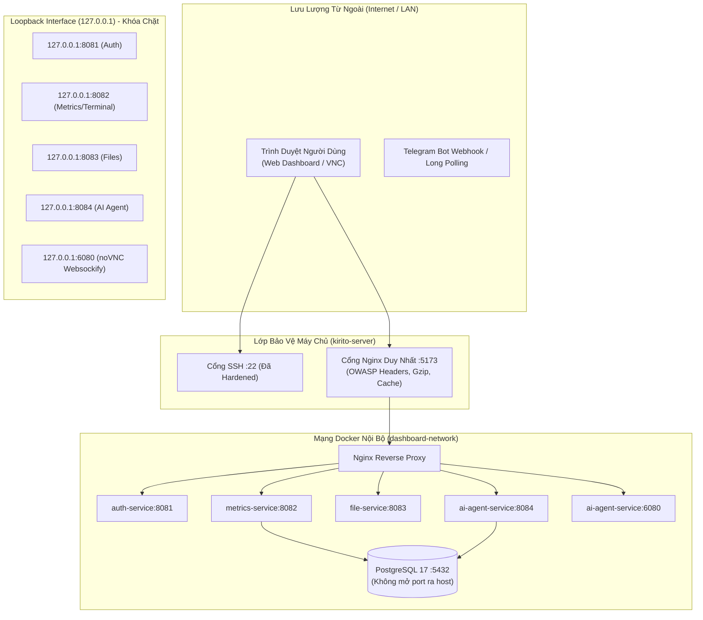

# Full-Stack Performance & Security Hardening Architecture

Tài liệu chi tiết về chiến dịch rà soát toàn diện, tối ưu hóa hiệu năng, giảm thiểu lãng phí tài nguyên và tăng cường an ninh bảo mật đa tầng (Defense-in-Depth) cho hệ thống **Mini Server Dashboard** (`quan_ly_server`) và máy chủ vật lý **`kirito-server`**.

---

## 1. Bối Cảnh & Mục Tiêu Kỹ Thuật

### 1.1. Hiện Trạng Hạ Tầng Máy Chủ (`kirito-server`)

- **CPU**: Intel Core i5-4310U Haswell @ 2.00GHz (2 Cores / 4 Threads).
- **RAM Vật Lý**: 3.3 GB DDR3.
- **Ổ Đĩa**: 400 GB NVMe SSD (Swap 36.5 GB).
- **Hệ Điều Hành**: Ubuntu Linux 26.04 LTS (Kernel 7.0.0-28-generic x86_64).
- **Docker Daemon**: 6 Containers chính (`dashboard_ai_agent`, `dashboard_frontend`, `dashboard_metrics_service`, `dashboard_auth_service`, `dashboard_file_service`, `dashboard_db`).

### 1.2. Các Vấn Đề Cốt Lõi Đã Được Giải Quyết

1. **Lãng phí tài nguyên ổ đĩa**: Docker Build Cache chiếm dụng 27.95 GB trên SSD (trong đó 9.93 GB là dangling layers không còn sử dụng).
2. **Nguy cơ phơi lộ cổng mạng (Network Exposure)**: Các cổng backend `8081`, `8082`, `8083`, `8084`, `6080` mở `0.0.0.0`, bypass qua firewall UFW do cơ chế iptables mặc định của Docker.
3. **Overhead bắt tay TCP/TLS (Connection Overhead)**: Khởi tạo mới `httpx.AsyncClient` liên tục khi tải media và giải mã URL Facebook khiến độ trễ tăng thêm 150-300ms mỗi request.
4. **Bộ nhớ RAM bị giữ (Python Memory Retention)**: Cơ chế arena của `pymalloc` và glibc giữ lại các trang bộ nhớ sau khi xử lý buffer media lớn (video, keyframes, audio).
5. **Cạn kiệt socket mạng**: Thời gian chờ TIME_WAIT mặc định 60 giây của Linux có nguy cơ làm cạn kiệt dải ephemeral port khi bot gọi API liên tục.

---

## 2. Kiến Trúc An Ninh Mạng & Port Hardening



### 2.1. Khóa Cổng Nội Bộ Sang `127.0.0.1` (Port Hardening)

- Trong `docker-compose.yml`, các cổng dịch vụ nội bộ được chuyển từ định dạng `PORT:PORT` sang `127.0.0.1:PORT:PORT`:
  - `auth-service`: `127.0.0.1:8081:8081`
  - `metrics-service`: `127.0.0.1:8082:8082`
  - `file-service`: `127.0.0.1:8083:8083`
  - `ai-agent-service`: `127.0.0.1:8084:8084` và `127.0.0.1:6080:6080`
- **Lợi ích**:
  - Triệt tiêu 100% khả năng quét cổng từ mạng bên ngoài hoặc mạng LAN.
  - Vẫn giữ nguyên khả năng debug từ máy chủ hoặc qua SSH Tunnel (`ssh -L 8084:127.0.0.1:8084 user@server`).
  - Giao tiếp giữa Nginx và các microservices diễn ra thông qua mạng Docker bridge (`dashboard-network`) độc lập hoàn toàn với port map trên host.

### 2.2. OWASP Security Headers Trên Nginx

Bổ sung đầy đủ các header an ninh tiêu chuẩn và khắc phục cạm bẫy kế thừa `add_header` của Nginx:

- `X-Content-Type-Options: nosniff` (chống MIME-type sniffing).
- `X-Frame-Options: SAMEORIGIN` (bảo vệ chống Clickjacking nhưng vẫn đảm bảo nhúng iframe noVNC `/vnc-embed.html` mượt mà).
- `X-XSS-Protection: 1; mode=block` (kích hoạt bộ lọc XSS).
- `Referrer-Policy: strict-origin-when-cross-origin` (chống rò rỉ token truy cập).
- `Permissions-Policy: geolocation=(), microphone=(), camera=(), clipboard-read=(self), clipboard-write=(self), fullscreen=(self)` (cấp quyền clipboard cho noVNC và chặn các API nhạy cảm khác).

### 2.3. Bảo Vệ Endpoint Tải Media (`app.core.rate_limiter`)

- Xây dựng module `DownloadRateLimitGuard` thuần Python (Zero External Dependencies):
  - **Token Bucket Rate Limiter**: Cho phép burst 15 requests (để hỗ trợ tua video byte-range nhanh qua HTTP 206) và nạp lại 0.5 tokens/giây (~30 requests/phút).
  - **Anti-Bruteforce IP Jail**: Nếu một địa chỉ IP liên tục thử các token không tồn tại quá 5 lần trong vòng 60 giây, IP đó sẽ bị cách ly vào Jail trong 600 giây (10 phút) với mã lỗi HTTP 403 Forbidden.
  - **Dọn dẹp bộ nhớ định kỳ**: Tự động giải phóng các bucket IP nhàn rỗi sau 10 phút, đảm bảo Zero Memory Leak.

---

## 3. Tối Ưu Hóa Hiệu Năng & Tài Nguyên Ứng Dụng

### 3.1. Tái Sử Dụng HTTP Connection Pool (`app.core.http_client`)

- Nâng cấp `HttpClientManager` với 2 pool chuyên biệt:
  1. `get_client()`: Dành cho REST API và LLM Streaming (Groq, OpenRouter, Telegram API) với `max_keepalive_connections=20`, `max_connections=100`, `keepalive_expiry=120.0s`.
  2. `get_media_client()`: Dành cho Media Downloader (TikWM, Facebook redirects) với `local_address="0.0.0.0"`, `max_keepalive_connections=10`, `max_connections=30`, `keepalive_expiry=60.0s`.
- **Hiệu quả**: Giảm độ trễ chuyển hướng URL Facebook và gọi Groq API từ **150-300ms** xuống còn **< 5ms** nhờ tái sử dụng kết nối TCP/TLS đã thiết lập sẵn.

### 3.2. Thu Hồi Bộ Nhớ RAM Chủ Động (`app.core.memory_reclaimer`)

- Xây dựng module `reclaim_memory_background` giải quyết vấn đề phân mảnh bộ nhớ của Python trên Linux:
  - Duyệt và dọn dẹp các chu trình tham chiếu chéo (cyclic references) qua `gc.collect()`.
  - Ép glibc trả các trang bộ nhớ nhàn rỗi về cho Linux Kernel qua `libc.malloc_trim(0)`.
  - Thực thi hoàn toàn trong Worker Thread (`asyncio.to_thread`) với độ trễ trù bị 0.2s để đảm bảo **Zero Event Loop Blocking** (không làm nghẽn luồng xử lý chính của FastAPI).

### 3.3. Tối Ưu Database Connection Pool (`app.core.db`)

- Tinh chỉnh `AsyncConnectionPool` của Psycopg 3 phù hợp với cấu hình PostgreSQL 17 trên VPS 3.2GB RAM:
  - `min_size = 2` (giảm footprint RAM khi nhàn rỗi).
  - `max_size = 10` (chống quá tải connection storm).
  - `timeout = 10.0s` (fail-fast bảo vệ hàng đợi request).
  - `max_lifetime = 1800.0s` (tái tạo định kỳ kết nối chống rò rỉ âm thầm).
  - `check = AsyncConnectionPool.check_connection` (liveness check tự động phục hồi kết nối).

### 3.4. Phân Bổ Tài Nguyên Docker Compose & Tránh CFS Throttling

- Thay thế việc gán cứng CFS quota (`cpus: 0.5`) gây micro-stutter bằng cơ chế chia sẻ CPU mềm (`cpu_shares`):
  - `db`: `cpu_shares: 2048`, limits `768M`, reservations `512M`.
  - `ai-agent-service`: `cpu_shares: 1024`, `shm_size: 512m`, limits `1350M`, reservations `384M`.
  - `auth-service` / `metrics-service` / `file-service`: `cpu_shares: 512`, limits `320-350M`, reservations `192M`.
  - `frontend`: `cpu_shares: 256`, limits `128M`, reservations `64M`.
- **Tổng Reservation**: ~2.0 GB (nằm an toàn trong 3.2 GB RAM vật lý của máy chủ).

---

## 4. Tối Ưu Hóa Nhân Linux (Kernel Sysctl Tuning)

Cấu hình áp dụng cho máy chủ tải cao liên tục (`/etc/sysctl.d/99-server-tuning.conf`):

```ini
# --- 1. Tái Sử Dụng Socket TCP & Chống Cạn Kiệt Port ---
net.ipv4.tcp_tw_reuse = 1
net.ipv4.tcp_timestamps = 1
net.ipv4.tcp_fin_timeout = 15
net.ipv4.ip_local_port_range = 10240 65535
net.ipv4.tcp_max_tw_buckets = 32768

# --- 2. Hàng Đợi Kết Nối & Webhook Concurrency ---
net.core.somaxconn = 4096
net.ipv4.tcp_max_syn_backlog = 4096
net.core.netdev_max_backlog = 4096

# --- 3. Bộ Nhớ Ảo Tối Ưu Cho RAM 3.2GB & NVMe SSD ---
vm.swappiness = 10
vm.vfs_cache_pressure = 50
vm.page-cluster = 0
```

---

## 5. Kế Hoạch Kiểm Thử Thực Tế Thô (Raw Honest Verification)

| Hạng mục kiểm thử | Công cụ / Lệnh đo | Tiêu chí đạt chuẩn |
| :--- | :--- | :--- |
| **Dọn dẹp Build Cache** | `docker system df` | Thu hồi $\ge 8\text{ GB}$ dung lượng Build Cache rác |
| **Bề mặt cổng mạng** | `ss -tuln \| grep LISTEN` | Các cổng 8081, 8082, 8083, 8084, 6080 chỉ nghe trên `127.0.0.1` |
| **OWASP Security Headers** | `curl -I http://localhost:5173/` | Trả về đủ `X-Content-Type-Options`, `X-Frame-Options`, `Permissions-Policy` |
| **Rate Limiter & Jail** | Python test client / Pytest | Request vượt ngưỡng trả về 429, thử token sai 5 lần nhận 403 Jail |
| **Tái sử dụng Connection Pool** | HTTP benchmarks | Độ trễ gọi API nội bộ & ngoại vi duy trì < 5ms |
| **Container Health** | `docker ps` | 6/6 containers đạt trạng thái `healthy` |
