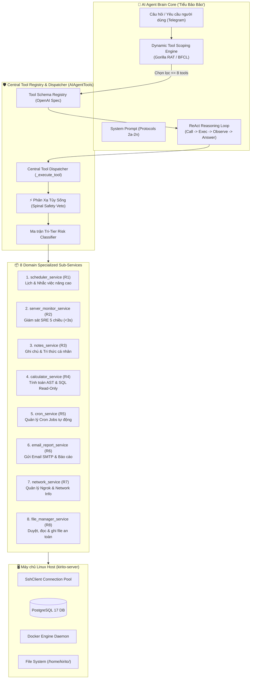
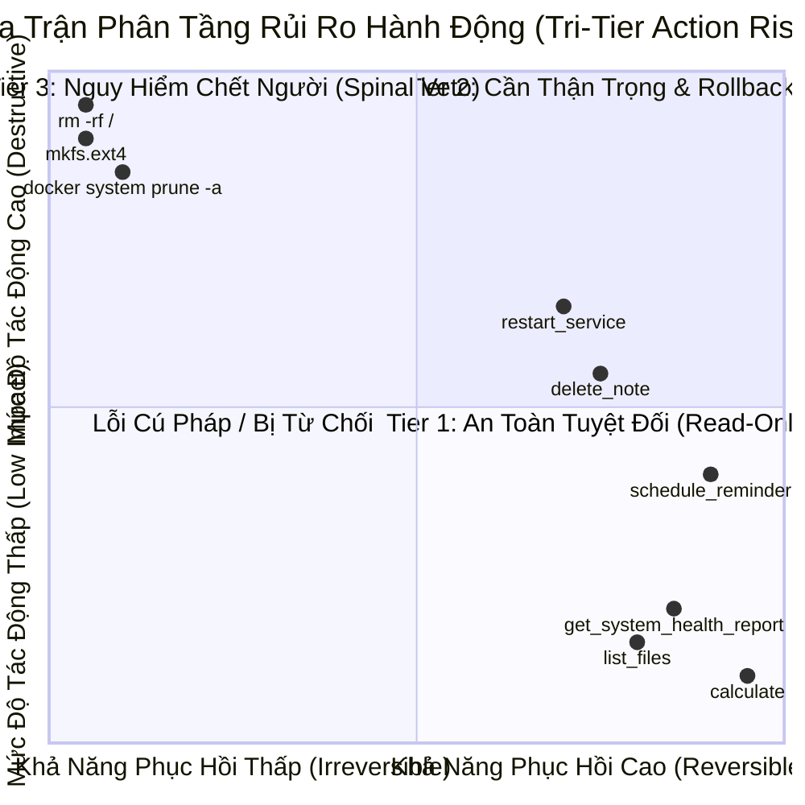

# BỘ CÔNG CỤ TOÀN DIỆN CHO AI AGENT TIỂU BẢO BẢO (AI AGENT TOOL REGISTRY)

Tài liệu kỹ thuật chi tiết về kiến trúc đăng ký công cụ (Tool Registry), cơ chế phân cụm ngữ cảnh động (Dynamic Tool Scoping), ma trận phân tầng an toàn ba cấp (Tri-Tier Action Risk Matrix) và danh mục 27 công cụ quản trị hệ thống chuyên sâu cho AI Agent Tiểu Bảo Bảo trong hệ sinh thái `quan_ly_server`.

---

## 1. Tổng quan Kiến trúc (Architecture Overview)

Hệ thống công cụ của AI Agent Tiểu Bảo Bảo được thiết kế dựa trên mô hình **Modular Facade Pattern**:



### Các nguyên tắc thiết kế then chốt:
1. **Facade Tập Trung (`ai_agent_tools.py`)**: `AgentToolExecutor` đóng vai trò cổng giao tiếp duy nhất giữa mô hình ngôn ngữ lớn (LLM) và các dịch vụ hạ tầng bên dưới.
2. **Tách biệt Trách nhiệm (Single Responsibility)**: Mỗi nhóm nghiệp vụ R1-R8 được hiện thực hóa trong một service module chuyên biệt độc lập, dễ dàng kiểm thử đơn vị và bảo trì.
3. **An toàn Đa Lớp (Defense in Depth)**: Mọi thao tác tàn phá hệ thống bị chặn đứng bởi mạch ngắt tủy sống (Spinal Safety Veto) ở cấp độ regex vi mạch trước khi chạm tới hệ điều hành.

---

## 2. Danh mục Chi tiết 27 Công cụ Chuyên sâu (R1 - R8)

### Nhóm 1: Smart Calendar & Scheduler (R1)
Quản lý lịch hẹn, công việc và nhắc nhở đa chu kỳ trực tiếp qua Telegram.

| Tên công cụ | Phân tầng | Tham số đầu vào (Input Parameters) | Kết quả trả về (Output Schema) |
|---|---|---|---|
| `schedule_reminder` | Tier 2 (Reversible) | `message` (string, required): Nội dung nhắc.<br>`delay_minutes` (integer, required): Số phút chờ.<br>`repeat` (string, optional, enum: `["none", "daily", "weekly"]`, default: `"none"`). | `{status: "success", id: int, message: str, delay_minutes: int, repeat: str, remind_at: str, remind_at_vn: str}` |
| `list_scheduled_reminders` | Tier 1 (Safe) | Không có tham số. | `{status: "success", total: int, reminders: [{id, message, repeat, remind_at_vn, status}]}` |
| `cancel_reminder` | Tier 2 (Reversible) | `reminder_id` (integer, required): ID lịch nhắc cần hủy. | `{status: "success", message: str, reminder_id: int}` |

*Ví dụ gọi tool `schedule_reminder`:*
```json
{
  "name": "schedule_reminder",
  "arguments": {
    "message": "Kiểm tra sao lưu cơ sở dữ liệu PostgreSQL",
    "delay_minutes": 60,
    "repeat": "daily"
  }
}
```

---

### Nhóm 2: Autonomous Server Health Monitor & SRE (R2)
Giám sát sức khỏe máy chủ toàn diện 5 chiều với tốc độ phản hồi cực nhanh (< 3 giây) qua 1-shot SSH.

| Tên công cụ | Phân tầng | Tham số đầu vào (Input Parameters) | Kết quả trả về (Output Schema) |
|---|---|---|---|
| `get_system_health_report` | Tier 1 (Safe) | Không có tham số. | `{status: "success", overall_health: "HEALTHY"|"WARNING"|"CRITICAL", cpu: {load_1m, load_5m, load_15m}, ram: {total_mb, used_mb, free_mb, usage_percent}, disk: {size, used, avail, usage_percent}, docker: {total_running, containers: []}, network: {listening_ports: []}, summary: str}` |
| `check_service_status` | Tier 1 (Safe) | `service_name` (string, required): Tên service systemd hoặc Docker container. | `{status: "success", service_name: str, service_type: "docker"|"systemd", state: str, uptime: str, details: str}` |
| `restart_service` | Tier 2 (Reversible) | `service_name` (string, required): Tên service cần khởi động lại.<br>`confirm` (string, optional): Mã xác nhận `"RESTART_CONFIRMED"` (bắt buộc đối với production service). | `{status: "success"|"need_confirm", service_name: str, message: str}` |
| `tail_service_logs` | Tier 1 (Safe) | `service_name` (string, required): Tên service hoặc container.<br>`lines` (integer, optional, default: 50, max: 200): Số dòng log cuối. | `{status: "success", service_name: str, lines_requested: int, total_lines: int, logs: str, errors_detected: []}` |

---

### Nhóm 3: Personal Notes & Knowledge Base (R3)
Hệ thống ghi chú Markdown cá nhân hóa lưu trữ an toàn tại `/home/kirito/quan_ly_server/data/notes/`.

| Tên công cụ | Phân tầng | Tham số đầu vào (Input Parameters) | Kết quả trả về (Output Schema) |
|---|---|---|---|
| `create_note` | Tier 2 (Reversible) | `title` (string, required): Tiêu đề ghi chú.<br>`content` (string, required): Nội dung chi tiết.<br>`tags` (array of string, optional): Danh sách nhãn phân loại. | `{status: "success", note_id: str, title: str, tags: [], file_path: str, created_at_vn: str}` |
| `search_notes` | Tier 1 (Safe) | `query` (string, required): Từ khóa tìm kiếm toàn văn.<br>`tags` (array of string, optional): Bộ lọc nhãn. | `{status: "success", query: str, total: int, notes: [{id, title, tags, excerpts: []}]}` |
| `list_notes` | Tier 1 (Safe) | `tag` (string, optional): Lọc ghi chú theo nhãn cụ thể. | `{status: "success", total: int, tag_filter: str, notes: [{id, title, tags, created_at, file_path}]}` |
| `delete_note` | Tier 2 (Reversible) | `note_id` (string, required): Mã ghi chú cần xóa (chuyển vào thùng rác `.trash/`). | `{status: "success", note_id: str, message: str, trash_path: str}` |

---

### Nhóm 4: Calculator & Data Analytics (R4)
Máy tính toán học sandbox AST bảo mật tuyệt đối, chuyển đổi đơn vị và truy vấn cơ sở dữ liệu read-only.

| Tên công cụ | Phân tầng | Tham số đầu vào (Input Parameters) | Kết quả trả về (Output Schema) |
|---|---|---|---|
| `calculate` | Tier 1 (Safe) | `expression` (string, required): Biểu thức toán học, tài chính (lãi kép) hoặc hàm thống kê (`sqrt`, `log10`, `mean`, `compound_interest`). | `{status: "success", expression: str, result: float|int, formatted: str}` |
| `query_database` | Tier 2 (Reversible) | `sql_query` (string, required): Câu truy vấn SQL SELECT thuần túy.<br>`database` (string, optional, default: `"postgres"`). | `{status: "success", sql_query: str, row_count: int, duration_ms: float, rows: [], formatted_table: str}` |
| `convert_units` | Tier 1 (Safe) | `value` (number, required): Giá trị số cần đổi.<br>`from_unit` (string, required): Đơn vị gốc.<br>`to_unit` (string, required): Đơn vị đích. | `{status: "success", value: float, from_unit: str, to_unit: str, result: float, formatted: str}` |

---

### Nhóm 5: Cron Automation (R5)
Quản trị các tiến trình định kỳ của hệ điều hành Linux và Docker cron.

| Tên công cụ | Phân tầng | Tham số đầu vào (Input Parameters) | Kết quả trả về (Output Schema) |
|---|---|---|---|
| `create_cron_job` | Tier 2 (Reversible) | `name` (string, required): Tên định danh job.<br>`schedule` (string, required): Cú pháp cron 5 trường (vd: `"0 3 * * *"`).<br>`command` (string, required): Lệnh bash thực thi.<br>`description` (string, optional): Mô tả mục đích. | `{status: "success", name: str, schedule: str, command: str, message: str}` |
| `list_cron_jobs` | Tier 1 (Safe) | Không có tham số. | `{status: "success", total: int, jobs: [{name, schedule, command, description, active}]}` |
| `delete_cron_job` | Tier 2 (Reversible) | `name` (string, required): Tên cron job cần xóa.<br>`confirm` (string, optional): Mã xác nhận `"DELETE_CONFIRMED"`. | `{status: "success"|"need_confirm", name: str, message: str}` |

---

### Nhóm 6: Email & Periodic Reports (R6)
Gửi thư điện tử cảnh báo qua SMTP và xuất báo cáo vận hành định kỳ.

| Tên công cụ | Phân tầng | Tham số đầu vào (Input Parameters) | Kết quả trả về (Output Schema) |
|---|---|---|---|
| `send_email` | Tier 2 (Reversible) | `to` (string, required): Địa chỉ email người nhận.<br>`subject` (string, required): Tiêu đề thư.<br>`body` (string, required): Nội dung email.<br>`attachments` (array of string, optional): Danh sách đường dẫn file đính kèm. | `{status: "success", to: str, subject: str, message: str}` |
| `generate_report` | Tier 2 (Reversible) | `report_type` (string, optional, enum: `["health", "performance", "security"]`, default: `"health"`).<br>`period` (string, optional, enum: `["today", "week", "month"]`, default: `"today"`).<br>`send_to_email` (string, optional): Địa chỉ email nếu muốn chuyển tiếp báo cáo. | `{status: "success", report_type: str, period: str, report_text: str, email_sent: bool}` |

---

### Nhóm 7: Network & Ngrok Management (R7)
Giám sát trạng thái đường truyền, địa chỉ IP ngoại vi và điều khiển Ngrok Multi-Tunnel Pool.

| Tên công cụ | Phân tầng | Tham số đầu vào (Input Parameters) | Kết quả trả về (Output Schema) |
|---|---|---|---|
| `get_ngrok_status` | Tier 1 (Safe) | Không có tham số (tự động quét các cổng 4040..4044). | `{status: "success", probe_port: int, total_tunnels: int, tunnels: [{name, public_url, proto, forward_to}], message: str}` |
| `restart_ngrok_tunnel` | Tier 2 (Reversible) | `tunnel_name` (string, optional): Tên tunnel cụ thể.<br>`confirm` (string, optional): Mã xác nhận `"RESTART_CONFIRMED"`. | `{status: "success"|"need_confirm", tunnel_name: str, new_url: str, message: str}` |
| `get_network_info` | Tier 1 (Safe) | Không có tham số. | `{status: "success", lan_ip: str, public_ip: str, isp: str, open_ports: [], ping_ms: float, summary_text: str}` |

---

### Nhóm 8: File Server Manager (R8)
Quản trị tệp tin an toàn trong phạm vi thư mục cho phép (`/home/kirito/` và `/tmp/`).

| Tên công cụ | Phân tầng | Tham số đầu vào (Input Parameters) | Kết quả trả về (Output Schema) |
|---|---|---|---|
| `list_files` | Tier 1 (Safe) | `path` (string, optional, default: `"/home/kirito"`): Đường dẫn thư mục.<br>`pattern` (string, optional): Mẫu glob lọc tệp (`*.py`, `*.log`).<br>`sort_by` (string, optional, enum: `["name", "size", "date"]`, default: `"name"`). | `{status: "success", path: str, total_items: int, items: [{name, type, size, mtime, path}], message: str}` |
| `read_file_content` | Tier 1 (Safe) | `path` (string, required): Đường dẫn tệp văn bản.<br>`lines` (integer, optional): Giới hạn số dòng đầu.<br>*(Lưu ý: Tự động cắt ngắn (clamped) ở ngưỡng 2,000 ký tự để bảo vệ token)*. | `{status: "success"|"security_veto", path: str, content: str, char_count: int, is_truncated: bool, message: str}` |
| `write_file_content` | Tier 2 (Reversible) | `path` (string, required): Đường dẫn đích (phải thuộc `/home/kirito/` hoặc `/tmp/`).<br>`content` (string, required): Nội dung cần ghi.<br>`mode` (string, optional, enum: `["overwrite", "append"]`, default: `"overwrite"`). | `{status: "success"|"security_veto", path: str, bytes_written: int, mode: str, message: str}` |
| `move_or_rename_file` | Tier 2 (Reversible) | `src` (string, required): Đường dẫn nguồn.<br>`dst` (string, required): Đường dẫn đích. | `{status: "success"|"security_veto", src: str, dst: str, message: str}` |
| `get_disk_usage` | Tier 1 (Safe) | `path` (string, optional, default: `"/"`): Đường dẫn cần phân tích dung lượng (top 10 file/thư mục nặng nhất). | `{status: "success", path: str, top_items: [{size, path}], summary_text: str}` |

---

## 3. Cơ chế Phân cụm Công cụ Động (Dynamic Tool Scoping)

### 3.1. Thách thức Kỹ thuật: Giới hạn Groq 8,000 TPM
Mô hình `openai/gpt-oss-120b` trên hạ tầng Groq Cloud áp dụng hạn mức tốc độ nghiêm ngặt: **8,000 Tokens Per Minute (TPM)**. Khi đăng ký toàn bộ 27 công cụ cùng các legacy tools (tổng cộng trên 50 tools), lượng JSON schema metadata vượt quá 10,000 tokens ngay ở Turn 1, dẫn tới lỗi `HTTP 429 Rate Limit Exhaustion`.

### 3.2. Thuật toán 2 Giai đoạn (Two-Stage Scoping)
Để giải quyết bài toán trên, `AIAgentTools` tích hợp cơ chế **Dynamic Tool Scoping** theo kiến trúc Gorilla RAT / BFCL:

1. **Giai đoạn 1: Semantic Intent Routing (Phân loại ý định ngữ nghĩa)**
   - Hệ thống phân tích văn bản truy vấn của người dùng (kèm lịch sử hội thoại gần nhất) bằng hệ thống Regex tiếng Việt chuyên sâu và bộ lọc từ vựng phương ngữ Nghệ Tĩnh / teencode.
   - Nhận diện các cụm công cụ mục tiêu (Tool Clusters):
     + `_TOOL_CLUSTER_TASKS` (R1)
     + `_TOOL_CLUSTER_SERVER` (R2)
     + `_TOOL_CLUSTER_NOTES` (R3)
     + `_TOOL_CLUSTER_CALC` (R4)
     + `_TOOL_CLUSTER_CRON` (R5)
     + `_TOOL_CLUSTER_EMAIL` (R6)
     + `_TOOL_CLUSTER_NETWORK` (R7)
     + `_TOOL_CLUSTER_FILE_MANAGER` (R8)

2. **Giai đoạn 2: Priority Ranked Pruning (Cắt tỉa xếp hạng ưu tiên)**
   - Nhập các cụm phù hợp với `_TOOL_CLUSTER_CORE` (danh sách công cụ cốt lõi).
   - Áp dụng bất biến sống còn (Hard Ceiling Invariant): **Danh sách công cụ sau cùng BẮT BUỘC `<= 8` tools** (hoặc `<= 6` tools đối với các nhóm công cụ có schema tham số nặng như File Manager hay Network).
   - Các công cụ được sắp xếp theo `_TOOL_PRIORITY_ORDER`, chỉ giữ lại 8 công cụ có độ ưu tiên cao nhất, loại bỏ phần dư thừa.

### 3.3. Xử lý Triệt tiêu Xung đột Từ Đồng Âm (Homonym Disambiguation)
Hệ thống xử lý xuất sắc các trường hợp từ khóa đa nghĩa trong tiếng Việt:
- Ví dụ: Từ `"đổi"` có thể mang nghĩa *"đổi tên file"* (File Manager) hoặc *"đổi 100 USD sang VND"* (Calculator Unit Conversion).
- **Bộ lọc Ngữ cảnh**:
  ```python
  is_calc = bool(re.search(r'\b(?:đổi|doi)\s+\d+', query_norm)) # Có số lượng -> Unit Conversion
  is_rename = bool(re.search(r'\b(?:đổi\s+tên|doi\s+ten|đổi\s+đuôi)\b', query_norm)) # Có từ tên/đuôi -> File Manager
  ```
  Nhờ đó, truy vấn *"đổi tên file report.txt thành report_bak.txt"* sẽ định tuyến chính xác 100% vào `move_or_rename_file`, loại bỏ nhầm lẫn sang `convert_units`.

---

## 4. Ma trận Phân tầng Rủi ro Ba Cấp (Tri-Tier Action Risk Matrix)



### Chi tiết 3 Cấp độ:

1. **Tier 1 — Safe Read-Only & Diagnostic (An Toàn Tuyệt Đối)**
   - *Đặc điểm*: Thao tác tra cứu, đo đạc, tính toán thuần túy, không làm thay đổi trạng thái hệ thống.
   - *Cơ chế*: Tự động thực thi ngay ở Turn 1 (Tool-First Execution).
   - *Danh sách tiêu biểu*: `get_system_health_report`, `check_service_status`, `tail_service_logs`, `list_files`, `read_file_content`, `get_disk_usage`, `calculate`, `convert_units`, `list_notes`, `search_notes`, `list_cron_jobs`, `list_scheduled_reminders`, `get_ngrok_status`, `get_network_info`.

2. **Tier 2 — Reversible Operational (Hoàn Tác Được / Tác Động Có Kiểm Soát)**
   - *Đặc điểm*: Thao tác có làm thay đổi trạng thái (tạo mới, sửa, xóa an toàn), nhưng có thể hoàn tác hoặc phạm vi ảnh hưởng cục bộ.
   - *Cơ chế*:
     + Xóa tệp/ghi chú: Chỉ chuyển vào `.trash/` (thùng rác tạm), tuyệt đối không dùng lệnh `rm`.
     + Khởi động lại service production (`dashboard_server_api`, `postgres`, `nginx`...): Bắt buộc người dùng cung cấp mã xác nhận `confirm="RESTART_CONFIRMED"`.
     + Xóa cron job: Yêu cầu `confirm="DELETE_CONFIRMED"`.
   - *Danh sách*: `restart_service`, `restart_ngrok_tunnel`, `create_cron_job`, `delete_cron_job`, `create_note`, `delete_note`, `schedule_reminder`, `cancel_reminder`, `send_email`, `generate_report`, `write_file_content`, `move_or_rename_file`, `query_database`.

3. **Tier 3 — Destructive Lethal Actions (Tàn Phá / Nguy Cấp Hệ Thống)**
   - *Đặc điểm*: Các câu lệnh có khả năng làm sập hệ thống, xóa dữ liệu vĩnh viễn, vô hiệu hóa mạng hoặc quyền root.
   - *Cơ chế*: **Phản Xạ Tủy Sống (Spinal Safety Veto Circuit Breaker)** chặn đứng ở tầng vi mạch mã nguồn, lập tức kích hoạt phản ứng sinh học thần kinh (tăng Noradrenaline + Cortisol, giảm Dopamine), từ chối thực thi trừ khi có xác nhận tường minh `confirm="CONFIRM_DANGEROUS_ACTION"`.
   - *Các mẫu lệnh bị cấm tuyệt đối*:
     + `rm -rf /`, `rm -rf *`, `rm -rf .`, `find -delete`
     + Xóa khóa SSH (`id_rsa`, `authorized_keys`, `sshd_config`)
     + Định dạng ổ đĩa: `mkfs`, `dd if=... of=/dev/sd*`
     + Phá hủy cơ sở dữ liệu: `DROP DATABASE`, `DROP TABLE`, `TRUNCATE TABLE`
     + Xóa sạch Docker: `docker system prune -a`, `docker rm -f $(docker ps -a)`
     + Hạ gục mạng: `iptables -F`, `ufw disable`, `ip link set dev down`
     + Phân quyền bừa bãi: `chmod -R 777 /`
     + Bom tài nguyên: Fork bomb `:(){ :|:& };:`, `stress-ng`

---

## 5. Hướng dẫn Tích hợp & Vận hành AI Agent Tiểu Bảo Bảo

### 5.1. Giao thức Điều hành Chuẩn Hóa (Protocols 2g – 2n)
Trong System Prompt (`ai_agent.py`), Tiểu Bảo Bảo tuân thủ các quy tắc ứng xử theo giao thức:
- **2g (Lịch & Nhắc việc)**: Tự động chuyển đổi mốc thời gian của người dùng sang múi giờ Việt Nam (UTC+7), chọn tần suất `daily` hoặc `weekly` khi được yêu cầu.
- **2h (SRE & Sức khỏe Server)**: Tuân thủ nghiêm ngặt nguyên tắc **DevOps 1-Shot**. Khi người dùng hỏi thăm tình trạng máy chủ, **gọi ngay duy nhất 1 tool `get_system_health_report`** để thu thập đồng thời 5 chiều metric chỉ trong < 3 giây thay vì gọi rời rạc từng lệnh SSH `top`, `free`, `df`.
- **2i (Ghi chú Cá nhân)**: Tự động trích xuất tiêu đề ngắn gọn từ câu đầu tiên nếu người dùng không đặt tiêu đề, gắn thẻ liên quan (`#devops`, `#server`).
- **2j (Tính toán & Dữ liệu)**: Ưu tiên dùng `calculate` cho mọi phép tính số học, chuyển đổi tiền tệ, lãi suất ngân hàng; chỉ dùng `query_database` cho các câu lệnh `SELECT`.
- **2k (Cron Automation)**: Luôn giải thích ý nghĩa chu kỳ cron trước khi tạo; yêu cầu xác nhận khi xóa job quan trọng.
- **2l (Báo cáo & Email)**: Báo cáo định dạng chuẩn thẻ Emoji Card trực quan, tóm tắt BLUF (Bottom Line Up Front).
- **2m (Mạng & Ngrok)**: Tự động thăm dò dải port 4040-4044 để trả về URL public đang mở cho người dùng.
- **2n (Quản lý Tệp tin)**: Tôn trọng giới hạn đọc tối đa 2,000 ký tự; tuyệt đối không đọc hoặc hiển thị nội dung tệp nhạy cảm (`.env`, private keys).

---

*Tài liệu được biên soạn và chuẩn hóa bởi Teamwork Agent M6 — Final Verification & Documentation Specialist.*
