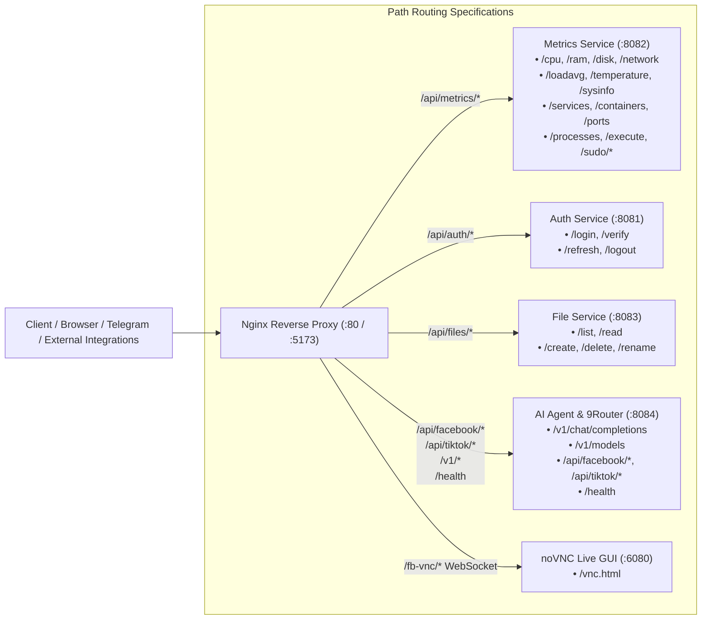

# API Reference & Gateway Architecture

Complete reference for all REST and Gateway endpoints exposed by the backend microservices ecosystem.

---

## 1. API Gateway Routing Map

---

## 2. Metrics Service Endpoints (`/api/metrics/*`)

| Endpoint | Method | Description | Shell Command |
| --- | --- | --- | --- |
| `/api/metrics/cpu` | `GET` | Live CPU usage metrics | `top -b -n 1 \| grep 'Cpu(s)'` |
| `/api/metrics/ram` | `GET` | Memory & Swap statistics | `free -m` |
| `/api/metrics/disk` | `GET` | Real block device storage | `df -h -x tmpfs -x devtmpfs` |
| `/api/metrics/network` | `GET` | Network RX/TX throughput | `cat /proc/net/dev` |
| `/api/metrics/loadavg` | `GET` | System Load Average (1m, 5m, 15m) | `cat /proc/loadavg` |
| `/api/metrics/temperature` | `GET` | Multi-core CPU temperatures | `sensors` |
| `/api/metrics/sysinfo` | `GET` | OS, Kernel, Uptime, Hostname | `uname -a && uptime` |
| `/api/metrics/services` | `GET` | Systemd service units status | `systemctl list-units --type=service` |
| `/api/metrics/containers` | `GET` | Docker containers list & status | `docker ps -a` |
| `/api/metrics/ports` | `GET` | Open TCP/UDP listening sockets | `ss -tulpn` |
| `/api/metrics/processes` | `GET` | Running Linux processes | `ps aux --sort=-%cpu` |
| `/api/metrics/execute` | `POST` | Terminal command execution | Sandboxed bash execution |
| `/api/metrics/sudo/service` | `POST` | Start/Stop/Restart systemd unit | `sudo systemctl <action> <service>` |
| `/api/metrics/sudo/container` | `POST` | Start/Stop/Restart container | `sudo docker <action> <id>` |

---

## 3. Auth Service Endpoints (`/api/auth/*`)

| Endpoint | Method | Description | Payload / Params |
| --- | --- | --- | --- |
| `/api/auth/login` | `POST` | Authenticate user & issue JWT | `{"username": "...", "password": "..."}` |
| `/api/auth/verify` | `GET` | Verify active JWT token validity | Bearer `<token>` |
| `/api/auth/refresh` | `POST` | Refresh expired access token | `{"refreshToken": "..."}` |
| `/api/auth/logout` | `POST` | Revoke active refresh token | Bearer `<token>` |

---

## 4. File Service Endpoints (`/api/files/*`)

| Endpoint | Method | Description | Query / Payload |
| --- | --- | --- | --- |
| `/api/files/list` | `GET` | List files and folders in directory | `?path=/var/log` |
| `/api/files/read` | `GET` | Read text file content with syntax | `?path=/etc/hosts` |
| `/api/files/create` | `POST` | Create new file or folder | `{"path": "...", "isDir": false}` |
| `/api/files/delete` | `DELETE` | Delete file or directory | `?path=/tmp/test.txt` |
| `/api/files/rename` | `PUT` | Rename or move item | `{"oldPath": "...", "newPath": "..."}` |

---

## 5. AI Agent & 9Router Gateway Endpoints

### OpenAI-Compatible Gateway (`/v1/*`)

| Endpoint | Method | Description | Features |
| --- | --- | --- | --- |
| `/v1/chat/completions` | `POST` | OpenAI-compatible chat endpoint | 9Router Multi-Key pool, RTK token compression |
| `/v1/models` | `GET` | List active models across tiers | Groq + OpenRouter active models |

### Facebook Messenger E2EE Endpoints (`/api/facebook/*`)

| Endpoint | Method | Description |
| --- | --- | --- |
| `/api/facebook/config` | `GET` / `POST` | Retrieve or update Facebook automation settings & PIN |
| `/api/facebook/scan` | `POST` | Trigger an immediate manual inbox scan cycle |
| `/api/facebook/threads` | `GET` | List tracked Messenger conversations and unsend states |
| `/api/facebook/reply` | `POST` | Send an outgoing reply to a specific thread |
| `/api/facebook/appointments` | `GET` | List extracted appointments from Messenger |

### TikTok Automation Endpoints (`/api/tiktok/*`)

| Endpoint | Method | Description |
| --- | --- | --- |
| `/api/tiktok/config` | `GET` / `POST` | Retrieve or update TikTok DM and streak keeper settings |
| `/api/tiktok/scan` | `POST` | Trigger an immediate TikTok DM scan |
| `/api/tiktok/streak` | `POST` | Trigger manual TikTok streak keeper cycle |
| `/api/tiktok/streaks` | `GET` | List active TikTok streaks and interaction logs |

### Health & Telemetry

| Endpoint | Method | Description |
| --- | --- | --- |
| `/health` | `GET` | Microservice health check & 9Router key pool telemetry |
| `/fb-vnc/` | `WebSocket` | noVNC live visual browser stream (Port 6080) |
