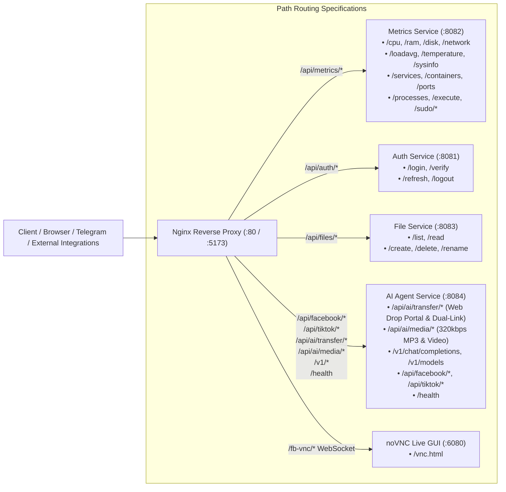

# API Reference & Gateway Architecture

Complete reference for all REST and Gateway endpoints exposed by the backend microservices ecosystem.

---

## 1. API Gateway Routing Map



---

## 2. Metrics Service Endpoints (`/api/metrics/*`)

| Endpoint | Method | Description | Shell Command |
| --- | --- | --- | --- |
| `/api/metrics/cpu` | `GET` | Live CPU usage metrics | `top -b -n 1 \| grep 'Cpu(s)'` |
| `/api/metrics/ram` | `GET` | Memory & Swap statistics | `free -m` |
| `/api/metrics/disk` | `GET` | Real block device storage | `df -h -x tmpfs -x devtmpfs` |
| `/api/metrics/network` | `GET` | Network RX/TX throughput | `cat /proc/net/dev` |
| `/api/metrics/loadavg` | `GET` | System Load Average (1m, 5m, 15m) | `cat /proc/loadavg` |
| `/api/metrics/temperature` | `GET` | Multi-core CPU temperatures | `sensors` |
| `/api/metrics/sysinfo` | `GET` | OS, Kernel, Uptime, Hostname | `uname -a && uptime` |
| `/api/metrics/services` | `GET` | Systemd service units status | `systemctl list-units --type=service` |
| `/api/metrics/containers` | `GET` | Docker containers list & status | `docker ps -a` |
| `/api/metrics/ports` | `GET` | Open TCP/UDP listening sockets | `ss -tulpn` |
| `/api/metrics/processes` | `GET` | Running Linux processes | `ps aux --sort=-%cpu` |
| `/api/metrics/execute` | `POST` | Terminal command execution | Sandboxed bash execution |
| `/api/metrics/sudo/service` | `POST` | Start/Stop/Restart systemd unit | `sudo systemctl <action> <service>` |
| `/api/metrics/sudo/container` | `POST` | Start/Stop/Restart container | `sudo docker <action> <id>` |

---

## 3. Auth Service Endpoints (`/api/auth/*`)

| Endpoint | Method | Description | Payload / Params |
| --- | --- | --- | --- |
| `/api/auth/login` | `POST` | Authenticate user & issue JWT | `{"username": "...", "password": "..."}` |
| `/api/auth/verify` | `GET` | Verify active JWT token validity | Bearer `<token>` |
| `/api/auth/refresh` | `POST` | Refresh expired access token | `{"refreshToken": "..."}` |
| `/api/auth/logout` | `POST` | Revoke active refresh token | Bearer `<token>` |

---

## 4. File Service Endpoints (`/api/files/*`)

| Endpoint | Method | Description | Query / Payload |
| --- | --- | --- | --- |
| `/api/files/list` | `GET` | List files and folders in directory | `?path=/var/log` |
| `/api/files/read` | `GET` | Read text file content with syntax | `?path=/etc/hosts` |
| `/api/files/create` | `POST` | Create new file or folder | `{"path": "...", "isDir": false}` |
| `/api/files/delete` | `DELETE` | Delete file or directory | `?path=/tmp/test.txt` |
| `/api/files/rename` | `PUT` | Rename or move item | `{"oldPath": "...", "newPath": "..."}` |

---

## 5. AI Agent & 9Router Gateway Endpoints

### OpenAI-Compatible Gateway (`/v1/*` & `/api/ai/*`)

| Endpoint | Method | Description | Features |
| --- | --- | --- | --- |
| `/v1/chat/completions` | `POST` | OpenAI-compatible chat completion endpoint | 9Router Multi-Key pool, RTK token compression, tool calling |
| `/api/ai/chat/completions` | `POST` | Internal alias for chat completion | Direct microservice routing |
| `/v1/models` | `GET` | List active models across tiers | Returns Groq + OpenRouter active model list |
| `/api/ai/models` | `GET` | Internal alias for model list | Direct microservice routing |
| `/v1/status` | `GET` | 9Router key pool health & latency | Real-time key state, cooldowns, and error counts |
| `/api/ai/router/status` | `GET` | Internal alias for 9Router key status | Direct telemetry query |

### Neuromorphic Cognitive Brain Core Endpoints (`/api/ai/brain/*`)

| Endpoint | Method | Description | Payload / Query |
| --- | --- | --- | --- |
| `/api/ai/brain/telemetry` | `GET` | Complete real-time dump of neurochemistry, Russell coordinates, FEP Free Energy, GWT spotlight, and ToM | None |
| `/api/ai/brain/pulse` | `POST` | Injects live CPU/RAM metrics into cognitive loop to update surprise | `{"cpu_usage": 45.2, "ram_usage": 68.1}` |
| `/api/ai/brain/stimulate` | `POST` | Micro-stimulates or suppresses a specific neurochemical (dopamine, serotonin, cortisol, etc.) | `{"chemical": "dopamine", "delta": 0.15, "reason": "Task completed"}` |
| `/api/ai/brain/dream-consolidate` | `POST` | Triggers immediate SWS memory pruning and REM dream synthesis cycle | `{"force_rem": true}` |
| `/api/ai/brain/recall` | `POST` | Performs associative query in 32GB Virtual Cortex using 10,000-bit HDC | `{"query": "Địa điểm tổ chức sự kiện", "top_k": 5}` |

### Facebook Messenger E2EE Endpoints (`/api/facebook/*`)

| Endpoint | Method | Description | Payload / Params |
| --- | --- | --- | --- |
| `/api/facebook/config` | `GET` / `POST` | Retrieve or update Facebook automation settings & PIN | `{"enabled": true, "fb_pin": "123456", ...}` |
| `/api/facebook/cookies` | `POST` | Import exported Facebook session cookies | `{"cookies": [...]}` |
| `/api/facebook/trigger` | `POST` | Trigger an immediate manual inbox scan cycle | None |
| `/api/facebook/scan-status` | `GET` | Check running state of background scan loop | Returns scan in-progress & last run timestamp |
| `/api/facebook/threads` | `GET` | List tracked Messenger conversations and unsend states | None |
| `/api/facebook/reply` | `POST` | Send an outgoing reply to a specific thread | `{"thread_id": "...", "message": "..."}` |
| `/api/facebook/appointments` | `GET` | List extracted appointments from Messenger | None |
| `/api/facebook/test-ai-chat` | `POST` | Dry-run test an AI response on a synthetic message | `{"message": "Hello"}` |
| `/api/facebook/launch-browser` | `POST` | Spawns visual Chromium session connected to noVNC | None |
| `/api/facebook/vnc-ready` | `GET` | Check whether noVNC visual stream is ready | None |
| `/api/facebook/save-browser-session` | `POST` | Persists cookies/state from manual noVNC session | None |
| `/api/facebook/close-browser-session` | `POST` | Gracefully closes visual Chromium session | None |
| `/api/facebook/vnc-heartbeat` | `POST` | Keep-alive heartbeat from web client to prevent VNC timeout | None |

### TikTok Automation Endpoints (`/api/tiktok/*`)

| Endpoint | Method | Description | Payload / Params |
| --- | --- | --- | --- |
| `/api/tiktok/config` | `GET` / `POST` | Retrieve or update TikTok DM and streak keeper settings | `{"enabled": true, "streak_enabled": true, ...}` |
| `/api/tiktok/cookies` | `POST` | Import exported TikTok session cookies | `{"cookies": [...]}` |
| `/api/tiktok/trigger-scan` | `POST` | Trigger immediate TikTok DM scan | None |
| `/api/tiktok/trigger-streak` | `POST` | Trigger manual TikTok streak keeper cycle | None |
| `/api/tiktok/scan-status` | `GET` | Check status of TikTok scanner loop | None |
| `/api/tiktok/clear-logs` | `POST` | Clear automation logs from database | None |
| `/api/tiktok/scan-friends` | `POST` | Scans TikTok following/friends list for streak targets | None |
| `/api/tiktok/batch-toggle-friends` | `POST` | Enable/disable streaks for multiple friends at once | `{"usernames": [...], "enabled": true}` |
| `/api/tiktok/streaks` | `GET` | List active TikTok streaks and interaction logs | None |
| `/api/tiktok/launch-browser` | `POST` | Launch visual browser for manual TikTok login via noVNC | None |
| `/api/tiktok/vnc-ready` | `GET` | Check if noVNC stream is active for TikTok | None |
| `/api/tiktok/save-browser-session` | `POST` | Save cookies from interactive browser session | None |
| `/api/tiktok/close-browser-session` | `POST` | Close visual browser and return to headless mode | None |
| `/api/tiktok/vnc-heartbeat` | `POST` | Client heartbeat to maintain active VNC session | None |

### High-Speed File Transfer & Web Drop Portal Endpoints (`/api/ai/transfer/*`)

| Endpoint | Method | Description | Payload / Query / Headers | Status Codes |
| --- | --- | --- | --- | --- |
| `/api/ai/transfer/create` | `POST` | Khởi tạo phiên truyền tệp mới, trả về đồng thời URL mạng LAN Gigabit và WAN Ngrok | JSON Body: `{"file_name": "backup.zip", "mode": "upload", "one_time": false, "ttl_hours": 24, "title": "Database backup"}` | `200 OK`, `500 Internal Error` |
| `/api/ai/transfer/upload/{token}` | `POST` | Tải lên tệp qua cơ chế Zero-RAM chunked disk streaming (bộ đệm 1MB qua `aiofiles`) | Stream nhị phân trực tiếp (`request.stream()`) hoặc `multipart/form-data` (`file`). Header tùy chọn: `X-Filename: data.iso`, Query: `?filename=data.iso` | `200 OK`, `400 Bad Request`, `404 Not Found`, `500 Internal Error` |
| `/api/ai/transfer/download/{token}` | `GET` | Tải xuống tệp hỗ trợ chuẩn RFC 7233 HTTP 206 Partial Content (Range requests) và Zero-Throttling | Header: `Range: bytes=start-end` (hoặc `bytes=start-`, `bytes=-suffix`), `ngrok-skip-browser-warning: 1` | `200 OK`, `206 Partial Content`, `404 Not Found`, `416 Range Not Satisfiable` |
| `/api/ai/transfer/download/{token}/{filename}` | `GET` | Tải xuống tệp với tên tệp tường minh (semantic filename) trong URL | Cùng tham số và header với endpoint trên | `200 OK`, `206 Partial Content`, `404 Not Found`, `416 Range Not Satisfiable` |
| `/api/ai/transfer/portal/{token}` | `GET` | Cung cấp giao diện Web Drop Portal HTML5 độc lập Zero-CDN (< 30KB) xem trước đa định dạng | Không yêu cầu payload. Tự động trả về trang 404 bảo mật nếu token không tồn tại/hết hạn | `200 OK` (text/html), `404 Not Found` (text/html) |
| `/api/ai/transfer/qr/{token}` | `GET` | Trả về ảnh mã QR PNG sinh trực tiếp trong bộ nhớ RAM (Zero-Disk Leak) trỏ đến Web Portal | Không yêu cầu payload. Trả về `image/png` kèm header `Cache-Control: public, max-age=86400` | `200 OK` (image/png), `404 Not Found` |
| `/api/ai/transfer/info/{token}` | `GET` | Truy vấn siêu dữ liệu phiên: trạng thái, kích thước, số lượt tải, thời gian TTL còn lại | Không yêu cầu payload | `200 OK` (JSON), `404 Not Found` |
| `/api/ai/transfer/sweep` | `POST` | Kích hoạt chu kỳ dọn dẹp cưỡng chế toàn bộ các phiên quá hạn và thư mục mồ côi | Không yêu cầu payload | `200 OK` (JSON thống kê dọn dẹp) |

#### Chi Tiết Yêu Cầu & Phản Hồi Mẫu (/api/ai/transfer/*)

##### 1. Khởi tạo phiên (`POST /api/ai/transfer/create`)

```bash
curl -X POST "http://192.168.0.100:5173/api/ai/transfer/create" \
     -H "Content-Type: application/json" \
     -d '{
       "file_name": "kirito_server_backup.tar.gz",
       "mode": "upload",
       "one_time": false,
       "ttl_hours": 24,
       "title": "Bản sao lưu cấu hình máy chủ"
     }'
```

*Phản hồi (200 OK):*

```json
{
  "token": "4a7f9b8c2d1e0f3a5b6c7d8e9f0a1b2c",
  "filename": "kirito_server_backup.tar.gz",
  "mode": "upload",
  "state": "pending",
  "file_size": 0,
  "content_type": "application/gzip",
  "one_time": false,
  "created_at": 1727101200.0,
  "expires_at": 1727187600.0,
  "ttl_seconds": 86400,
  "lan_url": "http://192.168.0.100:5173/api/ai/transfer/download/4a7f9b8c2d1e0f3a5b6c7d8e9f0a1b2c/kirito_server_backup.tar.gz",
  "wan_url": "https://deformational-semiopenly-ewa.ngrok-free.dev/api/ai/transfer/download/4a7f9b8c2d1e0f3a5b6c7d8e9f0a1b2c/kirito_server_backup.tar.gz",
  "upload_url": "http://192.168.0.100:5173/api/ai/transfer/upload/4a7f9b8c2d1e0f3a5b6c7d8e9f0a1b2c",
  "download_url": "http://192.168.0.100:5173/api/ai/transfer/download/4a7f9b8c2d1e0f3a5b6c7d8e9f0a1b2c/kirito_server_backup.tar.gz",
  "portal_url": "http://192.168.0.100:5173/api/ai/transfer/portal/4a7f9b8c2d1e0f3a5b6c7d8e9f0a1b2c"
}
```

##### 2. Tải tệp với Range Header (`GET /api/ai/transfer/download/{token}/{filename}`)

```bash
curl -i -H "Range: bytes=0-1048575" \
     -H "ngrok-skip-browser-warning: 1" \
     "http://192.168.0.100:5173/api/ai/transfer/download/4a7f9b8c2d1e0f3a5b6c7d8e9f0a1b2c/kirito_server_backup.tar.gz"
```

*Phản hồi (206 Partial Content):*

```http
HTTP/1.1 206 Partial Content
Content-Type: application/gzip
Content-Length: 1048576
Content-Range: bytes 0-1048575/62818232
Accept-Ranges: bytes
Content-Disposition: attachment; filename*=UTF-8''kirito_server_backup.tar.gz
Cache-Control: no-cache, no-store, must-revalidate
```

---

### Media Downloader & Audio Extraction Endpoints (`/api/ai/media/*`)

| Endpoint | Method | Description | Headers / Query | Status Codes |
| --- | --- | --- | --- | --- |
| `/api/ai/media/download/{token}` | `GET` | Tải xuống video hoặc audio gốc đã trích xuất từ 11+ MXH | Header: `Range: bytes=start-end`, `ngrok-skip-browser-warning: 1` | `200 OK`, `206 Partial Content`, `404 Not Found` |
| `/api/ai/media/download/{token}/{filename}` | `GET` | Tải xuống media với tên tệp ngữ nghĩa | Cùng tham số trên | `200 OK`, `206 Partial Content`, `404 Not Found` |
| `/api/ai/media/info/{token}` | `GET` | Tra cứu siêu dữ liệu tệp media (kích thước, định dạng, thời lượng, số lần tải, thời gian hết hạn TTL 4h) | Không yêu cầu payload | `200 OK` (JSON), `404 Not Found` |
| `/api/ai/media/sweep` | `POST` | Dọn dẹp các tệp media đã quá hạn 4h | Không yêu cầu payload | `200 OK` (JSON) |

---

### Health & Telemetry

| Endpoint | Method | Description |
| --- | --- | --- |
| `/health` | `GET` | Microservice health check, DB connection, and 9Router key pool telemetry |
| `/fb-vnc/` | `WebSocket` | noVNC live visual browser stream (Port 6080) |
