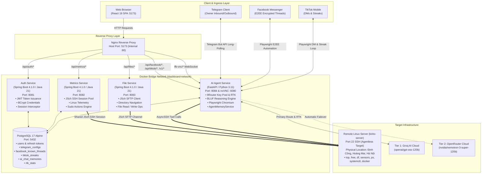
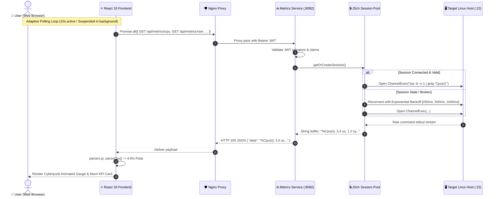
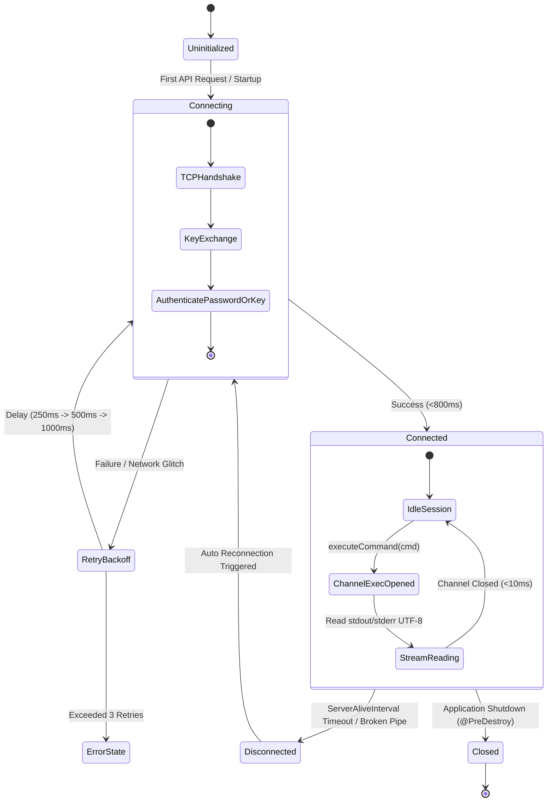
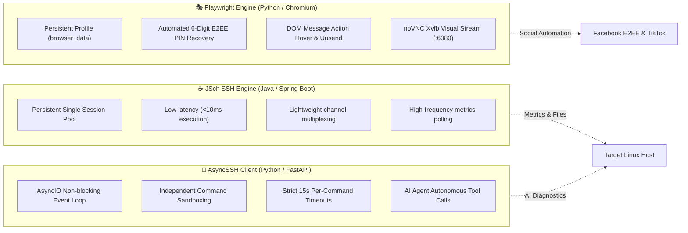

# Architecture & System Design

A detailed walkthrough of how the Mini Server Dashboard is structured, how data flows through the system, and the rationale behind key design decisions.

---

## 1. High-Level Microservices Topology

---

## 2. End-to-End Data Flow Sequence

---

## 3. JSch SSH Session Lifecycle State Machine

---

## 4. SSH & Automation Engine Comparison

---

## 5. Key Architectural Trade-offs

| Decision | Choice | Rationale |
| --- | --- | --- |
| **Telemetry Parsing Location** | Frontend (`parsers.js`) | Eliminates backend rebuilds when CLI formats change; isolated unit testing. |
| **SSH Connection Model** | Persistent Shared Session | Eliminates per-request handshake penalty (~200–800ms $\rightarrow$ <10ms). |
| **Multi-Provider AI Routing** | 9Router Key Pool | Guarantees zero downtime via automatic round-robin and Tier-2 failover. |
| **E2EE Decryption Strategy** | Headless Playwright | Interacts natively with client-side encrypted IndexedDB keys and DOM. |
| **Context Management** | Active Turn Compactor | Prevents Groq `HTTP 413 Payload Too Large` in multi-step AI reasoning turns. |
| **Physical Server Geolocation** | Explicit Ground Truth Metadata | Accurately identifies **Định Công, Hà Nội** despite dynamic ISP GeoIP shifts. |
