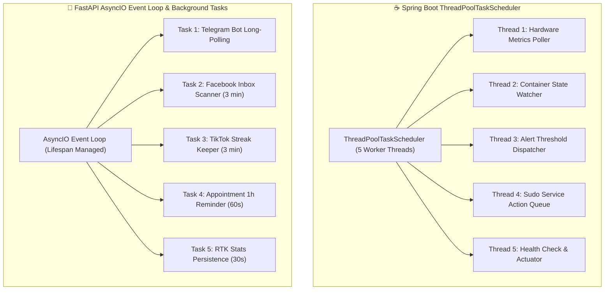

# Backend Internals

An in-depth architectural look at the backend microservices architecture: **Spring Boot 4.1.0** (Java 21) services and the **FastAPI** (Python 3.11) AI Agent & 9Router service.

---

## 1. Microservices Layered Architecture

```mermaid
flowchart TD
    subgraph SpringBootLayer["☕ Java 21 / Spring Boot 4.1.0 Ecosystem"]
        direction TB

        subgraph MetricsServiceMod["metrics-service (:8082)"]
            M_Ctrl["MetricsController\nREST Endpoints"]
            M_Ssh["SshService\nJSch Session Pool & Exec Channels"]
            M_Alert["AlertService\nThreshold Breaches"]
            M_Ctrl --> M_Ssh
            M_Ctrl --> M_Alert
        end

        subgraph AuthServiceMod["auth-service (:8081)"]
            A_Ctrl["AuthController\n/login, /verify, /refresh"]
            A_Sec["JwtTokenProvider\nBCryptPasswordEncoder (Cost 12)"]
            A_Repo["UserRepository & TokenRepository"]
            A_Ctrl --> A_Sec --> A_Repo
        end

        subgraph FileServiceMod["file-service (:8083)"]
            F_Ctrl["FileController\n/list, /read, /create, /delete"]
            F_Sftp["SftpService\nJSch ChannelSftp Operations"]
            F_Ctrl --> F_Sftp
        end
    end

    subgraph FastAPILayer["🐍 Python 3.11 / FastAPI AI Agent Ecosystem (:8084)"]
        direction TB

        subgraph AgentRouters["FastAPI Routers"]
            R_Health["health.py"]
            R_Brain["brain.py\n/api/ai/brain/*"]
            R_FB["facebook.py"]
            R_TT["tiktok.py"]
            R_GW["openai_gateway.py"]
        end

        subgraph AgentCore["Agent & Router Core Services"]
            S_Agent["AiAgentService (Tiểu Bảo Bảo)\nBLUF Engine | Loop Breaker | Compactor"]
            S_Tools["AiAgentToolRegistry & Executor\nScoped Tool Dispatcher (ai_agent_tools.py)"]
            S_Brain["ArtificialBrain & DreamEngine\n6 Neurotransmitters | FEP | 32GB HDC"]
            S_Video["LightweightVideoPipeline & MediaProcessor\nDual-Track Audio & Keyframe OCR"]
            S_Dialect["VietnameseLinguisticNormalizer\nNghệ Tĩnh Dialect & Envelope Guard"]
            S_Router["LlmRouter (9Router Engine)\nGroq Pool | OpenRouter Pool | RTK"]
            S_Formatter["TelegramFormatter v2.0\nTag Whitelisting | Card Transformer"]
            S_Memory["AgentMemoryService\nPostgreSQL Long-term Memory Brain"]
            S_Archive["ArchiveRecoveryEngine\n4-Tier High-Speed Cracker"]
            S_FB["FacebookService (Playwright E2EE)\nPIN Unlock | Auto-Reply | Unsend"]
            S_TT["TikTokService (Playwright)\nDaily Streak Keeper"]
        end

        AgentRouters --> S_Agent
        AgentRouters --> S_Router
        AgentRouters --> S_Brain
        S_Agent <--> S_Tools
        S_Agent <--> S_Brain
        S_Agent <--> S_Video
        S_Agent <--> S_Dialect
        S_Agent <--> S_Router
        S_Agent --> S_Formatter
        S_Agent <--> S_Memory
        S_Agent <--> S_Archive
        S_Agent <--> S_FB
        S_Agent <--> S_TT
    end

    MetricsServiceMod ==>|Persistent JSch Tunnel| TargetHost["🖥️ Target Linux Host (:22)"]
    FileServiceMod ==>|JSch SFTP Channel| TargetHost
    S_Agent ==>|AsyncSSH Tool Calls| TargetHost
```

---

## 2. Concurrency & Thread Pool Management

---

## 3. Spring Boot Microservices Internals

### JSch SSH Session Pool (`SshService`)

- Manages a persistent SSH session over the application lifetime.
- Commands execute via lightweight `ChannelExec` instances (<10 ms setup).
- Automatic reconnection with exponential backoff (`250ms`, `500ms`, `1000ms`).

### Actuator & Health Monitoring

- All Spring Boot services implement Spring Boot Actuator on `/actuator/health` used by Docker Compose health checks.

### Memory & Garbage Collection Tuning

- Configured with optimized JVM flags:
  `-XX:+UseG1GC -XX:MaxRAMPercentage=60.0 -XX:+ExitOnOutOfMemoryError`

---

## 4. AI Agent & 9Router Service Internals

### Autonomous ReAct Agent ("Tiểu Bảo Bảo")

- **Pyramid Principle / BLUF Thinking Engine:** Answers lead with a direct conclusion on line 1.
- **Telegram Native Formatter (`TelegramFormatter`):** Converts Markdown tables into mobile-friendly cards, auto-escapes HTML, balances tags, and normalizes Vietnamese typography.
- **Active Turn Context Compactor (`_build_compact_messages_for_llm`):** Dynamically compacts older tool outputs to ensure total payload stays under 3,500 chars, eliminating Groq `HTTP 413 Payload Too Large` errors.
- **Stagnation Circuit Breaker:** Detects duplicate command calls and forces synthesis when iterations reach limits.
- **Ground Truth Physical Location:** Configured at **Định Công, Hoàng Mai, Hà Nội, Việt Nam**, distinguishing physical hardware location from ISP BGP dynamic GeoIP routing.

### 9Router Engine & RTK

- **Multi-Key Pool Rotation:** Round-robin balancing across Groq and OpenRouter keys with automatic 60s cooldown on 429 rate limits.
- **Real-Time Token Compressor (RTK):** Achieves 40–85% reduction in prompt token volume with background persistence to PostgreSQL (`rtk_stats`).
- **OpenAI-Compatible Gateway:** Fully compliant `/v1/chat/completions` endpoint for external client tooling.

### Tool Architecture & Delegation (`ai_agent_tools.py`)

To preserve maintainability and eliminate circular dependencies, tool definitions and execution logic are decoupled from `ai_agent.py`:
- **`AgentToolRegistry`:** Manages scoped tool schema injection (`_TOOL_CLUSTER_CORE`, `_TOOL_CLUSTER_SERVER`, `_TOOL_CLUSTER_BROWSER`, `_TOOL_CLUSTER_ARCHIVE`, `_TOOL_CLUSTER_WEATHER`).
- **`AgentToolExecutor`:** Delegates tool calls to concrete service instances (`ssh_client`, `fb_service`, `browser_agent`, `appointment_service`, `archive_recovery`).
- **Scope Trimming:** Injects only query-relevant tools into LLM context, keeping total prompt schema size under 800 tokens.

### Neuromorphic Brain Core & Deep References

For complete low-level neuroscience formulas, hyperdimensional vector math, and media pipelines:
- [**`docs/neuromorphic-brain.md`**](./neuromorphic-brain.md): 6 Neurotransmitters, Karl Friston FEP Active Inference, 10,000-bit HDC 32GB Virtual Cortex, and Sleep/Dream Consolidation.
- [**`docs/multimodal-video-pipeline.md`**](./multimodal-video-pipeline.md): Parallel Audio/Visual pipeline, Whisper ASR biasing, and Cross-Modal Discrepancy Resolution.
