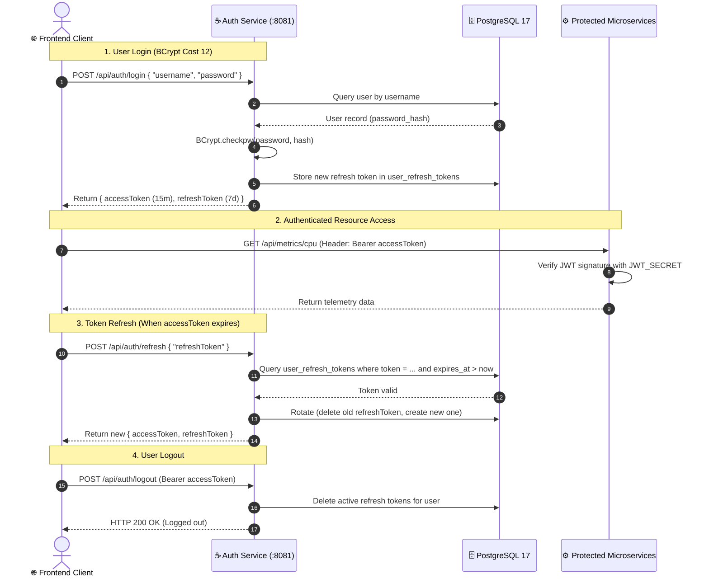

# Database & Authentication

Complete guide to the PostgreSQL 17 relational schema, JWT authentication lifecycle, BCrypt credential security, and state persistence.

---

## 1. PostgreSQL 17 Entity-Relationship Diagram (Full ERD)

```mermaid
erDiagram
    users ||--o{ user_refresh_tokens : "has many"
    users ||--o{ ai_agent_preferences : "configures"

    users {
        bigint id PK
        varchar username UK
        varchar password_hash
        varchar role
        timestamp created_at
        timestamp updated_at
    }

    user_refresh_tokens {
        bigint id PK
        bigint user_id FK
        varchar token UK
        timestamp expires_at
        timestamp created_at
    }

    telegram_configs {
        bigint id PK
        varchar bot_token
        varchar chat_id
        boolean notifications_enabled
        int cpu_threshold
        int ram_threshold
        int disk_threshold
        timestamp updated_at
    }

    facebook_config {
        bigint id PK
        boolean enabled
        text auto_reply_text
        int scan_interval_minutes
        boolean away_mode_enabled
        varchar pin_code
        timestamp updated_at
    }

    facebook_known_threads ||--o{ facebook_messages : "contains"
    facebook_known_threads ||--o{ facebook_appointments : "schedules"

    facebook_known_threads {
        varchar thread_id PK
        varchar thread_name
        timestamp last_interaction
        text auto_reply_text
        boolean auto_reply_unsent
        boolean is_e2ee
        boolean is_group
    }

    facebook_messages {
        bigint id PK
        varchar thread_id FK
        varchar sender_name
        text message_text
        boolean is_auto
        timestamp sent_at
    }

    facebook_appointments {
        bigint id PK
        varchar thread_id FK
        varchar person_name
        timestamp appointment_time
        text description
        varchar status
        boolean reminded_1h
        timestamp created_at
    }

    tiktok_config {
        bigint id PK
        boolean enabled
        boolean streak_enabled
        text auto_reply_text
        int scan_interval_minutes
        timestamp updated_at
    }

    tiktok_streaks {
        varchar user_id PK
        varchar username
        int streak_count
        timestamp last_sent_time
        timestamp last_received_time
        varchar status
    }

    rtk_stats {
        bigint id PK
        bigint total_compressions
        bigint chars_saved
        bigint estimated_tokens_saved
        timestamp updated_at
    }

    ai_chat_memories {
        bigint id PK
        varchar chat_id
        varchar key
        text value
        timestamp created_at
        timestamp updated_at
    }

    ai_agent_lessons {
        bigint id PK
        varchar category
        text lesson
        text context
        float confidence
        timestamp created_at
    }

    ai_agent_preferences {
        bigint id PK
        bigint user_id FK
        varchar preference_key
        text preference_value
        timestamp updated_at
    }

    ai_scheduled_tasks {
        bigint id PK
        varchar task_type
        jsonb payload
        timestamp run_at
        varchar status
    }
```

---

## 2. JWT Authentication & Refresh Token Rotation Sequence

---

## 3. Security & Hash Standards

- **Password Hashing:** BCrypt with Cost factor 12.
- **JWT Signing:** HMAC-SHA256 (HS256) / HS384 with $\ge 32$-character high-entropy secret.
- **Access Token Expiration:** 15 minutes.
- **Refresh Token Expiration:** 7 days (with single-use token rotation).
