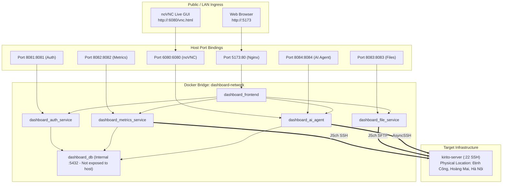
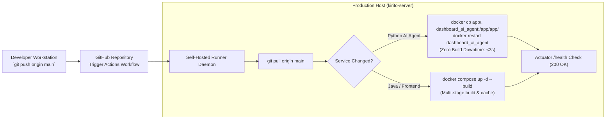

# Production Deployment & Hardening Guide

A complete reference for deploying, configuring, and hardening the Mini Server Dashboard ecosystem.

---

## 1. Production Deployment Topology & Port Mapping



---

## 2. CI/CD Self-Hosted Runner Workflow



---

## 3. Complete Environment Variables Reference

Create or update `.env` in the root directory:

```dotenv
# ── Target Server SSH Credentials ─────────────────────────────────────────────
SSH_HOST=192.168.0.100
SSH_PORT=22
SSH_USER=kirito
SSH_PASSWORD=your_ssh_password

# ── Ground Truth Physical Server Metadata ────────────────────────────────────
SERVER_PHYSICAL_LOCATION="Định Công, Hoàng Mai, Hà Nội, Việt Nam"
SERVER_ISP="FPT Telecom"
SERVER_OWNER="Trần Văn Mạnh (kirito)"

# ── PostgreSQL Database ───────────────────────────────────────────────────────
POSTGRES_PASSWORD=dashboard_password

# ── Dashboard Authentication ──────────────────────────────────────────────────
APP_AUTH_USERNAME=kiritoserver
APP_AUTH_PASSWORD=$2a$12$...
JWT_SECRET=your_minimum_32_chars_jwt_secret_key

# ── Telegram Bot & AI Key Pools ───────────────────────────────────────────────
TELEGRAM_BOT_TOKEN=your_telegram_bot_token
TELEGRAM_CHAT_ID=your_telegram_chat_id
TELEGRAM_POLLING_ENABLED=true

GROQ_API_KEY=gsk_primary_key
GROQ_API_KEY_2=gsk_second_key
OPENROUTER_API_KEY=sk-or-v1-primary_key
OPENROUTER_MODEL=nvidia/nemotron-3-super-120b-a12b:free
```

---

## 4. Production Deployment Commands

```bash
# 1. Pull latest code from repository
git pull origin main

# 2. Build and launch all services in background
docker compose up -d --build

# 3. Verify health status of all containers
docker compose ps

# 4. Inspect logs
docker compose logs -f ai-agent-service
```

---

## 5. Resource Allocation & Limits

| Container | CPU Limit | RAM Reservation | RAM Limit |
| --- | --- | --- | --- |
| `dashboard_db` | 0.5 | 128 MB | 256 MB |
| `dashboard_auth_service` | 0.5 | 192 MB | 384 MB |
| `dashboard_metrics_service` | 0.6 | 256 MB | 512 MB |
| `dashboard_file_service` | 0.5 | 192 MB | 384 MB |
| `dashboard_ai_agent` | 1.0 | 256 MB | 1024 MB |
| `dashboard_frontend` | 0.5 | 64 MB | 256 MB |
