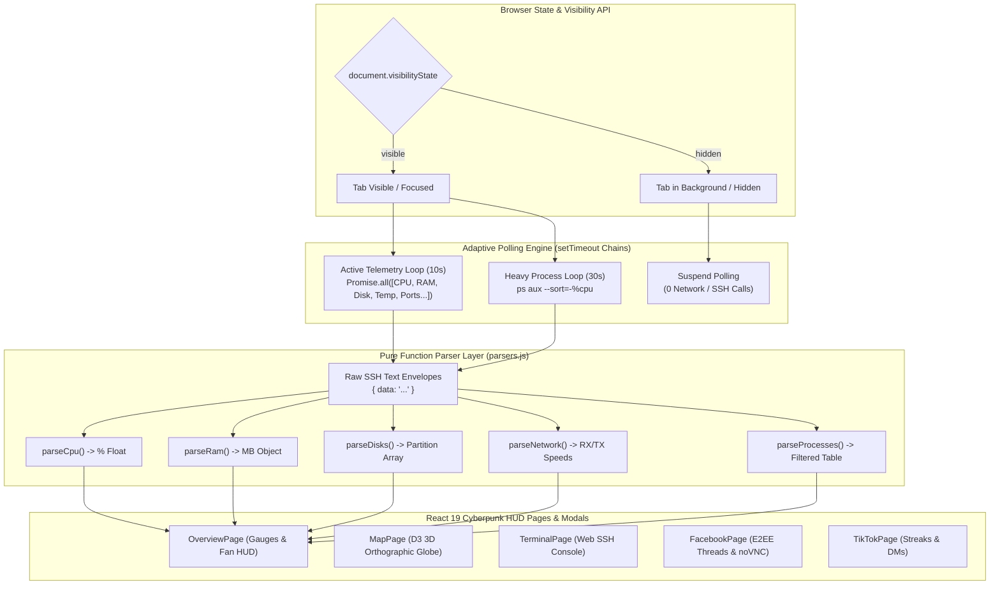
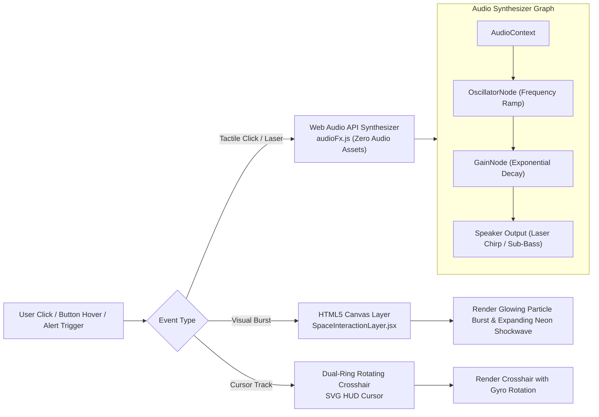

# Frontend Internals & UI Architecture

A technical reference for the React 19 frontend: state management, polling architecture, Sci-Fi HUD interaction layer, Web Audio API sound synthesis, and the parser utility layer.

---

## 1. Frontend State & Polling Architecture



---

## 2. Sci-Fi HUD Audio & Canvas Shockwave Pipeline



---

## 3. Tech Stack & Directory Structure

| Concern | Library | Version |
| --- | --- | --- |
| UI framework | React | 19 |
| Build tool | Vite | 8 |
| HTTP client | Axios | 1 |
| Charts | Recharts | 3 |
| 3D Globe | D3-geo + TopoJSON | 3 / 3 |
| Icons | Custom Sci-Fi SVG system (`SciFiIcons.jsx`) + Lucide React | latest |
| Audio & FX | Web Audio API + HTML5 Canvas | Native browser APIs |
| Production server | Nginx Alpine | latest |

```text
frontend/src/
├── main.jsx                       ← React DOM entry point — mounts <App /> into #root
├── App.jsx                        ← Root layout, routing outlet, global state & context
├── components/
│   ├── SciFiIcons.jsx             ← Custom SVG vector icon library (SciFiShield, SciFiLightning, etc.)
│   ├── SpaceInteractionLayer.jsx  ← Global rotating crosshair, canvas shockwaves & Web Audio laser FX
│   └── modals/                    ← Process termination, Docker log viewer modals
├── pages/
│   ├── OverviewPage.jsx           ← Real-time telemetry overview, KPI cards & multi-sensor Fan HUD
│   ├── ProcessesPage.jsx          ← Live process monitor, CPU/Mem filters & CSV export
│   ├── ServicesPage.jsx           ← Systemd units, container states, timers & host runtimes
│   ├── ContainersPage.jsx         ← Dedicated Docker container manager & live log streaming
│   ├── TerminalPage.jsx           ← Web SSH Terminal with macro chips & command sandbox
│   ├── MapPage.jsx                ← 3D Interactive Orthographic Globe & active SSH node tracer
│   ├── SecurityPage.jsx           ← Listening ports (ss), active sessions (who), colorized logs
│   ├── FilesPage.jsx              ← Remote SFTP file browser & syntax-highlighted viewer
│   ├── FacebookPage.jsx           ← Facebook E2EE threads, appointment manager & embedded noVNC viewer
│   ├── TikTokPage.jsx             ← TikTok streak keeper, automated DM logs & configuration
│   └── SettingsPage.jsx           ← Alert threshold sliders, polling speed & AI bot controls
└── utils/
    ├── parsers.js                 ← Pure functions: raw SSH text → typed JavaScript objects
    ├── audioFx.js                 ← Synthesized Web Audio laser chirps & sub-bass feedback
    └── api.js                     ← Axios instance with JWT interceptors & error handlers
```
