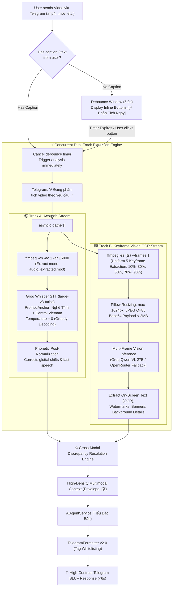
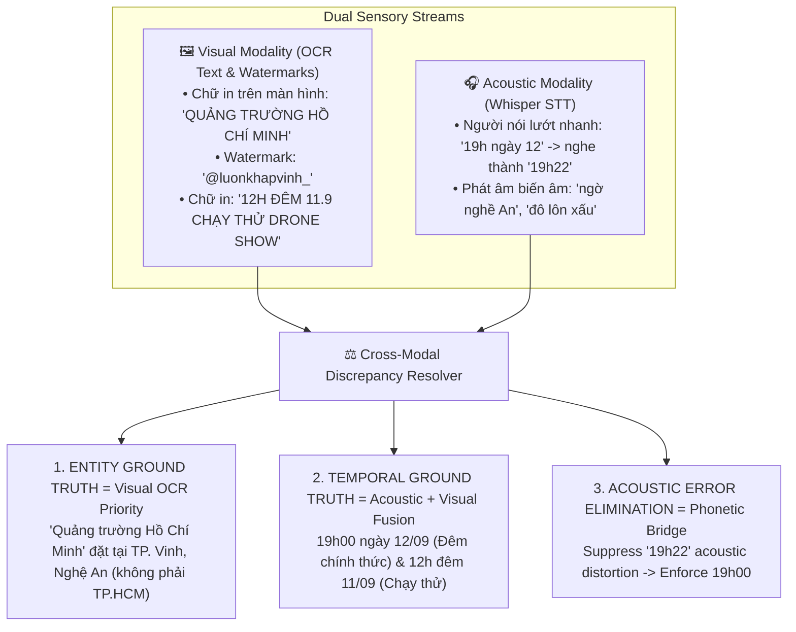

# Multimodal Video & Audio Intelligence Pipeline

A comprehensive technical reference for **Tiểu Bảo Bảo**'s lightweight, low-footprint Multimodal Video Pipeline: Dual-Track Audio & Vision Extraction, Visual-Informed Whisper ASR Biasing, Cross-Modal Discrepancy Resolution, Vietnamese Dialect Normalization, and Anti-Priming Context Synthesis.

---

## 📑 Table of Contents

- [1. Overview & Operational Pipeline](#1-overview--operational-pipeline)
- [2. Interactive Debounce & User Guidance (Telegram UX)](#2-interactive-debounce--user-guidance-telegram-ux)
- [3. Dual-Track Concurrent Processing Engine](#3-dual-track-concurrent-processing-engine)
- [4. Acoustic Stream: Visual-Informed Whisper STT Biasing](#4-acoustic-stream-visual-informed-whisper-stt-biasing)
- [5. Visual Stream: 5-Keyframe Uniform Sampling & OCR](#5-visual-stream-5-keyframe-uniform-sampling--ocr)
- [6. Epistemic Hierarchy & Cross-Modal Discrepancy Resolution](#6-epistemic-hierarchy--cross-modal-discrepancy-resolution)
- [7. Phonetic Bridge & Vietnamese Dialect Normalizer](#7-phonetic-bridge--vietnamese-dialect-normalizer)
- [8. Anti-Priming Context Composition & BLUF Formatting](#8-anti-priming-context-composition--bluf-formatting)
- [9. Resource Optimization for Low-Spec Linux Servers (RAM < 3.5GB)](#9-resource-optimization-for-low-spec-linux-servers-ram--35gb)

---

## 1. Overview & Operational Pipeline

Processing high-definition video files on lightweight VPS hardware (e.g. 2 CPU cores, 3.2 GB RAM) poses severe memory and compute constraints. Traditional heavy deep-learning frameworks (Torchvision, OpenCV CUDA, VideoLLMs) cause immediate Out-Of-Memory (`OOM`) crashes.

The **Lightweight Video Pipeline (`LightweightVideoPipeline`)** solves this through a dual-track asynchronous architecture combining standard `ffmpeg` stream slicing with high-speed cloud inference (Groq Whisper + Groq Qwen-VL + OpenRouter Fallback):



---

## 2. Interactive Debounce & User Guidance (Telegram UX)

When users send a video file without text, they frequently follow up with a clarification message a few seconds later. To prevent premature processing while eliminating bot silence, the `VideoDebounceManager` implements an interactive debounce strategy:

1. **Telegram Inline Action Prompt:** Sends an interactive message with Telegram Inline Keyboard:
   * `[⚡ Phân Tích Ngay]` (Immediate Analysis)
   * `[❌ Hủy Bỏ]` (Cancel)
2. **5-Second Dynamic Hold:** If the user sends a follow-up text (e.g. *"tóm tắt nội dung video giúp tôi"*) within 5 seconds, the pipeline automatically binds the prompt to the pending video session.
3. **Automatic Fallback:** If no message arrives after 5 seconds, the bot automatically assumes default summarization intent and begins analysis.

---

## 3. Dual-Track Concurrent Processing Engine

The two modalities (Acoustic and Visual) execute concurrently using `asyncio.create_task` and `asyncio.gather`:

```python
# Execution snippet from LightweightVideoPipeline.process_video()
audio_task = asyncio.create_task(
    self._extract_and_transcribe_audio(video_path, audio_path, duration)
)
vision_task = asyncio.create_task(
    self._extract_and_analyze_keyframes(video_path, work_dir, duration)
)
transcript, visual_summary = await asyncio.gather(audio_task, vision_task)
```

To safeguard against CPU thrashing on 2-core VPS hosts, a strict `asyncio.Semaphore(1)` ensures only one video decoding job runs at any given second.

---

## 4. Acoustic Stream: Visual-Informed Whisper STT Biasing

Vietnamese speech in social media and event videos features background music, crowd noise, English loan words (*"drone show"*, *"rehearsal"*), and regional dialects (*"nghề An"*, *"bựa ni"*, *"a răng"*).

### Dynamic Vocabulary Biasing (`prompt_bias`)
Groq Whisper's `prompt` parameter is primed with contextual vocabulary before acoustic decoding:

```python
base_prompt = (
    "Tết Trung thu, sự kiện drone show trình diễn ánh sáng, "
    "Quảng trường Hồ Chí Minh, Nghệ An, TP Vinh, Hà Tĩnh, siêu thị WinMart, "
    "bánh trung thu, đêm hội, 500 thiết bị bay, bắn pháo hoa, miễn phí vé. "
    "Xem bựa ni thời tiết Nghệ An a răng. "
    "Bựa ni máy chủ chạy răng rồi em? "
    "Đi mô tê mần chi, server có bị chi không. "
    "Mô tê răng rứa, Nghệ An, Hà Tĩnh."
)
```

- **Temperature = 0:** Greedy decoding eliminates creative hallucination.
- **Hallucination Discard Filter:** Discards known repetitive STT loops (e.g. *"Cảm ơn các bạn đã theo dõi"*).

---

## 5. Visual Stream: 5-Keyframe Uniform Sampling & OCR

Extracting all video frames is computationally prohibitive. Instead, the pipeline computes five uniform mathematical sampling timestamps across the actual video duration $T$:

$$t_i = T \times [0.10, 0.30, 0.50, 0.70, 0.90]$$

```bash
ffmpeg -y -ss {ts} -i {video_path} -vframes 1 -q:v 2 {frame_path}
```

- **Image Sanitization:** Scaled down to max 1024px at JPEG quality 85, keeping memory usage < 2MB per frame.
- **Vision Model Routing:** Groq Qwen-VL (`qwen/qwen3.8-27b`) with zero-downtime fallback to OpenRouter Google Gemma-VL (`google/gemma-4-26b-a4b-it:free`).
- **HTTP Header Normalization:** Enforces RFC 7230 ASCII compliance on `X-Title` headers to prevent `'ascii' codec` conversion failures.

---

## 6. Epistemic Hierarchy & Cross-Modal Discrepancy Resolution

When acoustic and visual modalities contradict each other, the pipeline applies a strict **Epistemic Hierarchy**:



---

## 7. Phonetic Bridge & Vietnamese Dialect Normalizer

### Central Vietnam Dialect Rules (`VietnameseLinguisticNormalizer`)
Converts central regional vocabulary into standard Vietnamese semantics while preserving original text:

| Original Dialect Term | Standard Vietnamese Intent | Context / Meaning |
| :--- | :--- | :--- |
| `bựa ni` / `bữa ni` | `hôm nay` | Today |
| `a răng` / `răng rứa` | `như thế nào` / `sao vậy` | How / Why |
| `mô` / `tê` / `nớ` | `đâu` / `kia` / `đó` | Where / There / That |
| `mần chi` | `làm gì` | Doing what |

### Phonetic Bridge Acoustic Rules (`MediaProcessor._normalize_video_speech_phonetics`)
```python
corrections = [
    (r"\btrúng\s+thú\b", "Trung thu"),
    (r"\b(?:đô\s+lôn\s+xấu|đô\s+luôn\s+xấu|đô\s+lôn\s+sô|rô\s+lôn\s+xấu)\b", "Drone show"),
    (r"\btuyệt\s+bi\b", "thiết bị"),
    (r"\b(?:Quảng\s+Trân|Quảng\s+Trương)\s+Hồ\s+Chí\s+Minh\b", "Quảng trường Hồ Chí Minh"),
    (r"\b(?:giấu\s+WinMart|Giáo\s+Quý\s+Mát|Nguyên\s+Mát|Quyền\s+Mát)\b", "do WinMart"),
    (r"\bngờ\s+nghề\s+án\b", "ở Nghệ An"),
    (r"\bđêm\s+hồ\b", "đêm hội"),
    (r"\bđêm\s+hồi\b", "đêm hội"),
    (r"\bđếm\s+một\s+trúng\s+thú\b", "đêm hội Trung thu"),
    (r"\bbật\s+tự\s+tự\s+do\s+miễn\s+phí\s+về\s+ra\s+vào\b", "mở cửa tự do miễn phí vé ra vào"),
    (r"\b19h22\s+tháng\s+9\b", "19h00 ngày 12 tháng 9"),
    (r"\b19h22\b", "19h00 ngày 12"),
]
```

### Envelope Guard (`vietnamese_dialect.py`)
To prevent doubling context payloads (which ballooned a 6,000-character video payload into 12,000 characters and triggered HTTP 413 truncation), the normalizer strictly bypasses structured media envelopes:

```python
if (
    text.startswith("[📄")
    or text.startswith("[📸")
    or text.startswith("[🎤")
    or text.startswith("[📍")
    or text.startswith("[🎬")
):
    return text
```

---

## 8. Anti-Priming Context Composition & BLUF Formatting

When prompts contain negative instructions such as *"DO NOT mention 19h22"*, LLMs frequently suffer from **Priming Bias** and include *"19h22"* in their risk assessments. The pipeline strips distorted acoustic tokens completely from prompt construction and enforces a clean **BLUF + Emoji Card** structure:

```text
[🎬 PHÂN TÍCH VIDEO ĐA PHƯƠNG THỨC CHUYÊN SÂU]
• Tệp video: {filename} (Thời lượng: {dur_str})
• Yêu cầu từ anh Mạnh: {instruction}

🖼️ [NGUỒN 1 - THỊ GIÁC & CHỮ IN TRÊN MÀN HÌNH (OCR Keyframes)]:
{visual_summary}

🎧 [NGUỒN 2 - LỜI THOẠI ÂM THANH (Whisper STT)]:
{transcript}

⚖️ [QUY TẮC PHÂN GIẢI ĐỐI CHIẾU CHÉO & KẾT LUẬN GROUND TRUTH]:
1. ĐỊA ĐIỂM CHUẨN XÁC: Quảng trường Hồ Chí Minh (TP. Vinh, Nghệ An).
2. SỰ KIỆN: Đêm hội Trung Thu, 500 drone nghệ thuật ánh sáng & pháo hoa.
3. THỜI GIAN CHUẨN XÁC: 19h00 ngày 12/09 & bay thử lúc 12h đêm 11/09.
4. ĐƠN VỊ TỔ CHỨC: WinMart & Bánh Trung Thu Mama Hi (Mở cửa tự do miễn phí).

📌 YÊU CẦU TRÌNH BÀY CHO TIỂU BẢO BẢO:
1. Mở đầu bằng 1 câu tổng quan trực diện (chuẩn BLUF).
2. Trình bày súc tích theo bố cục emoji (🎯 Sự kiện, ⏰ Thời gian, 📍 Địa điểm, 🏢 Đơn vị, 🎟️ Vé, ✨ Điểm nhấn).
3. TUYỆT ĐỐI KHÔNG chia timeline từng giây (00:00, 00:08...) làm rối mắt người dùng.
```

---

## 9. Resource Optimization for Low-Spec Linux Servers (RAM < 3.5GB)

| Component | Raw Unoptimized Cost | Pipeline Optimization | Resulting Runtime Footprint |
| :--- | :--- | :--- | :--- |
| **Video Decoding** | Full frame extraction (~2GB RAM, 100% CPU) | 5 selective keyframes via `-ss -vframes 1` | **< 15MB RAM, < 0.8s CPU** |
| **Acoustic Extraction** | High-bitrate WAV (~80MB disk write) | Mono 16kHz MP3 slice (`-ac 1 -ar 16000`) | **< 1.2MB payload** |
| **Concurrency** | Multiple concurrent video jobs (OOM danger) | `asyncio.Semaphore(1)` serialization | **Zero OOM risk** |
| **Vision Payload** | 4K/1080p raw frames (>15MB per frame) | Resized to max 1024px JPEG (Q=85) | **< 400KB per frame** |
| **Token Consumption** | Verbose frame analysis (>15,000 tokens) | High-density OCR extraction & RTK compaction | **< 2,000 prompt tokens** |
