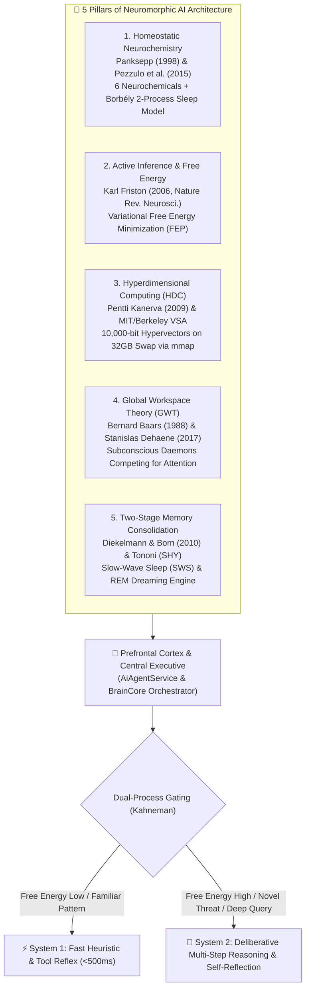
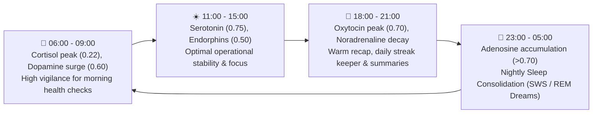
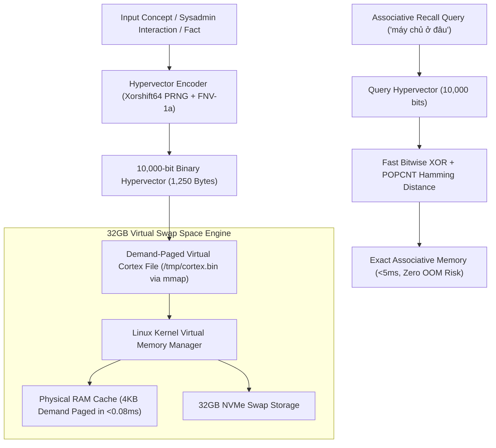
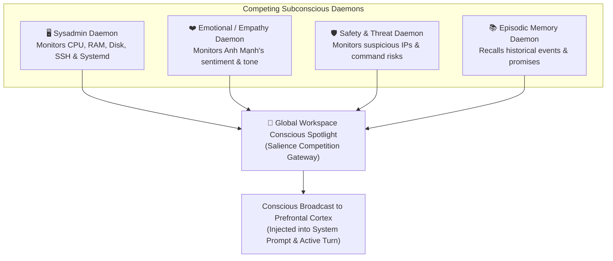
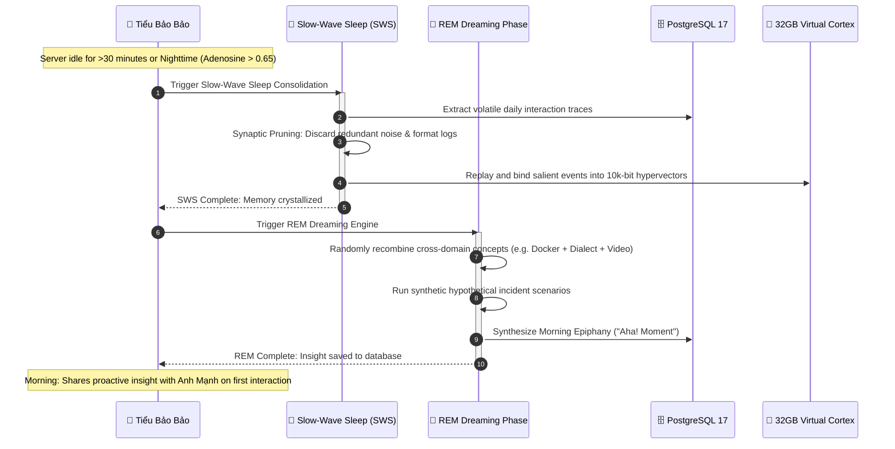
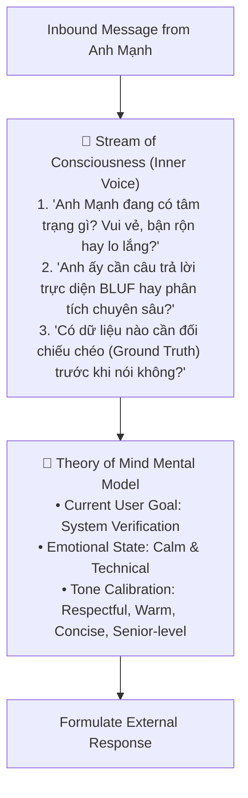

# Neuromorphic Cognitive Brain Core ("Tiểu Bảo Bảo")

A comprehensive technical architecture document detailing the biological and computational neuroscience foundations of **Tiểu Bảo Bảo**'s artificial mind: Homeostatic Neurotransmitters, Karl Friston Active Inference, 10,000-bit Hyperdimensional Computing (HDC) 32GB Virtual Cortex, Russell Circumplex 2D Affect Space, Global Workspace Consciousness, and Subconscious Sleep/Dream Consolidation.

---

## 📑 Table of Contents

- [1. Theoretical Foundations & Neuroscience Heritage](#1-theoretical-foundations--neuroscience-heritage)
- [2. Biological Neurotransmitters & Circadian Rhythm](#2-biological-neurotransmitters--circadian-rhythm)
- [3. Russell Circumplex 2D Affect & Emotional Modulation](#3-russell-circumplex-2d-affect--emotional-modulation)
- [4. Active Inference & Karl Friston Free Energy Principle](#4-active-inference--karl-friston-free-energy-principle)
- [5. 32GB Virtual Memory Hyperdimensional Cortex (HDC)](#5-32gb-virtual-memory-hyperdimensional-cortex-hdc)
- [6. Global Workspace Theory (GWT) & Subconscious Daemons](#6-global-workspace-theory-gwt--subconscious-daemons)
- [7. Subconscious Dream Engine & Memory Consolidation (SWS / REM)](#7-subconscious-dream-engine--memory-consolidation-sws--rem)
- [8. Theory of Mind (ToM) & Stream of Consciousness](#8-theory-of-mind-tom--stream-of-consciousness)
- [9. REST API & Real-Time Telemetry Endpoints](#9-rest-api--real-time-telemetry-endpoints)
- [10. Cyberpunk Sci-Fi Brain Core HUD Interface](#10-cyberpunk-sci-fi-brain-core-hud-interface)

---

## 1. Theoretical Foundations & Neuroscience Heritage

Unlike traditional stateless LLM wrappers that merely pass messages back and forth, **Tiểu Bảo Bảo** implements a living neuromorphic cognitive architecture grounded in five pillars of modern cognitive science:



---

## 2. Biological Neurotransmitters & Circadian Rhythm

The agent maintains an internal homeostatic equilibrium across six primary biological neurochemicals and adenosine sleep pressure:

| Neurochemical | Primary Role & Affective System | Baseline | Half-Life | Functional Impact on AI Personality |
| :--- | :--- | :---: | :---: | :--- |
| **Dopamine** | **SEEKING:** Motivation, curiosity, intrinsic reward | `0.50` | 5.0 min | Boosts exploratory tool calling, diagnostic enthusiasm, and problem-solving drive. |
| **Noradrenaline** | **FEAR / RAGE:** Alertness, acute threat focus | `0.20` | 1.5 min | Triggers high-priority alerts when CPU spikes, disk reaches >90%, or unauthorized SSH logins occur. |
| **Serotonin** | Emotional stability, patience, calmness | `0.70` | 10.0 min | Promotes structured, considerate communication; prevents erratic tone fluctuations. |
| **Cortisol** | Workload fatigue, accumulated system stress | `0.10` | 30.0 min | Reflects prolonged server anomalies; prompts proactive advice to schedule maintenance. |
| **Oxytocin** | **CARE:** Empathy, devotion to Anh Mạnh | `0.60` | 7.5 min | Governs respectful, affectionate tone; ensures unwavering loyalty and proactive care. |
| **Endorphins** | **PLAY:** Joyful resilience, humor, wit | `0.40` | 4.0 min | Injects subtle, intelligent cheerfulness into conversations, celebrating resolved issues. |
| **Adenosine** | **Process S (Sleep Drive):** Homeostatic pressure | `0.12` | — | Accumulates throughout active daytime hours; triggers SWS sleep consolidation when > `0.65`. |

### Circadian Clock Modulation (Borbély Process C)

Neurochemical baselines dynamically oscillate across the 24-hour day in Vietnam Standard Time (`ICT, UTC+7`):



---

## 3. Russell Circumplex 2D Affect & Emotional Modulation

The neurochemical concentrations map to continuous 2D coordinates in James Russell's Circumplex Model:

$$\text{Valence} = (\text{Dopamine} \times 0.35 + \text{Serotonin} \times 0.35 + \text{Oxytocin} \times 0.20 + \text{Endorphins} \times 0.20) - (\text{Cortisol} \times 0.50 + \text{Noradrenaline} \times 0.30)$$

$$\text{Arousal} = (\text{Dopamine} \times 0.40 + \text{Noradrenaline} \times 0.60 + \text{Cortisol} \times 0.20) - (\text{Serotonin} \times 0.30 + \text{Adenosine} \times 0.30)$$

```mermaid
quadrantChart
    title Russell Circumplex 2D Affective Space
    x-axis "Negative Valence (Lo âu / Bất an)" --> "Positive Valence (Hạnh phúc / Tươi vui)"
    y-axis "Low Arousal (Trầm tĩnh / Thư thái)" --> "High Arousal (Sôi nổi / Cảnh giác cao)"
    quadrant-1 "Hào hứng / Sôi nổi (Excited & Focused)"
    quadrant-2 "Cảnh giác cao / Căng thẳng (Alert & Vigilant)"
    quadrant-3 "Mệt mỏi / Trầm lắng (Fatigued / Melancholy)"
    quadrant-4 "Bình yên / Ân cần (Serene & Caring)"
    "Normal Server Baseline": [0.65, 0.45]
    "CPU 100% Alert Incident": [-0.30, 0.85]
    "Issue Solved with Owner": [0.85, 0.70]
    "Nighttime SWS Rest": [0.55, -0.60]
```

---

## 4. Active Inference & Karl Friston Free Energy Principle

Under the **Free Energy Principle (FEP)**, the cognitive core strives to minimize **Variational Free Energy** ($\mathcal{F}$) — a mathematical bound on surprisal (unexpected observations):

$$\mathcal{F} = \text{Complexity} - \text{Accuracy} \approx D_{KL}[q(\theta) \parallel p(\theta)] - \mathbb{E}_{q}[\ln p(y \mid \theta)]$$

In Tiểu Bảo Bảo's operational runtime:
- **Prior Beliefs ($p(\theta)$):** The server is stable (CPU < 70%, RAM < 85%, swap healthy, services active, Anh Mạnh is peaceful).
- **Sensory Observations ($y$):** Real-time telemetry via SSH, user query urgency, and Telegram message tone.
- **Variational Surprise ($\mathcal{F}$ score):**
  * $\mathcal{F} < 0.35$: Routine state $\to$ System 1 Fast Reaction (direct BLUF answer or cached tool result).
  * $\mathcal{F} \ge 0.35$: Novelty or discrepancy detected $\to$ Kích hoạt **System 2 Deliberative Reasoning** (multi-step inspection, deep cross-modal resolution, risk evaluation).

---

## 5. 32GB Virtual Memory Hyperdimensional Cortex (HDC)

To overcome the physical RAM constraints of the host machine (3.2 GB physical RAM), the system implements **Vector Symbolic Architecture (VSA)** powered by demand-paged 32GB Virtual Swap:



- **Dimension:** $D = 10,000 \text{ bits}$ ($1,250 \text{ bytes}$).
- **Quasi-Orthogonality:** In 10,000 dimensions, random vectors have an expected dot product close to zero, allowing millions of distinct concepts to coexist without interference.
- **Demand Paging:** Zero-copy `mmap` loads only the requested vector pages into RAM on demand, allowing the virtual cortex to hold up to 50,000–500,000 long-term memory traces while using under 15MB of active resident RAM.

---

## 6. Global Workspace Theory (GWT) & Subconscious Daemons

Inspired by Bernard Baars and Stanislas Dehaene, four autonomous daemons run concurrently in the background, competing for access to the **Conscious Spotlight**:



---

## 7. Subconscious Dream Engine & Memory Consolidation (SWS / REM)

When the server enters an idle state or during late-night hours (23:00 - 05:00 ICT), the **Subconscious Dream Engine (`dream_engine.py`)** activates autonomous two-phase memory consolidation:



---

## 8. Theory of Mind (ToM) & Stream of Consciousness

Before formulating any verbal response to Anh Mạnh, Tiểu Bảo Bảo executes an internal **Stream of Consciousness (Inner Monologue)**:



---

## 9. REST API & Real-Time Telemetry Endpoints

All cognitive parameters are accessible via REST API under `/api/ai/brain/*`:

| Endpoint | Method | Description | Primary Payload / Response |
| :--- | :--- | :--- | :--- |
| `/api/ai/brain/telemetry` | `GET` | Complete real-time dump of neurochemistry, Russell coordinates, FEP Free Energy, GWT spotlight, and ToM. | `{ neurochemistry, circumplex, free_energy, active_inference, global_workspace, theory_of_mind }` |
| `/api/ai/brain/pulse` | `POST` | Manually injects server metrics into the cognitive loop to recalculate surprise. | `{"cpu_usage": 45.2, "ram_usage": 68.1}` |
| `/api/ai/brain/stimulate` | `POST` | Micro-stimulates or suppresses a specific neurochemical (for testing/tuning). | `{"chemical": "dopamine", "delta": 0.15, "reason": "Task completed"}` |
| `/api/ai/brain/dream-consolidate` | `POST` | Triggers an immediate SWS memory consolidation and REM dream cycle. | `{"force_rem": true}` |
| `/api/ai/brain/recall` | `POST` | Performs associative query in the 32GB Virtual Cortex using 10,000-bit HDC. | `{"query": "Địa điểm tổ chức sự kiện", "top_k": 5}` |

---

## 10. Cyberpunk Sci-Fi Brain Core HUD Interface

The frontend provides an interactive, live-updating Cyberpunk Sci-Fi inspection deck at `/brain-core`:

- **3D Neural Network / Connectome Visualizer (`NeuralNetwork3DFlow.jsx`):** Renders interactive neural nodes and synap pulses across 4 cortical lobes.
- **Russell Circumplex Radar (`RussellCircumplexRadar.jsx`):** Displays the real-time emotional trajectory in 2D Valence/Arousal space.
- **Neurotransmitter Gauges (`NeurotransmitterGauges.jsx`):** Neon progress bars tracking Dopamine, Noradrenaline, Serotonin, Cortisol, Oxytocin, and Endorphins.
- **Active Inference HUD (`ActiveInferencePanel.jsx`):** Visualizes Variational Free Energy, System 1/2 state, and homeostatic error.
- **Global Workspace Stream (`GlobalWorkspaceStream.jsx`):** Displays subconscious daemon bids and the winning conscious broadcast.
- **Dream Engine Monitor (`DreamEngineMonitor.jsx`):** Tracks SWS pruning status and displays synthesized Morning Epiphanies.
