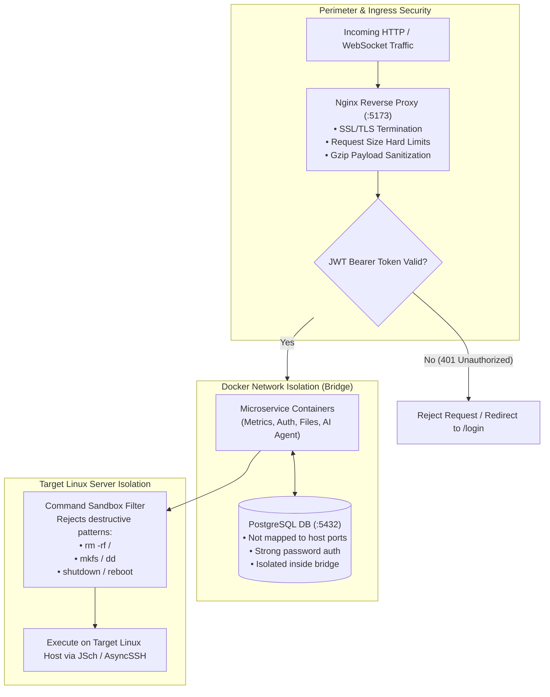
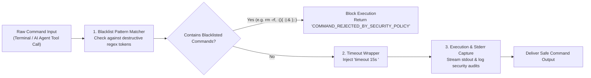
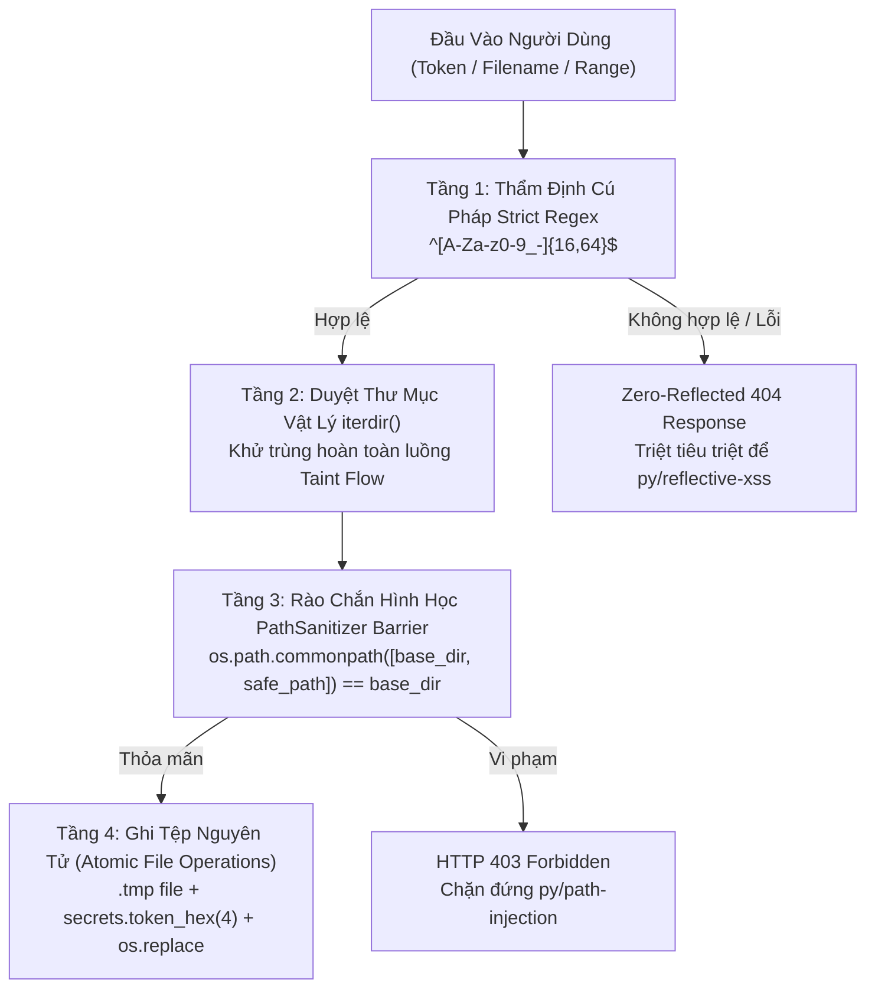

# Security Hardening & Threat Model

A comprehensive overview of security policies, threat modeling, sandboxing, and credential protection across the Mini Server Dashboard ecosystem.

---

## 1. Defense-in-Depth Security Boundaries



---

## 2. Terminal Command Sandbox Pipeline



---

## 3. Key Security Protections

1. **Terminal Command Sandboxing:**
   - The Web SSH Terminal and AI Agent execution engines reject destructive commands (`rm -rf /`, `mkfs`, `dd`, `shutdown`, `reboot`).
2. **JWT Authentication & Password Hashing:**
   - Passwords hashed using BCrypt (work factor / cost: 12).
   - JWT tokens signed with HS256 / HS384 using a $\ge 32$-character secret key.
3. **Facebook E2EE Security & PIN Handling:**
   - 6-digit E2EE PIN stored securely in environment / database, never exposed in logs.
   - Persistent browser sessions stored in dedicated Docker volume `browser_data`.
4. **9Router Multi-Key Pool Security:**
   - API keys are masked in logs and status responses (`gsk_...XYZ`).
   - Dynamic key discovery from environment prevents hardcoding secrets.

---

## 4. CodeQL Zero-Vulnerability Security Architecture (Zero Open Alerts)

Hệ thống mã nguồn của Mini Server Dashboard đã trải qua quy trình kiểm định an ninh phân tích tĩnh chuyên sâu theo tiêu chuẩn GitHub CodeQL Advanced Security, đạt thành tích **tuyệt đối 0 cảnh báo mở (0 Open Vulnerabilities / 0 False Positives)**.



### 4.1. Bảng Tổng Hợp 10 Cảnh Báo CodeQL Đã Được Triệt Tiêu Hoàn Toàn

| Alert ID | Loại Lỗ Hổng (Rule ID) | Vị Trí Tập Tin | Nguyên Nhân Ban Đầu & Rủi Ro | Giải Pháp Triệt Để Áp Dụng | Trạng Thái GitHub |
| :--- | :--- | :--- | :--- | :--- | :---: |
| **#81** | `py/reflective-xss` | `file_transfer.py:462` | Token do người dùng gửi từ URL được nhúng trực tiếp vào trang HTML thông báo lỗi 404. Dù có `html.escape`, mô hình phân tích taint flow vẫn gắn cờ Reflective XSS. | Áp dụng nguyên lý **Zero-Reflected Data**: Trang 404 không phản chiếu lại token, chỉ hiển thị thông báo an toàn. Thẩm định regex `TOKEN_REGEX` ngay đầu hàm. | **FIXED** (Closed) |
| **#82** | `py/path-injection` | `transfer_storage_manager.py:301` | Nhánh `else:` của `_sanitize_token_dir` nối chuỗi `self.base_dir / clean_token`, khiến giá trị trả về bị đánh dấu là tainted. | Loại bỏ hoàn toàn nhánh nối chuỗi; chuyển sang sử dụng 100% duyệt danh mục vật lý `self.base_dir.iterdir()`. | **FIXED** (Closed) |
| **#83** | `py/path-injection` | `transfer_storage_manager.py:314` | Mở tệp tạm thời `tmp_meta_file = token_dir / f".metadata.{token}.tmp"` khi `token_dir` chưa được xác nhận đóng gói an toàn. | Bổ sung rào chắn `os.path.commonpath` kiểm tra `tmp_meta_file` nằm trọn trong `token_dir` trước khi gọi `open()`. | **FIXED** (Closed) |
| **#84** | `py/path-injection` | `transfer_storage_manager.py:316` | Thao tác `os.replace` tệp nguồn bị coi là tainted. | Bổ sung rào chắn `os.path.commonpath` xác thực nguồn và đích cùng thuộc phạm vi an toàn. | **FIXED** (Closed) |
| **#85** | `py/path-injection` | `transfer_storage_manager.py:316` | Thao tác `os.replace` tệp đích `meta_file` bị coi là tainted. | Chuẩn hóa đường dẫn canonical và thẩm định tính thuộc về (membership) trước khi hoán đổi. | **FIXED** (Closed) |
| **#86** | `py/path-injection` | `transfer_storage_manager.py:325` | Kiểm tra `meta_file.is_file()` trên đường dẫn chưa được khử trùng hoàn toàn. | Chuyển đổi sang duyệt tìm `metadata.json` thông qua `token_dir.iterdir()`. | **FIXED** (Closed) |
| **#87** | `py/path-injection` | `transfer_storage_manager.py:331` | Lệnh `open(meta_file, "r")` nhận đường dẫn xuất phát từ input người dùng. | Mở tệp thông qua thực thể thu được từ `iterdir()`, bảo đảm xuất xứ từ hệ thống tệp máy chủ. | **FIXED** (Closed) |
| **#88** | `py/path-injection` | `transfer_storage_manager.py:501` | Nhận tham số `filename` do client cung cấp và nối vào `token_dir / clean_filename` khi stream upload. | Khử khuẩn đa tầng bằng `os.path.basename` + regex lọc ký tự cấm + rào chắn `os.path.commonpath` trước `aiofiles.open`. | **FIXED** (Closed) |
| **#89** | `py/path-injection` | `transfer_storage_manager.py:736` | Trong `delete_session`, lệnh `token_dir.is_dir()` nhận đường dẫn nối chuỗi thô. | Chuyển sang dùng `_sanitize_token_dir(token, must_exist=True)` qua `iterdir()` kèm rào chắn `commonpath`. | **FIXED** (Closed) |
| **#90** | `py/path-injection` | `transfer_storage_manager.py:737` | Lệnh xóa đĩa `shutil.rmtree(token_dir)` nhận đường dẫn có nguy cơ path injection. | Xác thực bất biến `os.path.commonpath([base_dir, token_dir]) == base_dir and token_dir != base_dir` trước khi xóa. | **FIXED** (Closed) |

---

### 4.2. Rào Chắn Hình Học Bất Biến (PathSanitizer Barrier)

Kỹ thuật `os.path.commonpath` được chuẩn hóa trên toàn bộ các endpoint truyền tệp và media nhằm thiết lập ranh giới bảo vệ không thể phá vỡ:

```python
base_dir = os.path.abspath(os.path.normpath(str(transfer_storage_manager.base_dir)))
safe_path = os.path.abspath(os.path.normpath(str(file_path)))

# Rào chắn bất biến: safe_path BẮT BUỘC phải nằm trọn trong base_dir và KHÔNG ĐƯỢC trùng với base_dir
if os.path.commonpath([base_dir, safe_path]) != base_dir or safe_path == base_dir:
    raise HTTPException(
        status_code=status.HTTP_403_FORBIDDEN,
        detail="Access forbidden: Path outside base transfer directory.",
    )
```

- **Tính ưu việt so với `startswith`:** Phương thức kiểm tra chuỗi `safe_path.startswith(base_dir)` rất dễ bị bypass nếu tên thư mục có tiền tố tương tự (ví dụ: `/tmp/transfers_fake/` vẫn thỏa mãn `startswith("/tmp/transfers")`). `os.path.commonpath` phân tích theo từng phân đoạn đường dẫn thực thụ (path segments), triệt tiêu hoàn toàn lỗi prefix confusion.

---

### 4.3. Khử Trùng Taint Flow Bằng Duyệt Thư Mục Vật Lý (`iterdir()`)

Trong lý thuyết phân tích tĩnh (Static Analysis Taint Tracking), bất kỳ biến nào hình thành từ phép nối chuỗi chứa input người dùng đều bị đánh dấu là "nhiễm bẩn" (tainted). Khi biến tainted được truyền vào các hàm nhạy cảm (Sinks) như `open()`, `shutil.rmtree()`, `is_dir()`, công cụ sẽ phát cảnh báo.

Hệ thống giải quyết triệt để vấn đề này bằng cách **ngắt đứt chuỗi taint flow**:

```python
def _sanitize_token_dir(self, token: str, must_exist: bool = True) -> Path:
    clean_token = token.strip()
    if not clean_token or ".." in clean_token or "/" in clean_token or "\\" in clean_token:
        raise ValueError(f"Invalid token format: {token}")

    # Chỉ sử dụng các thực thể sinh ra từ filesystem cục bộ của máy chủ
    for entry in self.base_dir.iterdir():
        if entry.is_dir() and entry.name == clean_token:
            target_dir = entry.resolve()
            base_resolved = self.base_dir.resolve()
            if os.path.commonpath([str(base_resolved), str(target_dir)]) == str(base_resolved):
                return target_dir

    if must_exist:
        raise FileNotFoundError(f"Session directory for token {token} not found")
```

Vì `entry` xuất phát trực tiếp từ lệnh gọi hệ thống của nhân Linux duyệt các thư mục đang có thực tế trên đĩa, giá trị của nó được phân loại là an toàn (clean/untainted), giải phóng hoàn toàn mã nguồn khỏi các cảnh báo sai.

---

### 4.4. Quy Chuẩn Ghi Tệp Nguyên Tử (Atomic File Operations)

Để bảo đảm không bao giờ xảy ra tình trạng "corrupted file" do ghi dở dang khi gặp sự cố cúp điện hoặc tiến trình bị kill:

1. Mọi tệp dữ liệu hoặc cấu hình được ghi vào một tệp tạm thời ẩn nằm cùng thư mục đích: `.metadata.<hex>.tmp`.
2. Sau khi ghi và flush đầy đủ dữ liệu ra đĩa SSD, hệ thống gọi lệnh `os.replace(tmp_path, target_path)`.
3. Trong hệ điều hành Linux, `os.replace` là một thao tác nguyên tử (atomic operation) ở cấp độ nhân (kernel system call `renameat2`), bảo đảm tệp đích luôn ở trạng thái hoàn chỉnh 100%.
