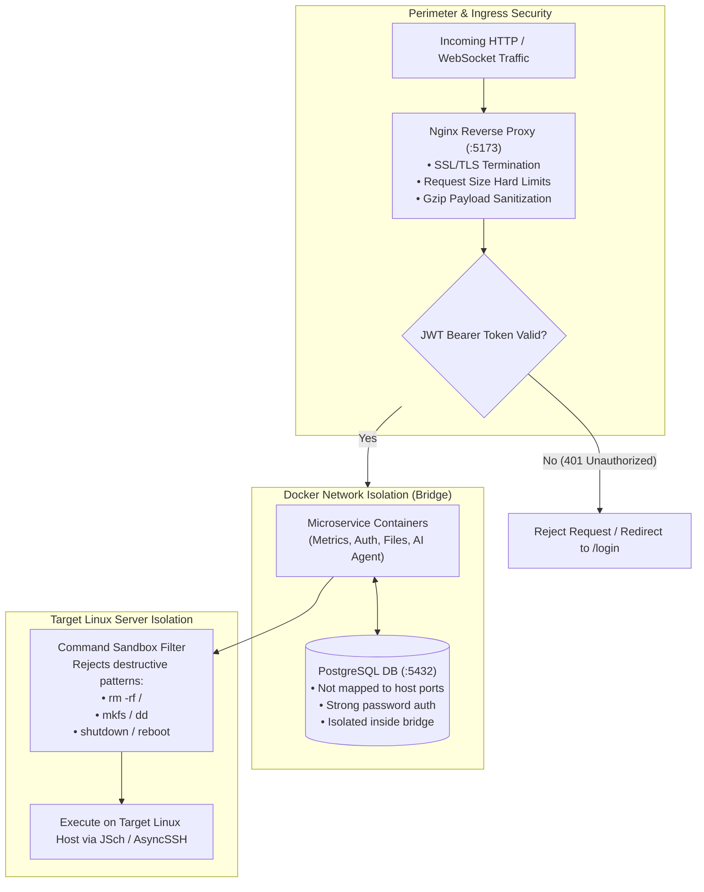
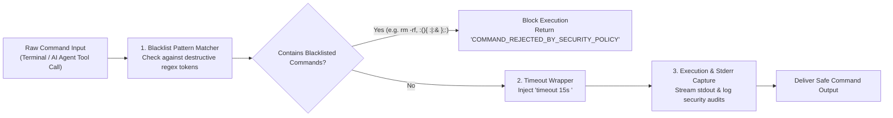

# Security Hardening & Threat Model

A comprehensive overview of security policies, threat modeling, sandboxing, and credential protection across the Mini Server Dashboard ecosystem.

---

## 1. Defense-in-Depth Security Boundaries

---

## 2. Terminal Command Sandbox Pipeline

---

## 3. Key Security Protections

1. **Terminal Command Sandboxing:**
   - The Web SSH Terminal and AI Agent execution engines reject destructive commands (`rm -rf /`, `mkfs`, `dd`, `shutdown`, `reboot`).
2. **JWT Authentication & Password Hashing:**
   - Passwords hashed using BCrypt (work factor / cost: 12).
   - JWT tokens signed with HS256 / HS384 using a $\ge 32$-character secret key.
3. **Facebook E2EE Security & PIN Handling:**
   - 6-digit E2EE PIN stored securely in environment / database, never exposed in logs.
   - Persistent browser sessions stored in dedicated Docker volume `browser_data`.
4. **9Router Multi-Key Pool Security:**
   - API keys are masked in logs and status responses (`gsk_...XYZ`).
   - Dynamic key discovery from environment prevents hardcoding secrets.
