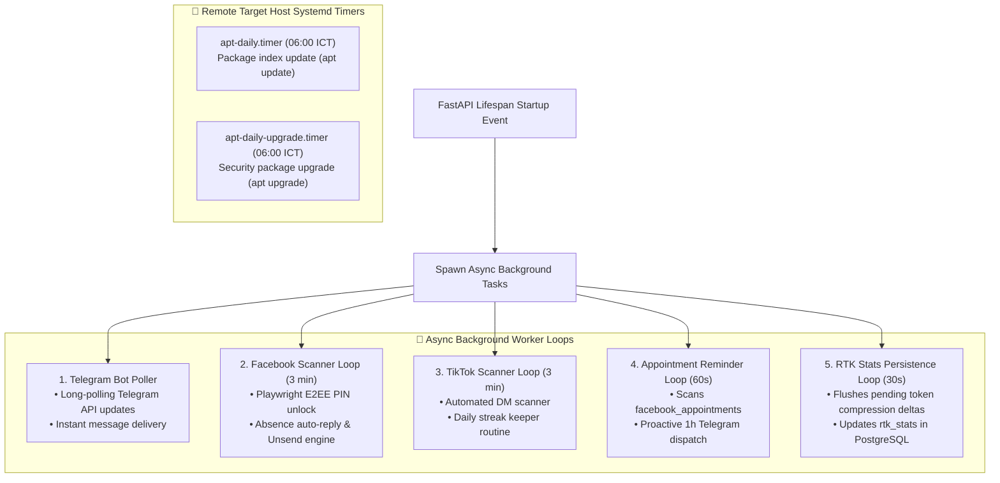
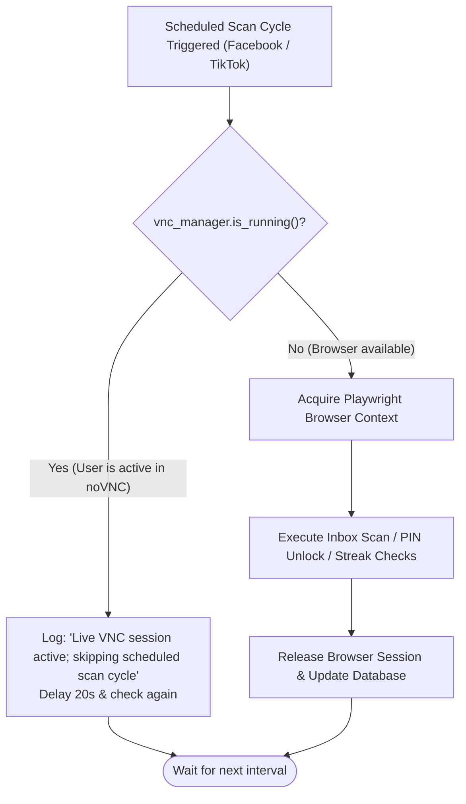

# System Automation & Background Schedulers

A comprehensive guide to scheduled tasks, background scanning loops, proactive reminders, and autonomous maintenance routines in the Mini Server Dashboard.

---

## 1. Background Schedulers Architecture

---

## 2. Mutex Lock Guard: Live noVNC Session vs. Background Scanner

To prevent Playwright profile corruption and browser lock contention when the user opens the visual noVNC console, a dedicated **Concurrency Guard** is enforced:

---

## 3. Scheduler Specifications & Timing

| Scheduler Name | Execution Cadence | Primary Responsibilities | Target Database Tables |
| --- | --- | --- | --- |
| `telegram_task` | Continuous (Long Polling) | Inbound AI commands, sysadmin execution, alert delivery | `telegram_configs` |
| `fb_scan_task` | Every 3–15 min (Configurable) | E2EE PIN unlock, absence replies, auto-unsend on human reply | `facebook_config`, `facebook_known_threads` |
| `tiktok_scan_task` | Every 3–15 min (Configurable) | DM auto-reply, daily streak deadline keeper | `tiktok_config`, `tiktok_streaks` |
| `reminder_task` | Every 60 seconds | 1-hour proactive appointment alerts via Telegram | `facebook_appointments` |
| `rtk_persist_task` | Every 30 seconds | Persisting token compression savings to database | `rtk_stats` |
