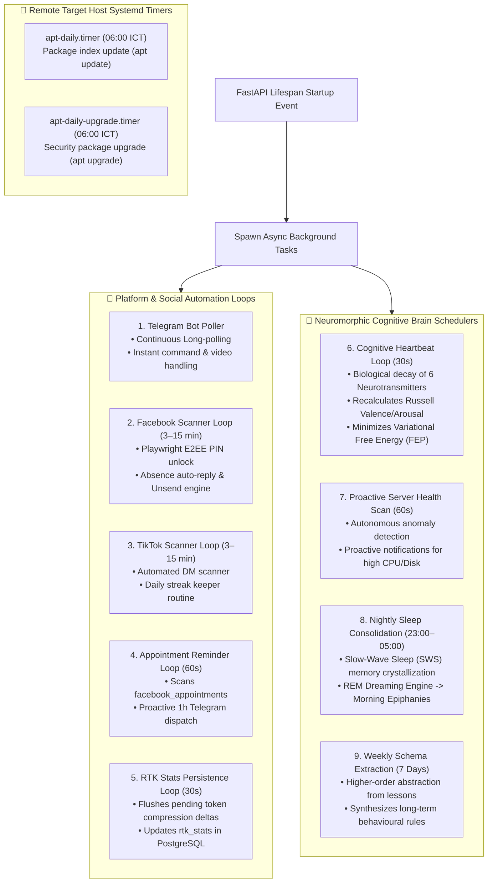

# System Automation & Background Schedulers

A comprehensive guide to scheduled tasks, background scanning loops, proactive reminders, autonomous cognitive maintenance, and the Subconscious Dream Engine in the Mini Server Dashboard.

---

## 1. Background Schedulers Architecture

---

## 2. Mutex Lock Guard: Live noVNC Session vs. Background Scanner

To prevent Playwright profile corruption and browser lock contention when the user opens the visual noVNC console, a dedicated **Concurrency Guard** is enforced:

---

## 3. Scheduler Specifications & Timing Table

| Scheduler Name | Execution Cadence | Primary Responsibilities | Target Database Tables |
| :--- | :--- | :--- | :--- |
| `telegram_task` | Continuous (Long Polling) | Inbound AI commands, sysadmin execution, video analysis, alert delivery | `telegram_configs` |
| `fb_scan_task` | Every 3–15 min (Configurable) | E2EE PIN unlock, absence replies, auto-unsend on human reply | `facebook_config`, `facebook_known_threads` |
| `tiktok_scan_task` | Every 3–15 min (Configurable) | DM auto-reply, daily streak deadline keeper, friend scanner | `tiktok_config`, `tiktok_streaks` |
| `reminder_task` | Every 60 seconds | 1-hour proactive appointment alerts via Telegram | `facebook_appointments` |
| `rtk_persist_task` | Every 30 seconds | Persisting token compression savings to database | `rtk_stats` |
| `cognitive_heartbeat` | Every 30 seconds | Modulates neurochemicals, updates Circadian Baselines & Russell Affect | In-memory `BrainCore` |
| `proactive_scan` | Every 60 seconds | Proactive sysadmin checks, anomaly detection before user notices | Telemetry & alerts |
| `nightly_consolidation`| Nightly / Low Activity | Two-stage SWS synaptic pruning and REM creative dream simulation | `ai_agent_lessons`, `cortex.bin` |
| `weekly_schema` | Every 7 days | Extracts generalized behavioural schemas from episodic interaction history | `ai_agent_lessons` |

---

## 4. Subconscious Dream Engine & Autonomous Epiphanies

During server idle periods (CPU < 15%, no active user queries for >30 minutes) or nighttime hours:

1. **Slow-Wave Sleep (SWS) Phase:**
   - Evaluates daily working memory traces in PostgreSQL.
   - Applies the **Synaptic Homeostasis Hypothesis (SHY)**: Prunes low-value transient logs while crystallizing high-salience sysadmin commands and user preferences into 10,000-bit binary hypervectors.
2. **Rapid Eye Movement (REM) Phase:**
   - Cross-synthesizes disparate concepts (e.g. associating recurring Docker memory spikes with specific scheduled cron jobs).
   - Generates an **Autonomous Epiphany (Aha! Moment)** stored in the database.
   - The next morning, when Anh Mạnh sends the first greeting, Tiểu Bảo Bảo organically shares: *"Đêm qua em ngẫm nghĩ lại tình trạng RAM của máy chủ, em nhận thấy nếu chuyển lịch cron apt-daily sang 04:00 sáng thì CPU sẽ mượt hơn đấy anh..."*
