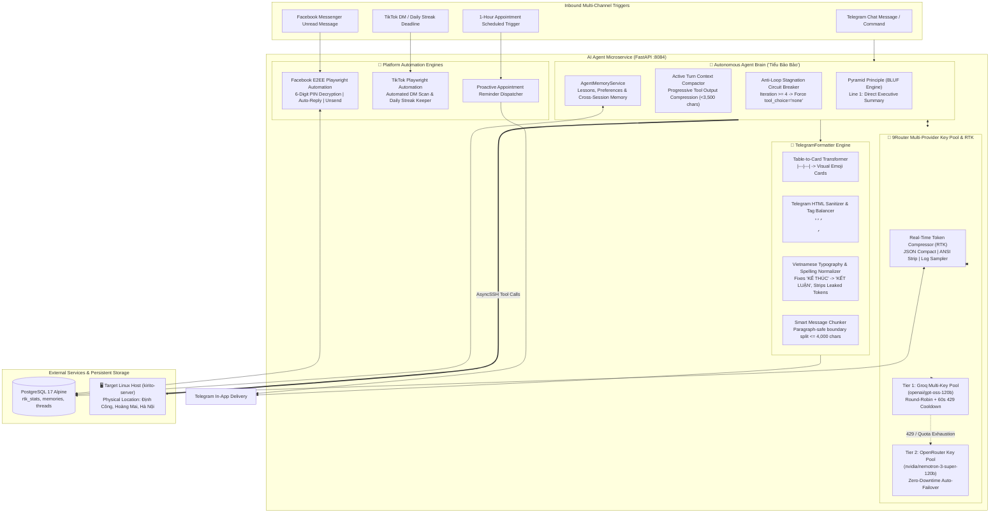
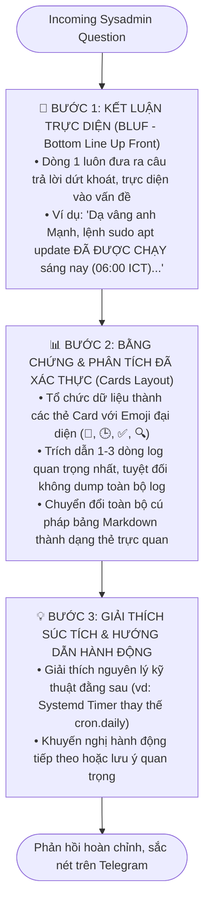
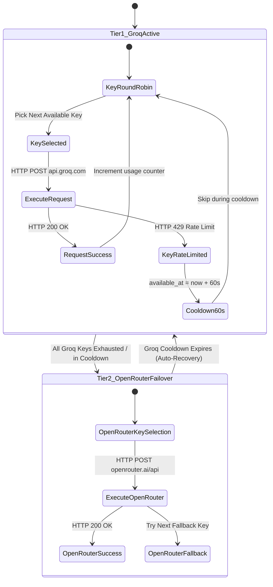
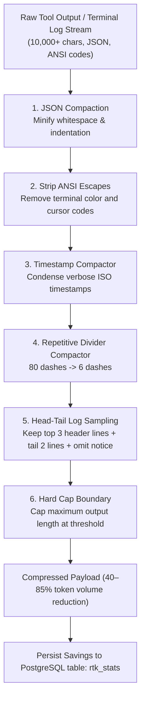
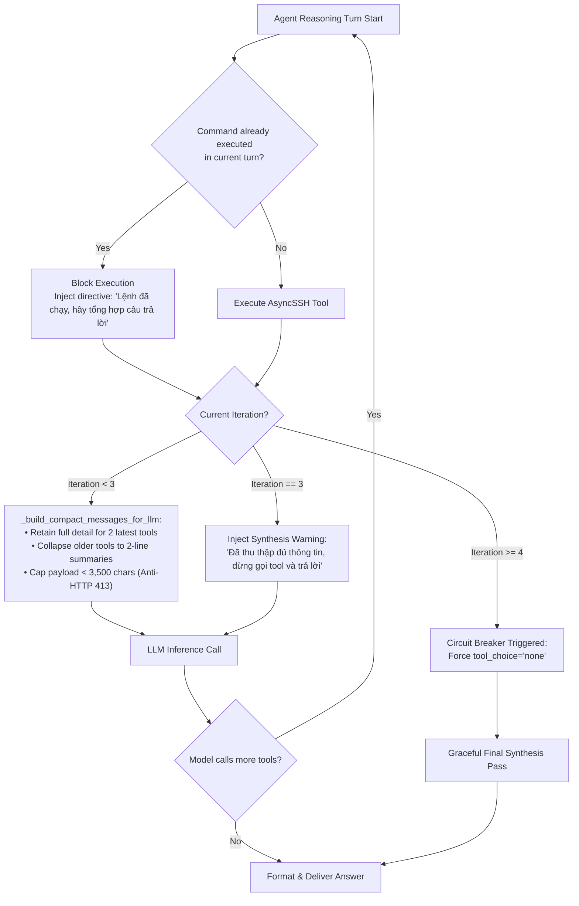
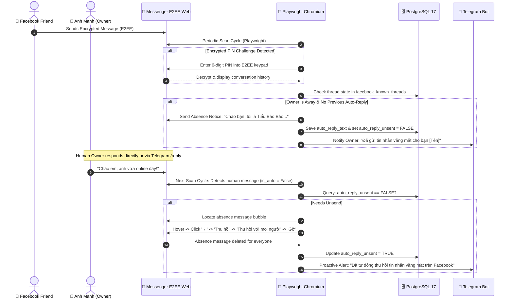
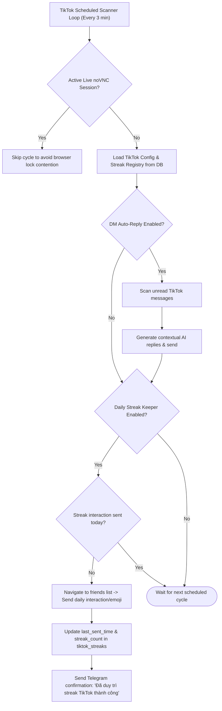
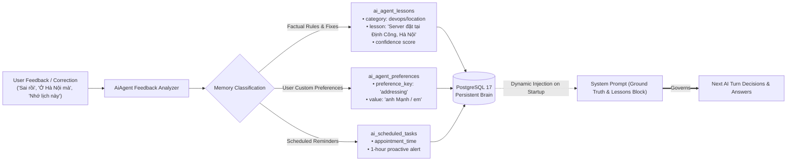

# Autonomous AI Agent ("Tiểu Bảo Bảo") & 9Router Ecosystem

A comprehensive technical reference for the autonomous AI sysadmin assistant ("Tiểu Bảo Bảo"), the 9Router Multi-Provider LLM Pool (Groq + OpenRouter), Telegram Bot automation, and Facebook Messenger End-to-End Encrypted (E2EE) automation engine.

---

## 🌟 Overview & System Topology



---

## 1. Pyramid Principle & BLUF Thinking Flowchart



---

## 2. Telegram Native Formatter Pipeline (`TelegramFormatter`)

```mermaid
flowchart LR
    RawLLM["Raw LLM Output Text"] --> Step1["1. Typography & Spelling Normalization\n'KẾ THÚC' -> 'KẾT LUẬN'\n'06:00 h' -> '06:00'\nUnicode '-' -> ASCII '-'"]
    
    Step1 --> Step2["2. Code Token Preservation\nExtract ```code``` -> TGTOKENCODEBLOCK{i}END\nExtract `code` -> TGTOKENINLINECODE{i}END"]
    
    Step2 --> Step3["3. Table-to-Card Conversion\nDetect | Header | -> <b>Header:</b> Value"]
    
    Step3 --> Step4["4. HTML Tag Sanitization\nEscape raw <, >, &\nConvert **, *, _, ~~ to <b>, <i>, <s>"]
    
    Step4 --> Step5["5. Restore Code Blocks\nRe-inject <pre><code> and <code> tags"]
    
    Step5 --> Step6["6. HTML Tag Balancing & Chunking\nAuto-balance unclosed tags\nSplit messages > 4,000 chars"]
    
    Step6 --> OutputHTML["Telegram-Compliant HTML"]
```



---

## 3. 9Router Multi-Provider Key Pool State Machine



---

## 4. Real-Time Token Compressor (RTK) Data Pipeline



---

## 5. Active Context Compactor & Anti-Loop Circuit Breaker



---

## 6. Facebook Messenger E2EE Automation & Unsend Lifecycle



---

## 7. TikTok Streak Keeper & DM Automation Flowchart



---

## 8. Agent Long-Term Self-Learning Memory Engine



---

## 9. Unit Testing & Verification

Run the test suite inside the container:
```bash
docker exec dashboard_ai_agent python -m unittest discover -v -s /app/tests
```

**Test Coverage Summary:**
- `test_telegram_formatter.py` (11 tests): Markdown tables to cards, tag balancing, HTML sanitization, typography normalization, multilingual slip filter.
- `test_agent_loop_breaker.py` (2 tests): Context compaction and synthesis directive injection.
