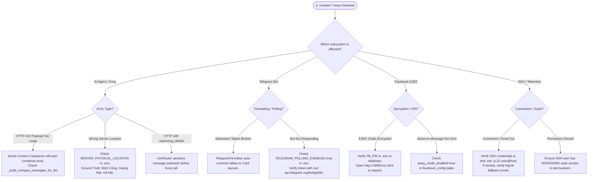

# Troubleshooting & Diagnostic Handbook

Runbooks, diagnostic procedures, and interactive decision trees for identifying and resolving common issues across the Mini Server Dashboard ecosystem.

---

## 1. Troubleshooting Decision Tree



---

## 2. Detailed Runbooks

### Runbook 1: Groq `HTTP 413 Payload Too Large`

- **Root Cause:** Accumulation of verbose raw shell outputs in multi-step agent reasoning turns.
- **Resolution:** The **Active Turn Context Compactor (`_build_compact_messages_for_llm`)** in `ai_agent.py` automatically retains full detail only for the 2 most recent tool outputs and collapses older outputs into 2-line summaries, capping turn payload under 3,500 characters (~900 tokens).

### Runbook 2: Server Location Discrepancy (GeoIP vs. Physical Location)

- **Root Cause:** Dynamic ISP IP blocks (`1.53.99.21`) route via central ISP BGP gateways which GeoIP services report as TP.HCM or Cầu Giấy.
- **Resolution:** Configured `SERVER_PHYSICAL_LOCATION="Định Công, Hoàng Mai, Hà Nội, Việt Nam"` in `.env` and `app/config.py`. The AI Agent explicitly explains the difference between ISP BGP GeoIP and on-premise hardware coordinates.

### Runbook 3: OpenRouter `reasoning_details` causing Groq `HTTP 400`

- **Root Cause:** Provider-specific reasoning fields returned by OpenRouter models are rejected by Groq API validation.
- **Resolution:** `LlmRouter.route_chat()` strips `reasoning_details` from message objects before constructing request payloads.

### Runbook 4: Telegram Markdown Entity Parsing Recovery

- **Root Cause:** Telegram API rejects unescaped raw HTML entities or unbalanced tags.
- **Resolution:** `TelegramFormatter` auto-balances open tags (`_balance_html_tags`) and `TelegramBot._send_single_chunk` provides an automated fallback that strips tags and resends plain text if entity parsing fails.

---

## 3. Diagnostic & Testing Commands

```bash
# Run all unit tests inside container
docker exec dashboard_ai_agent python -m unittest discover -v -s /app/tests

# Check container health and logs
docker compose ps
docker compose logs --tail 50 dashboard_ai_agent
```
